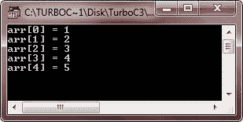
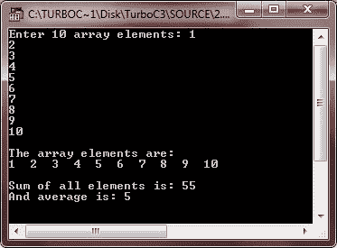
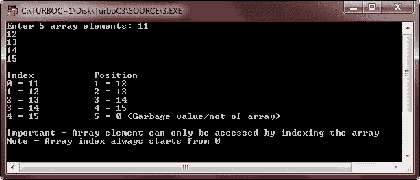
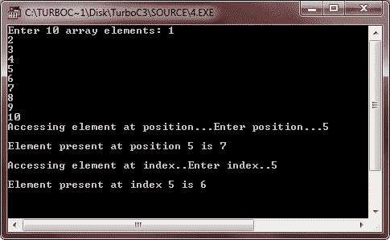

# C++ 一维数组

> 原文：<https://codescracker.com/cpp/cpp-one-dimensional-arrays.htm>

一维数组是一组具有相同数据类型和相同名称的元素。使用元素的通用名称和唯一索引来引用各个元素。

最简单的数组形式是一维数组。数组本身是有名字的，它的元素通过下标来引用。在 C++ 中，数组表示如下:

```
array_name[array_size]
```

其中 size 指定数组中元素的数量，下标(也称为索引)值的范围是从 0 到 size-1。

## 在 C++ 中声明一维数组

下面是在 C++ 中声明一维数组的一般形式

```
data_type array_name[array_size];
```

这里，data_type 是任何有效的 C++ 数据类型，array_name 是数组的名称，array_size 是数组的大小。下面是一个示例，声明一个名为 arr 的 int 类型的数组，最大元素大小为 10 个元素

```
int arr[10];
```

## 在 C++ 中初始化一维数组

下面是在 C++ 中将值初始化为一维数组的一般形式

```
data_type array_name[array_size] = {comma_separated_element_list};
```

下面是一个示例，声明并初始化 int 类型的数组名 arr 的值，包含 10 个元素

```
int arr[10] = {1, 2, 3, 4, 5, 6, 7, 8, 9, 10};
```

## C++ 一维数组示例

下面是一些示例程序，演示了 C++ 中一维数组

```
/* C++ One Dimensional Array */

#include<iostream.h>
#include<conio.h>
void main()
{
   clrscr();
   int arr[5] = {1, 2, 3, 4, 5};
   int i;
   for(i=0; i<5; i++)
   {
      cout<<"arr["<<i<<"] = "<<arr[i]<<"\n";
   }
   getch();
}
```

下面是这个 C++ 程序的示例输出:



这是另一个 C++ 的例子，也演示了 C++ 中的一维数组

```
/* C++ One Dimensional Array */

#include<iostream.h>
#include<conio.h>
void main()
{
   clrscr();
   int arr[10];
   int i;
   int sum=0, avg=0;
   cout<<"Enter 10 array elements: ";
   for(i=0; i<10; i++)
   {
      cin>>arr[i];
      sum = sum + arr[i];
   }
   cout<<"\nThe array elements are: \n";
   for(i=0; i<10; i++)
   {
      cout<<arr[i]<<"  ";
   }
   cout<<"\n\nSum of all elements is: "<<sum;
   avg = sum/10;
   cout<<"\nAnd average is: "<<avg;
   getch();
}
```

下面是上述 C++ 程序的运行示例:



下面是另一个用 C++ 编写的一维数组程序

```
/* C++ One Dimensional Array */

#include<iostream.h>
#include<conio.h>
void main()
{
   clrscr();
   int arr[5];
   int i, position, index;
   cout<<"Enter 5 array elements: ";
   for(i=0; i<5; i++)
   {
      cin>>arr[i];
   }
   cout<<"\nIndex\t\tPosition";
   for(i=0; i<5; i++)
   {
      cout<<"\n";
      cout<<i<<" = "<<arr[i]<<"\t\t"<<i+1<<" = "<<arr[i+1];
   }
   cout<<" (Garbage value/not of array)";
   cout<<"\n\nImportant - Array element can only be accessed by indexing the array\n";
   cout<<"Note - Array index always starts from 0";
   getch();
}
```

下面是这个 C++ 程序的运行示例:



让我们再看一个 C++ 程序，关于一维或一维数组

```
/* C++ One Dimensional Array */

#include<iostream.h>
#include<conio.h>
void main()
{
   clrscr();
   int arr[10];
   int i, position, index;
   cout<<"Enter 10 array elements: ";
   for(i=0; i<10; i++)
   {
      cin>>arr[i];
   }
   cout<<"Accessing element at position...Enter position...";
   cin>>position;
   cout<<"\nElement present at position "<<position<<" is "<<arr[position+1];
   cout<<"\n\nAccessing element at index..Enter index..";
   cin>>index;
   cout<<"\nElement present at index "<<index<<" is "<<arr[index];

   getch();
}
```

下面是上述 C++ 程序的运行示例:



### 更多示例

这里有更多的 C++ 程序列在一维数组上，你可能会喜欢:

*   [一维数组程序](/cpp/program/cpp-program-one-dimensional-array.htm)
*   [线性搜索](/cpp/program/cpp-program-linear-search.htm)
*   [二分搜索](/cpp/program/cpp-program-binary-search.htm)
*   [使用指针](/cpp/program/cpp-program-add-two-numbers-using-pointers.htm)将两个数相加
*   [找到数组中最大的元素](/cpp/program/cpp-program-find-largest-element-in-array.htm)
*   [找到数组中最小的元素](/cpp/program/cpp-program-find-smallest-element-in-array.htm)
*   [反向排列](/cpp/program/cpp-program-reverse-array.htm)
*   [在数组中插入元素](/cpp/program/cpp-program-insert-element-in-array.htm)
*   [从数组中删除元素](/cpp/program/cpp-program-delete-element-from-array.htm)
*   [合并两个数组](/cpp/program/cpp-program-merge-two-arrays.htm)
*   [冒泡排序](/cpp/program/cpp-program-bubble-sort.htm)
*   [选择排序](/cpp/program/cpp-program-selection-sort.htm)
*   [插入排序](/cpp/program/cpp-program-Insertion-sort.htm)

[C++ 在线测试](/exam/showtest.php?subid=3)

* * *

* * *