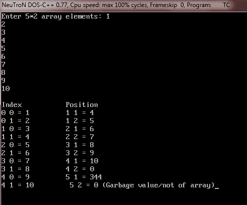

# C++二维数组

> 原文：<https://codescracker.com/cpp/cpp-two-dimensional-arrays.htm>

二维数组中的每个元素本身都是一维数组。

## 在 C++中声明二维数组

下面是在 C++中声明二维数组的一般形式

```
data_type array_name[row_size][column_size];
```

这里，data_type 是任何有效的 C++数据类型，array_name 是数组的名称，row_size 和 column_size 是二维数组的维度。如果行的大小是 5，列的大小是 2，那么二维数组的维数将是 5*2，总大小变成 10。因此，10 个元素保存这个二维数组。下面是一个示例，它声明了一个名为 arr、维数为 5*2 的二维数组

```
int arr[5][2];
```

## 在 C++中初始化二维数组

下面是在 C++中将值初始化为二维数组的一般形式

```
data_type array_name[row_size][column_size] = { {comma_separated_value_list} };
```

下面是一个示例，声明并初始化一个名为 arr 的二维数组的值，该数组为 int 类型，包含 5 行 2 列，即该数组的维数为 5*2

```
int arr[5][2] = { {1, 2}, {3, 4}, {5, 6}, {7, 8}, {9, 10} };
```

## C++二维数组示例

这是一些 C++程序，演示了 C++中的二维数组

```
/* C++ Two Dimensional Array */

#include<iostream.h>
#include<conio.h>
void main()
{
   clrscr();
   int arr[5][2] = { {1, 2}, {1, 3}, {1, 4}, {1, 5}, {1, 6} };
   int i, j;
   for(i=0; i<5; i++)
   {
      for(j=0; j<2; j++)
      {
         cout<<"arr["<<i<<"]["<<j<<"] = "<<arr[i][j]<<"\n";
      }
   }
   getch();
}
```

以下是上述 C++程序的示例输出:


这是另一个 C++程序，也演示了 C++中的二维数组

```
/* C++ Two Dimensional Array */

#include<iostream.h>
#include<conio.h>
void main()
{
   clrscr();

   int arr[5][2];
   int i, j;
   int sum=0, avg=0;

   cout<<"Enter 5*2 array elements: ";
   for(i=0; i<5; i++)
   {
      for(j=0; j<2; j++)
      {
         cin>>arr[i][j];
         sum = sum + arr[i][j];
      }
   }
   cout<<"\nThe array elements are: \n";
   for(i=0; i<5; i++)
   {
      for(j=0; j<2; j++)
      {
         cout<<arr[i][j]<<"   ";
      }
      cout<<"\n";
   }
   cout<<"\n\nSum of all elements is: "<<sum;
   avg = sum/10;
   cout<<"\nAnd average is: "<<avg;

   getch();
}
```

下面是上述 C++程序的运行示例:


下面是另一个二维数组的 C++程序:

```
/* C++ Two Dimensional Array */

#include<iostream.h>
#include<conio.h>
void main()
{
   clrscr();

   int arr[5][2];
   int i, j, position, index;
   cout<<"Enter 5*2 array elements: ";
   for(i=0; i<5; i++)
   {
      for(j=0; j<2; j++)
      {
         cin>>arr[i][j];
      }
   }
   cout<<"\nIndex\t\tPosition";
   for(i=0; i<5; i++)
   {
      for(j=0; j<2; j++)
      {
         cout<<"\n";
         cout<<i<<" "<<j<<" = "<<arr[i][j]<<"         ";
         cout<<i+1<<" "<<j+1<<" = "<<arr[i+1][j+1];
      }
   }
   cout<<" (Garbage value/not of array)";

   getch();
}
```

下面是这个 C++程序的运行示例:



让我们再来看一个 C++程序，以便完全理解 C++中的二维数组

```
/* C++ Two Dimensional Array */

#include<iostream.h>
#include<conio.h>
void main()
{
   clrscr();

   int arr[5][2];
   int i, j;
   int row_position, col_position;
   int row_index, col_index;

   cout<<"Enter 5*2 array elements: ";
   for(i=0; i<5; i++)
   {
      for(j=0; j<2; j++)
      {
         cin>>arr[i][j];
      }
   }
   cout<<"Array Elements (row by column) are:\n";
   for(i=0; i<5; i++)
   {
      for(j=0; j<2; j++)
      {
         cout<<arr[i][j]<<"\t";
      }
      cout<<"\n";
   }

   cout<<"Accessing element at position...Enter row and column position...";
   cin>>row_position;
   cin>>col_position;
   cout<<"\nElement present at row position "<<row_position;
   cout<<" and column position "<<col_position<<" is "<<arr[row_position-1][col_position-1];
   cout<<"\n\nAccessing element at index..Enter row and column index..";
   cin>>row_index;
   cin>>col_index;
   cout<<"\nElement present at row index "<<row_index;
   cout<<"and column index "<<col_index<<" is "<<arr[row_index][col_index];

   getch();
}
```

下面是上述 C++程序的运行示例:


### 更多示例

这里列出了更多的二维和三维数组的 C++程序，你可能会喜欢:

*   [二维数组程序](/cpp/program/cpp-program-two-dimensional-array.htm)
*   [添加两个矩阵](/cpp/program/cpp-program-add-two-matrices.htm)
*   [减去矩阵](/cpp/program/cpp-program-subtract-matrices.htm)
*   [转置矩阵](/cpp/program/cpp-program-transpose-matrix.htm)
*   [将两个矩阵相乘](/cpp/program/cpp-program-multiply-two-matrices.htm)
*   [三维阵列程序](/cpp/program/cpp-program-three-dimensional-array.htm)

[C++在线测试](/exam/showtest.php?subid=3)

* * *

* * *