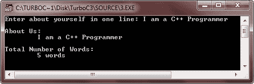
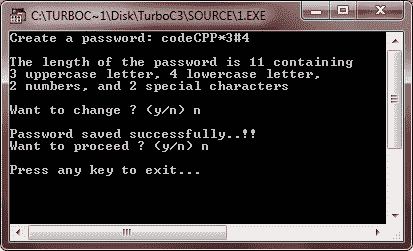

# C++字符串

> 原文：<https://codescracker.com/cpp/cpp-strings.htm>

字符串是字符的组合。换句话说，您可以将字符串视为字符数组。

## 在 C++中声明字符串

下面是在 C++中声明字符串的一般形式。

```
char string_name[string_size];
```

这里 char 是有效的 C++类型，string_name 是字符串的名称，string_size 是字符串的大小。string_size 表示字符串可以容纳多少个字符。这里有一个例子。

```
char str[20];
```

上面的声明告诉编译器，声明了一个字符串 str，它最多可以包含 20 个字符。

## 在 C++中初始化字符串

下面是在 C++中初始化字符串的一般形式。

```
char string_name[string_size] = {comma_separated_character_list};
```

下面是一个用 C++初始化字符串的例子。

```
char str[6] = {'H', 'e', 'l', 'l', 'o', '\0'};
```

上面的声明和初始化创建了一个包含单词“Hello”的字符串。为了在数组末尾保存空字符(' \0 ')，包含该字符串的字符数组的大小比单词“Hello”中的字符数多 1。如果你采用数组初始化的规则，那么你可以把上面的语句写成如下:

```
char str[] = "Hello";
```

实际上，不要在字符串常量的末尾放置空字符(' \0 ')。C++编译器在初始化数组时会自动将“\0”(空字符)放在字符串的末尾。让我们试着打印上面提到的字符串:

## C++字符串示例

这里有一些示例程序实际演示了 C++中字符串的概念。

```
/* C++ Strings - Example Program of C++ Strings */

#include<iostream.h>
#include<conio.h>

void main()
{
   clrscr();
   char greet[6] = {'H', 'e', 'l', 'l', 'o', '\0'};
   cout<<greet<<endl;
   getch();
}
```

以下是上述 C++程序的示例输出:


这是另一个 C++字符串示例程序。

```
/* C++ Strings - Example Program of C++ Strings */

#include<iostream.h>
#include<conio.h>
void main()
{
   clrscr();
   char str[40];
   cout<<"Enter your name: ";
   cin>>str;
   cout<<"Hello, "<<str;
   getch();
}
```

下面是这个 C++程序的运行示例。


这是另一个 C++字符串示例程序。

```
/* C++ Strings - Example Program of C++ Strings */

#include<iostream.h>
#include<conio.h>
#include<string.h>
void main()
{
   clrscr();
   char str[80];
   int len;
   int countword=0, i;
   cout<<"Enter about yourself in one line: ";
   cin.getline(str, 80);
   len=strlen(str);
   for(i=0; i<len; i++)
   {
      if(str[i] == ' ')
      {
         countword++;
      }
   }
   cout<<"\nAbout Us:\n\t"<<str<<endl;
   cout<<"\nTotal Number of Words:\n\t"<<countword+1<<" words";
   getch();
}
```

下面是上述 C++程序的运行示例:



为了全面理解 C++字符串，让我们再举一个例子:

```
/* C++ Strings - Example Program of C++ Strings */

#include<iostream.h>
#include<conio.h>
#include<stdlib.h>
#include<string.h>
void main()
{
   clrscr();
   char pass[20], check_pass[20], ans;
   int count_spec_char=0;
   int count_upper_char=0, count_lower_char=0;
   int count_num=0, pass_len, i;
   cout<<"Create a password: ";
   cin>>pass;

   pass_len = strlen(pass);
   for(i=0; i<pass_len; i++)
   {
      if(pass[i]>=65 && pass[i]<=90)
      {
         count_upper_char++;
      }
      else if(pass[i]>=97 && pass[i]<=122)
      {
         count_lower_char++;
      }
      else if(pass[i]>=48 && pass[i]<=57)
      {
         count_num++;
      }
      else
      {
         count_spec_char++;
      }
   }
   cout<<"\nThe length of the password is "<<pass_len<<" containing";
   cout<<"\n"<<count_upper_char<<" uppercase letter, "<<count_lower_char;
   cout<<" lowercase letter,\n"<<count_num<<" numbers, and ";
   cout<<count_spec_char<<" special characters";

   cout<<"\n\nWant to change ? (y/n) ";
   cin>>ans;
   if(ans=='y' || ans=='Y')
   {
      cout<<"Create a new password: ";
      cin>>pass;
   }
   cout<<"\nPassword saved successfully..!!\n";
   cout<<"Want to proceed ? (y/n) ";
   cin>>ans;
   if(ans=='y' || ans=='Y')
   {
      cout<<"\nEnter password: ";
      cin>>check_pass;
      if(!strcmp(check_pass, pass))
      {
         cout<<"\nWelcome to codescracker.com\n";
         cout<<"This is C++ Strings Tutorial\n";
      }
      else
      {
         cout<<"Sorry..!!..Wrong password..\n";
         cout<<"Press any key to exit...\n";
         getch();
         exit(1);
      }
   }
   cout<<"\nPress any key to exit...\n";
   getch();
}
```

以下是上述 C++程序的一些运行示例:




### 更多示例

以下是更多关于 C++字符串的例子:

*   [打印字符串](/cpp/program/cpp-program-print-string.htm)
*   [找出字符串的长度](/cpp/program/cpp-program-find-length-of-string.htm)
*   [比较两个字符串](/cpp/program/cpp-program-compare-two-string.htm)
*   [复制字符串](/cpp/program/cpp-program-copy-string.htm)
*   [连接字符串](/cpp/program/cpp-program-concatenate-string.htm)
*   [反串](/cpp/program/cpp-program-reverse-string.htm)
*   [从字符串中删除元音](/cpp/program/cpp-program-delete-vowels-from-string.htm)
*   [从字符串中删除单词](/cpp/program/cpp-program-delete-words-from-sentence.htm)
*   [计算字符串中的字符数](/cpp/program/cpp-program-frequency-character.htm)
*   [统计字符串中的单词数](/cpp/program/cpp-program-count-words-in-sentence.htm)
*   [删除字符串中的空格](/cpp/program/cpp-program-remove-spaces-from-string.htm)
*   [对字符串进行排序](/cpp/program/cpp-program-sort-string.htm)
*   [将大写字符串转换成小写](/cpp/program/cpp-program-convert-uppercase-into-lowercase.htm)
*   [将小写字符串转换成大写](/cpp/program/cpp-program-convert-lowercase-into-uppercase.htm)
*   [交换两根弦](/cpp/program/cpp-program-swap-two-strings.htm)
*   [检查字符串是否是变位词](/cpp/program/cpp-anagram-program.htm)

### 练习更多关于 C++字符串的例子

这里列出了一些带有输出的 C++字符串程序，帮助你更清楚地理解 C++中的字符串。

下面是另一个关于 C++字符串的程序:

```
/* C++ String - Example Program */

#include<iostream.h>
#include<conio.h>
void main()
{
   clrscr();
   char arr[26], string[26];
   int i, j;

   // initializing array with values from 65 to 91
   for(i=65, j=0; i<92; i++, j++)
   {
      arr[j] = i;
   }

   // converting and initializing array's values to string
   // like arr[0] to string[0]. That is, 65 to string[i]. Means,
   // 'A' to string[i] and so on.
   for(i=0; i<26; i++)
   {
      string[i] = arr[i];
   }

   // printing all the elements of the string[]
   for(i=0; i<26; i++)
   {
      cout<<string[i];
   }
   getch();
}
```

下面是这个 C++字符串示例的输出示例:


让我们用另一个程序演示 C++中的字符串:

```
/* C++ String - Example Program */

#include<iostream.h>
#include<string.h>
#include<conio.h>
void main()
{
   clrscr();
   char string[100];
   int i, len;
   cout<<"Enter a sentence\n";
   cin.getline(string, 100);
   len = strlen(string);
   for(i=0; string[i] != '\0'; i++)
   {
      if(string[i] == ' ')
      {
         string[i] = '-';
      }
   }
   cout<<"\nHere is the string after replacing space with hyphen\n";
   for(i=0; i<len; i++)
   {
      cout<<string[i];
   }
   getch();
}
```

上面的 C++字符串程序的输出如下所示:


下面是另一个 C++字符串示例:

```
/* C++ String - Example Program */

#include<iostream.h>
#include<stdio.h>
#include<conio.h>
void main()
{
   clrscr();
   char string[100];
   int count=0, i;
   cout<<"Enter a sentence\n";
   gets(string);
   for(i=0; string[i] != '\0'; i++)
   {
      switch(string[i])
      {
         case 'a':
         case 'e':
         case 'i':
         case 'o':
         case 'u':
         case 'A':
         case 'E':
         case 'I':
         case 'O':
         case 'U': count++;
      }
   }
   cout<<"\nThe above sentence contains total "<<count<<" number of vowels.";
   getch();
}
```

上面的 C++字符串程序将产生以下输出:


下面是另一个 C++字符串示例:

```
/* C++ String - Example Program */

#include<iostream.h>
#include<string.h>
#include<conio.h>
#include<stdio.h>
void main()
{
   clrscr();
   char string[100], word[20];
   int i, m=0, n;
   cout<<"Enter a sentence\n";
   gets(string);
   strcat(string, " ");
   for(i=0; string[i] != '\0'; i++)
   {
      if(string[i] != ' ')
      {
         word[m] = string[i];
         m++;
      }
      else
      {
         while(m>0)
         {
            cout<<word[--m];
         }
         cout<<string[i];
      }
   }
   getch();
}
```

以下是上述 C++字符串示例的运行示例:


让我们再举一个 C++字符串的例子:

```
/* C++ String - Example Program */

#include<iostream.h>
#include<conio.h>
#include<ctype.h>
#include<stdio.h>
void main()
{
   clrscr();
   char string[100];
   int i;
   cout<<"Enter a sentence\n";
   gets(string);
   string[0] = toupper(string[0]);
   for(i=0; string[i] != '\0'; i++)
   {
      if(string[i] == ' ')
      {
         string[i+1] = toupper(string[i+1]);
      }
   }
   cout<<"\nHere is the string after capitalizing every first letter of the word\n";
   cout<<string;
   getch();
}
```

以下是上述 C++字符串示例的输出:


下面是另一个关于 C++字符串的例子:

```
/* C++ String - Example Program */

#include<iostream.h>
#include<conio.h>
#include<string.h>
#include<stdio.h>
void main()
{
   clrscr();
   char string[100], ch;
   int i, j, l=0, m, len;
   cout<<"Enter a sentence\n";
   gets(string);
   len = strlen(string);
   for(i=0; i<len; i++)
   {
      j=i;
      while(string[j] != ' ' && string[j] != '\0')
      {
         j++;
      }
      l = j;
      if(j%2==0)
      {
         l = j;
      }
      else
      {
         l = j-1;
      }
      for(m=i; m<l; m=m+2)
      {
         ch = string[m];
         string[m] = string[m+1];
         string[m+1] = ch;
      }
      i = j+1;
   }
   cout<<string;
   getch();
}
```

下面是这个 C++字符串示例的运行示例:


下面是关于 C++ string 的最后一个程序，帮助你完全理解 C++中的 string:

```
/* C++ String - Example Program */

#include<iostream.h>
#include<conio.h>
#include<stdio.h>
#include<string.h>
void main()
{
   clrscr();
   char string[100], word[20];
   int i, j, k, lenm, spos, lpos, lens;
   cout<<"Enter a sentence\n";
   gets(string);
   cout<<"Enter a word to find\n";
   gets(word);
   lenm=strlen(string);
   for(i=0; i<lenm; i++)
   {
      j = i;
      if(string[j] == word[0])
      {
         k = 0;
         while(string[j++] == word[k++]);
         if(word[k-1]=='\0')
         {
            spos=i;
            break;
         }
         else
         {
            i=j-1;
         }
      }
      else
      {
         i++;
      }
   }
   lens=strlen(word);
   for(i=lenm-1; i>=0;)
   {
      j=i;
      if(string[j]==word[lens-1])
      {
         k=lens-1;
         while(string[j--]==word[k--]);
         if(k<0)
         {
            lpos=j+2;
            break;
         }
         else
         {
            i=j+1;
         }
      }
      else
      {
         i--;
      }
   }
   cout<<"First occurrence of "<<word<<" is at position "<<spos+1<<"\n";
   cout<<"Last occurrence of "<<word<<" is at position "<<lpos+1;
   getch();
}
```

以下是由上述 C++字符串示例程序生成的运行示例:


[C++在线测试](/exam/showtest.php?subid=3)

* * *

* * *