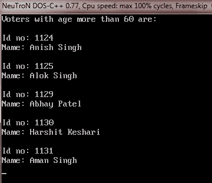
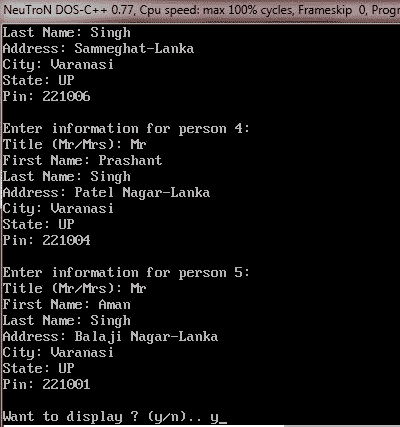

# C++数据结构

> 原文：<https://codescracker.com/cpp/cpp-data-structures.htm>

有时，一些逻辑上相关的元素需要在一个单元下处理。例如，存储学生信息的元素(例如，rollno、姓名、班级、分数、年级)需要在一个屋檐下一起处理。类似地，保存日期信息的元素(例如，日、月和年)需要一起处理。为了处理和服务于这种情况，C++提供了结构。

## C++结构定义

要在 C++中定义结构，请遵循以下通用格式:

```
struct tag
{
   type variable-name ;
   type variable-name ;
   type variable-name ;
}structure-variables ;
```

其中可以省略标记名或结构变量，但不能两者都省略。

下面的代码片段展示了如何定义一个结构(比如日期)。关键字 struct 告诉编译器正在定义一个结构:

```
struct date
{
   short day ;
   short month ;
   short year ;
};
```

在上面的定义中，日期是一个结构标签，它标识这个特定的数据结构及其类型说明符。

## C++结构变量定义

还要记住，在这个时间点上(也就是在上述定义之后)，还没有声明任何结构变量，也就是说，还没有预留任何内存空间。只定义了数据的形式。要声明一个具有由日期定义的数据形式的结构变量，我们将编写:

```
data joining_date;
```

这声明了一个 date 类型的结构变量 joining_date。因此，完整的结构定义如下:

```
struct date
{
   short day ;
   short month ;
   short year ;
};
date joining_date;
```

现在，joining_date 结构的元素将是日、月和年。C++编译器自动分配足够的内存来容纳构成结构变量的所有元素变量。

上面给出的两个独立的结构语句也可以连接起来，如下所示:

```
struct date
{
   short day ;
   short month ;
   short year ;
}joining_date ;
```

上面的语句定义了一个名为 date 的结构类型，并声明了一个结构变量 joining_date。

## 在 C++中访问结构成员

在 C++中，一旦定义了结构变量，就可以通过使用点(.)运算符。在 [C++访问结构成员](/cpp/cpp-accessing-structure-members.htm)教程中你会学到更多。 但是现在，这里有一个例子，下面的代码片段访问 rollno 元素的 senior_student 结构变量:

```
senior_student.rollno;
```

## C++结构元素初始化

structure 的结构元素可以使用单独的赋值语句单独初始化，也可以使用类似于数组初始化的符号联合初始化。例如，可以分别初始化结构 senior_student 的成员，如下所示:

```
senior_student.rollno = 01 ;
senior_student.class = 12 ;
senior_student.marks = 50.00 ;
senior_student.grade = 'A' ;
```

或者，可以使用用于数组初始化的符号来初始化结构 senior_student，如下所示:

```
stutype senior_student = {01, 12, 50.00, 'A'};
```

**请注意**上面定义的第二种结构初始化方法，只有在定义了结构变量时才能使用。 在定义结构变量之前不能使用。在这种情况下，使用单独初始化元素的第一种方法。

在上面给出的语句中，stutype 是 senior_student 的类型说明符，同时声明和初始化了结构 senior_student。要分配给结构成员的值用大括号括起来，并用逗号分隔。第一个值分配给第一个成员，第二个值分配给第二个成员，依此类推。

## C++结构赋值

结构类型的对象可以赋值，作为函数参数传递，并作为函数的结果返回。从下面的语句中可以看出，一个结构变量可以赋给另一个结构变量:

```
junior_student = senior_student ;
```

使用此语句，每个成员 senior_student 的值被分配给 junior_student 的相应成员。

**注意**——一个结构变量只能赋给同一个结构类型的另一个变量。如果你试图将一种结构类型的变量 赋给另一种结构类型的变量，那么编译器会报错。

如果在函数中定义，结构可以是局部的(对于函数而言)。也就是说，除了定义它的函数之外，没有其他函数可以访问它(结构)。如果在所有函数之外定义(即，任何函数都可以访问它)，则结构可以是全局的(对于程序中的所有函数)。

## C++数据结构教程

本教程讲述 C++数据结构，分为以下几个部分:

*   [C++数据结构](/cpp/cpp-data-structures.htm)
*   [C++访问结构成员](/cpp/cpp-accessing-structure-members.htm)
*   [C++嵌套数据结构](/cpp/cpp-nested-structures.htm)
*   [C++结构数组](/cpp/cpp-structures-arrays.htm)
*   [C++将结构传递给函数](/cpp/cpp-pasing-structures-to-functions.htm)
*   [C++ typedef](/cpp/cpp-user-defined-data-types.htm)
*   [c++ #定义](/cpp/cpp-hash-define-preprocessor-directive.htm)

你会学到 C++中所有的数据结构，一个接一个的详细。下面是一些关于 C++数据结构的示例程序

## C++数据结构示例

这是一个示例程序，实际演示了 C++中的数据结构

```
/* C++ Data Structures */

#include<iostream.h>
#include<conio.h>
#include<stdio.h>

struct stud
{
   int rollno;
   char name[20];
   char branch[3];
   char batch[2];
   float marks[5];
   char grade;
}stud_var;

void main()
{
   clrscr();
   float sum = 0;
   float avg;

   cout<<"Enter rollno: ";
   cin>>stud_var.rollno;
   cout<<"Enter name: ";
   gets(stud_var.name);
   cout<<"Enter branch: ";
   gets(stud_var.branch);
   cout<<"Enter batch: ";
   gets(stud_var.batch);
   cout<<"Enter marks obtained in 5 subjects:\n";
   for(int i=0; i<5; i++)
   {
      cout<<"Subject "<<i+1<<": ";
      cin>>stud_var.marks[i];
      sum = sum + stud_var.marks[i];
   }
   avg = sum / 5;
   if(avg<50)
   {
      stud_var.grade = 'F';
   }
   else if(avg<60)
   {
      stud_var.grade = 'C';
   }
   else if(avg<80)
   {
      stud_var.grade = 'B';
   }
   else
   {
      stud_var.grade = 'A';
   }

   cout<<"\nStudent Result:\n";
   cout<<"\nRoll no: "<<stud_var.rollno<<"\t\tName: "<<stud_var.name;
   cout<<"\nBranch: "<<stud_var.branch<<"\t\tBatch: "<<stud_var.batch;
   cout<<"\nTotal Marks: "<<sum<<"\tGrade: "<<stud_var.grade;

   getch();
}
```

下面是上述 C++程序的运行示例:


这是另一个程序，也演示了 C++中的数据结构

```
/* C++ Data Structure */

#include<iostream.h>
#include<conio.h>
#include<stdio.h>

struct voter
{
   int idno;
   char name[20];
   char address[60];
   int age;
};

void main()
{
   clrscr();
   voter ward[10];
   for(int i=0; i<10; i++)
   {
      cout<<"Voter No. "<<i+1;
      cout<<"\nEnter id no: ";
      cin>>ward[i].idno;
      cout<<"Enter Name: ";
      gets(ward[i].name);
      cout<<"Enter Address: ";
      gets(ward[i].address);
      cout<<"Enter Age: ";
      cin>>ward[i].age;
      cout<<"\n";
   }
   clrscr();
   cout<<"Voters with age more than 60 are:\n";
   for(i=0; i<10; i++)
   {
      if(ward[i].age > 60)
      {
         cout<<"\nId no: "<<ward[i].idno;
         cout<<"\nName: "<<ward[i].name;
         cout<<"\n";
      }
   }
   getch();
}
```

以下是上述 C++程序的运行示例。


输入数据后，如上面的三个示例所示，按 ENTER 键查看年龄超过 60 岁的投票者



让我们再用一个程序来说明 C++中的数据结构

```
/* C++ Data Structures */

#include<iostream.h>
#include<conio.h>
#include<stdio.h>

const int SIZE = 5;

struct person
{
   char title[3];
   char fname[20];
   char lname[20];
   char address[40];
   char city[20];
   char state[20];
   long pin;
};

void main()
{
   clrscr();
   person labels[SIZE];
   for(int i=0; i<SIZE; i++)
   {
      cout<<"Enter information for person "<<i+1<<":\n";
      cout<<"Title (Mr/Mrs): ";
      cin>>labels[i].title;
      cout<<"First Name: ";
      cin>>labels[i].fname;
      cout<<"Last Name: ";
      cin>>labels[i].lname;
      cout<<"Address: ";
      gets(labels[i].address);
      cout<<"City: ";
      gets(labels[i].city);
      cout<<"State: ";
      gets(labels[i].state);
      cout<<"Pin: ";
      cin>>labels[i].pin;
      cout<<"\n";
   }
   char ch;
   cout<<"Want to display ? (y/n).. ";
   cin>>ch;
   if(ch=='y' || ch=='Y')
   {
      clrscr();
      for(i=0; i<SIZE; i++)
      {
         cout<<"Person "<<i+1<<": \t";
         cout<<labels[i].title<<" ";
         cout<<labels[i].fname<<" "<<labels[i].lname<<endl;
         cout<<"\t\t";
         cout<<labels[i].address<<", "<<labels[i].city<<endl;
         cout<<"\t\t";
         cout<<labels[i].state<<endl;
         cout<<"\t\t";
         cout<<labels[i].pin<<endl;
      }
   }
   getch();
}
```

下面是上述 C++程序的一些运行示例。饲养数据，如下三图所示




输入如上所示的数据后，按 y，然后按 ENTER，在屏幕上查看输入的数据，如下图所示:


[C++在线测试](/exam/showtest.php?subid=3)

* * *

* * *