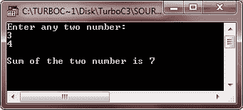

# C++访问结构成员

> 原文：<https://codescracker.com/cpp/cpp-accessing-structure-members.htm>

在 [C++](/cpp/index.htm) 中，一旦定义了一个[结构](/cpp/cpp-data-structures.htm) [变量](/cpp/cpp-variables.htm)，就可以通过 使用点号(.)[运算符](/cpp/cpp-operators.htm)。例如，下面的 代码片段将 1740 赋给前面声明的 birth_date 结构变量的 year 元素:

```
birth_date.year = 1740 ;
```

## C++中访问结构成员的语法

结构变量名后跟一个句点或点(。)和引用该单个结构元素的元素名称。访问结构元素的语法如下所示:

```
structure-name.element-name
```

请记住，表达式中包含点(.)运算符是特定结构变量的名称(本例中为 birth_date)，而不是结构说明符的名称(date)。

结构成员就像其他变量一样被对待。因此，要打印出生日期，您可以简单地写:

```
cout << birth_date.year ;
```

同样，要阅读 joining_date 的年、月、日，您可以简单地写:

```
cin >> joining_date.day >> joining_date.month >> joining_date.year ;
```

## C++访问结构成员示例

下面是一个例子，演示了如何在 C++中访问结构的成员

```
/* C++ Access Structure Member */

#include<iostream.h>
#include<conio.h>

struct st
{
   int a;    // structure member
   int b;    // structure member
   int sum;  // structure member
}st_var;         // structure variable

void main()
{
   clrscr();
   cout<<"Enter any two number:\n";
   // accessing structure member a and b
   cin>>st_var.a>>st_var.b;
   // accessing structure member sum, a, and b
   st_var.sum = st_var.a + st_var.b;
   // accessing structure member sum
   cout<<"\nSum of the two number is "<<st_var.sum;
   getch();
}
```

下面是这个 C++程序的运行示例:



[C++在线测试](/exam/showtest.php?subid=3)

* * *

* * *