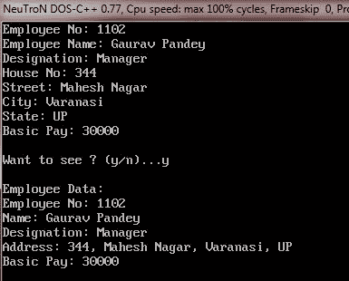

# C++ 嵌套数据结构

> 原文：<https://codescracker.com/cpp/cpp-nested-structures.htm>

结构元素可以是复杂的，也可以是简单的。简单元素是 C++ 的任何基本数据类型，如 int、float、char、double。然而，结构可以由本身复杂的元素组成，即，它由基本类型组成，例如，数组、结构等。

因此，结构的元素本身可以是数组或结构。由这种复杂元素组成的结构称为复杂结构。

## C++ 嵌套结构定义

一个结构可以嵌套在另一个结构中。下面的代码片段说明了这一点:

```
struct addr       // structure tag
{
   int houseno ;
   char area[26] ;
   char city[26] ;
   char state[26] ;
};
struct emp                    // structure tag
{
   int empno ;
   char name[26] ;
   char desig[16] ;
   addr address ;
         /* See, address is a structure variable itself (of type
           addr) and it is member of another structure,
           the emp structure. */

   float basic ;
} ;
emp worker ;       // create structure variable
```

结构 emp 被定义为具有几个元素，还包括结构地址。(emp 结构的)元素地址本身是 addr 类型的结构。

**提示** -在定义这样的结构时，只要确保内部结构在外部结构之前定义即可。

## C++ 访问嵌套结构成员

使用点运算符访问结构的成员。要访问 address 结构的 city 成员(它是另一个结构 worker 的元素),我们应该编写:

```
worker.address.city
```

要初始化地址结构的 houseno 成员，worker 结构的元素，我们可以编写如下:

```
worker.address.houseno = 1693
```

如您所见，每个结构的元素都是从最外层到最内层引用的。

## C++ 嵌套结构示例

下面是一个示例程序，演示了 C++ 中嵌套结构的概念

```
/* C++ Nested Structure - Example of Nested Structure in C++ */

#include<iostream.h>
#include<conio.h>
#include<stdlib.h>
#include<stdio.h>

struct addr
{
   int houseno;
   char street[30];
   char city[20];
   char state[20];
};
struct emp
{
   int empno;
   char name[20];
   char desig[20];
   addr address;
   float basic;
}worker;

void main()
{
   clrscr();

   emp evar;

   cout<<"Employee No: ";
   cin>>evar.empno;
   cout<<"Employee Name: ";
   gets(evar.name);
   cout<<"Designation: ";
   gets(evar.desig);
   cout<<"House No: ";
   cin>>evar.address.houseno;
   cout<<"Street: ";
   gets(evar.address.street);
   cout<<"City: ";
   gets(evar.address.city);
   cout<<"State: ";
   gets(evar.address.state);
   cout<<"Basic Pay: ";
   cin>>evar.basic;
   cout<<"\n";

   char ch;
   cout<<"Want to see ? (y/n)...";
   cin>>ch;
   if(ch=='y' || ch=='Y')
   {
      cout<<"\nEmployee Data:\n";
      cout<<"Employee No: "<<evar.empno;
      cout<<"\nName: "<<evar.name;
      cout<<"\nDesignation: "<<evar.desig;
      cout<<"\nAddress: "<<evar.address.houseno<<", ";
      cout<<evar.address.street<<", ";
      cout<<evar.address.city<<", ";
      cout<<evar.address.state<<endl;
      cout<<"Basic Pay: "<<evar.basic;
      cout<<"\n";
   }

   getch();
}
```

下面是上述 C++ 程序的运行示例:



上述程序将值读入嵌套结构 worker 的各个元素。gets()函数用于读取字符串，因为字符串也可能包含空格，而“> >”运算符会忽略空格。但是，如果希望在声明嵌套结构时对其进行初始化，可以通过以下方式实现:

```
emp worker = { 103, "Ravi", "Manager", {451, "Patel Nagar", "Varanasi", "UP"}, 9800.00};
```

看，当在结构中初始化一个结构时，内部结构的元素本身被包含在{ }中。

嵌入在 emp 中的 addr 类型的结构地址是通过用大括号将它的值括起来单独初始化的。在上面的语句之后，worker.empno 将具有值 103，worker.name 将具有“Ravi”，worker.desig 将是“Manager”，worker.address.houseno 将是“451”，worker.address.area 将是“Patel Nagar”，worker.address.city 将是“Varanasi”，worker.address.state 将是“UP”，worker.basic 将是 9800.00。

[C++ 在线测试](/exam/showtest.php?subid=3)

* * *

* * *