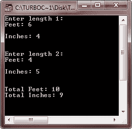
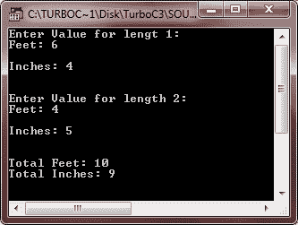

# C++ 将结构传递给函数

> 原文：<https://codescracker.com/cpp/cpp-pasing-structures-to-functions.htm>

到目前为止，前面例子中使用的所有结构都是全局的，因此可用于程序中的所有函数。但是，如果您有一个函数的局部结构，并且需要将它的值传递给另一个函数，那么可以通过两种方式实现:

*   通过传递单个结构元素
*   通过传递整个结构

这两种方法都可以通过按值调用和按引用调用传递变量的方法来实现。下面详细讨论这些。

## 将结构元素传递给函数

当一个结构的元素被传递给一个函数时，你实际上是在传递这个元素的值给这个函数。因此，它就像传递一个简单变量一样(当然，除非这个元素很复杂，比如一个字符数组)。例如，考虑以下结构:

```
struct date
{
   short day ;
   short month ;
   short year ;
}Bdate ;
```

此结构的单个元素可以按如下方式传递:

```
func1(Bdate.day, Bdate.month, Bdate.year) ;
```

上面的函数调用通过传递结构 Bdate 的各个结构元素的值来调用函数 func1()。

该函数可以通过为值创建自己的副本(通过值调用)或通过为原始变量创建引用(通过引用调用)来接收值。如果您希望结构元素的值不被函数改变，那么您应该通过值传递结构元素，如果您希望函数改变原始值，那么您应该通过引用传递结构元素。

**但是请记住**如果结构元素之一恰好是一个数组，它将自动通过引用传递，因为数组不能通过值传递。

## 将整个结构传递给函数

当结构相对紧凑时，传递整个结构最有意义。整个结构可以通过值和引用两种方式传递给函数。当原始值不变时，按值传递很有用，当原始值要变时，按引用传递很有用。

## C++ 通过值将结构传递给函数调用

当结构用作函数的参数时，整个结构使用标准的按值调用方法传递。当然，这意味着对传递给它的函数内部的结构内容的任何更改都不会影响用作参数的结构。

传递的结构的接收参数必须与传递的结构的类型匹配。

## 通过值将结构传递给函数调用示例

考虑下面的示例程序，演示如何通过按值调用方法将结构传递给函数:

```
/* C++ Passing Structure to Function - Call by Value */

#include<iostream.h>
#include<conio.h>

struct distance
{
   int feet;
   int inches;
};

void prnsum(distance l1, distance l2);  // function prototype
void main()
{
   clrscr();

   distance length1, length2;   // two structures of type distance declared

   /* Read values for length1 */
   cout<<"Enter length 1:\n";
   cout<<"Feet: ";
   cin>>length1.feet;
   cout<<"\nInches: ";
   cin>>length1.inches;

   /* Read values for length2 */
   cout<<"\n\nEnter length 2:\n";
   cout<<"Feet: ";
   cin>>length2.feet;
   cout<<"\nInches: ";
   cin>>length2.inches;
   prnsum(length1, length2);      // print sum of length1 and length2

   getch();

}     // end of main()

void prnsum(distance l1, distance l2)
{
   distance l3;      // new structure
   l3.feet=l1.feet+l2.feet+(l1.inches+l2.inches)/12;  // 1 feet=12 inches
   l3.inches=(l1.inches+l2.inches)%12;
   cout<<"\n\nTotal Feet: "<<l3.feet<<"\n";
   cout<<"Total Inches: "<<l3.inches;
}
```

当编译并执行上述 C++ 程序时，它将产生以下输出:



上面的程序输入两个距离类型的结构 length1 和 length2，并打印两者的和。

通过按值传递两个结构 length1 和 length2 来调用函数 prnsum()，该函数计算这两个结构的和并打印出来。函数 prnsum()为长度 1 和长度 2 创建自己的副本，即 l1 和 l2，并使用它。因此，原始副本长度 1 和长度 2 保持不变。

## 通过引用将结构传递给函数调用

结构可以像其他简单类型一样通过引用传递。当通过引用传递结构时，被调用的函数声明对被传递结构的引用，并通过其引用引用原始结构元素。因此，被调用的函数使用原始值。

## 通过引用示例将结构传递给函数调用

下面的示例程序说明了通过引用方法调用将结构传递给函数:

```
/* C++ Passing Structure to Function
 * Passing Structure to Function with
 * Call by Reference Method in C++ */

#include<iostream.h>
#include<conio.h>

struct distance
{
   int feet;
   int inches;
};

void prnsum(distance &l1, distance &l2);  // watch the declaration

void main()
{
   clrscr();

   distance length1, length2;   // two structures of type distance declared

   /* Read values for length1 */
   cout<<"Enter Value for length 1:\n";
   cout<<"Feet: ";
   cin>>length1.feet;
   cout<<"\nInches: ";
   cin>>length1.inches;

   /* Read values for length2 */
   cout<<"\n\nEnter Value for length 2:\n";
   cout<<"Feet: ";
   cin>>length2.feet;
   cout<<"\nInches: ";
   cin>>length2.inches;
   prnsum(length1, length2);   // print sum of length1 and length2

   getch();
}

void prnsum(distance &l1, distance &l2)
{
   distance l3;          // new structure created
   l3.feet=l1.feet+l2.feet+(l1.inches+l2.inches)/12;  // 1 feet=12 inches
   l3.inches=(l1.inches+l2.inches)%12;
   cout<<"\n\nTotal Feet: "<<l3.feet<<"\n";
   cout<<"Total Inches: "<<l3.inches;
}
```

当编译并执行上述 C++ 程序时，它将产生以下输出:



上面的程序通过引用传递结构 length1 和 length2 来调用 prnsum()。函数 prnsum()为结构 length1 和 length2 创建了引用 l1 和 l2，因此分别使用了名为 l1 和 l2 的原始结构 length1 和 length2。

## 从 C++ 中的函数返回结构

就像其他类型一样，函数也可以返回结构。则函数的返回类型与返回的结构类型相同。例如，如果函数 prnsum()(上述两个程序，即 1 号程序和 2 号程序)必须返回一个 distance 类型的结构，其声明将如下所示:

```
distance prnsum(distance L1, L2) ;
```

看，prnsum()的返回类型是距离。对于 1 号程序，即当结构通过值和 as 传递时

```
distance prnsum(distance &L1, distance &L2) ;
```

对于程序 2，即当结构通过引用传递时。1 号程序的函数 prnsum()的定义如下:

```
distance prnsum(distance L1, distance L2)
{
   distance L3 ;
   L3.feet = L1.feet + L2.feet + (L1.inches + L2.inches) / 12 ;     // 1 feet = 12 inches
   L3.inches = (L1.inches + L2.inches) % 12 ;
   return L3 ;        // structure returned
}
```

如果函数 prnsum()的返回值被赋给一个变量，那么这个变量必须是一个 distance 类型的结构变量。例如，请注意下面的代码片段:

```
:
distance total ;
total = prnsum(length1, length2) ;
cout << total.feet << "  " << total.inches ;
```

上面的代码片段将函数 prnsum()的返回值存储到同样是 distance 类型的结构 total 中，然后打印结构元素的值。函数 prnsum()返回一个结构并通过引用调用。

一个函数甚至可以返回一个对结构的引用。例如，考虑以下函数:

```
distance & sum (distance L1, distance L2) ;     //notice the declaration
distance L3 ;        // global structure declared
/* Function Definition follows */
distance & sum (distance L1, distance L2)
{
   L3.feet = L1.feet + L2.feet + (L1.inches + L2.inches) / 12 ;
   L3.inches = (L1.inches + L2.inches) % 12 ;
   return L3 ;
}
```

上述函数返回对结构 L3 的引用。当函数返回一个引用时，它返回一个变量的左值(位置值)而不是右值(数据值)。

[C++ 在线测试](/exam/showtest.php?subid=3)

* * *

* * *