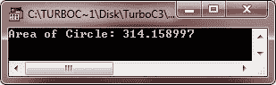

# c++ #定义

> 原文：<https://codescracker.com/cpp/cpp-hash-define-preprocessor-directive.htm>

预处理命令称为指令，以井号或井号(#)开头。#前不应出现空格，末尾不需要分号。

在预处理阶段可以做的许多事情包括:

*   通过#include 指令包含其他文件
*   通过#define 指令定义符号常量和宏

通过一些预处理器指令，您还可以有条件地编译或执行一些预处理器指令。

**注意**——c++程序的预处理阶段发生在程序编译之前。C++预处理器是一个在源代码编译前执行的程序 。

您已经学会了使用#include 预处理程序指令，该指令允许您在程序中包含所需的头文件。这个讨论或者我们的讨论致力于#define 预处理器指令。

#define 预处理程序允许我们定义符号名和常量。举个例子，

```
#define PI 3.14159
```

这条语句将把程序中每一次出现的圆周率转换成 3.14159。

## c++ #定义示例

现在考虑完整的示例，其中 PI 的每次出现都将替换为值 3.14159，该值是用#define 指令定义的。

```
/* C++ #define - Example Program of #define */

#include<iostream.h>
#include<conio.h>

#define PI 3.14159

void main()
{
   clrscr();

   int r = 10;
   float cir;
   cir = PI * (r * r);
   cout<<"Area of Circle: "<<cir<<endl;

   getch();
}
```

以下是上述 C++程序的示例输出:



#define 允许您在编译程序之前进行文本替换。这里有一个例子:

```
#define MAX 70
```

在编译之前，如果 C++预处理器发现 MAX 是一个单词(所以像 MAXIMUM 这样的单词不会受到影响)，那么在源代码中，它会用数字 70 替换它。如果 MAX 是字符串的一部分(例如，在 cout 的引号之间)，预处理器将不会处理它。

您可以将宏定义命名为任何名称，只要它不包含特殊字符或空格，并且不能以数字开头。我倾向于使用大写字母和下划线。您也可以定义字符串:

```
#define NAME "Computer Science C++"
```

每次预处理器看到 NAME，它就会用“计算机科学 C++”来代替它

这个特性对于定义“神奇”数字特别有用。#define 的一个高级用途是创建宏。要了解关于预处理器的更多信息，请参考 [C++预处理器](/cpp/cpp-preprocessors.htm)。

[C++在线测试](/exam/showtest.php?subid=3)

* * *

* * *