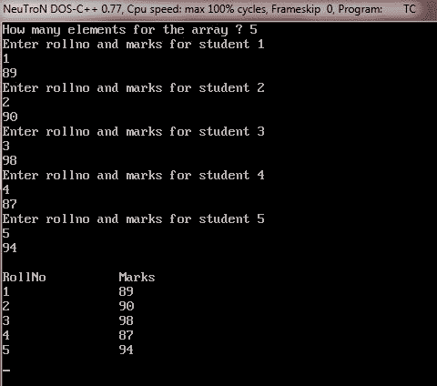
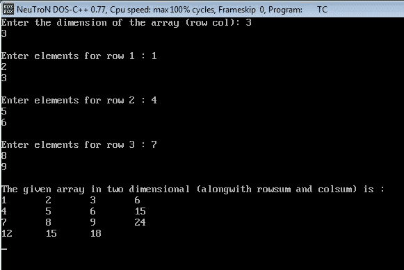

# C++ 动态内存分配

> 原文：<https://codescracker.com/cpp/cpp-dynamic-allocation-operators.htm>

指针为 C++ 强大的动态内存分配系统提供了必要的支持。

动态分配是程序在运行时获取内存的方法。

全局和局部变量在编译时被分配内存。但是，您不能在运行时添加任何全局或局部变量。如果你的程序需要使用可变数量的内存怎么办？在这种情况下，您需要在运行时按需分配内存。当然，这里的动态分配例程可以满足这个目的。

## C++ 动态内存分配运算符

C++ 动态分配例程从[自由存储](/cpp/cpp-free-store.htm)、 提供给程序的未分配堆内存池中获取内存进行分配。C++ 定义了两个一元操作符 new 和 delete，它们在运行时执行分配和释放(释放)内存的任务。因为这些操作符 new 和 delete 是在空闲存储内存上操作的，所以它们也被称为空闲存储操作符。

运算符 new 可用于创建所有类型的对象，包括类名。

使用 new 创建对象的一般形式如下:

```
pointer-variable = new data-type ;
```

其中数据类型是任何有效的 C++ 数据类型，指针类型是数据类型的指针。操作符 new 将分配大小等于指定数据类型大小的内存，并返回一个指向新分配区域的指针(指定数据类型的)。例如，下面的代码片段

```
iptr = new int ;
```

存储初始值将从空闲存储中分配足够的内存量来保存指定数据类型的值，并存储新分配的 iptr 内存的起始地址。因为 new 为 int 类型分配内存，所以接收指针也必须是 int 类型，也就是说，对于上面给定的赋值，iptr 必须是 int 类型。同样，对于以下作业

```
cptr = new char ;
fptr = new float ;
```

cptr 是 char 类型的指针，fptr 是 float 类型的指针。在上述赋值之前，指针 cptr 和 fptr 必须已经声明为适当类型的指针。或者，指针的声明和赋值可以按如下方式组合:

```
char ∗cptr = new char ;
float ∗fptr = new float ;
```

一旦指针指向新分配的内存，就可以使用指针的“at address”操作符将数据值存储在那里，如下所示:

```
∗cptr = 'a' ;
∗fptr = 17.32 ;
```

上面的赋值将把‘a’赋给新创建的 char 对象，把 17.32 赋给 float 对象。新分配的内存(通过 new)可以在分配时初始化。这是按如下方式完成的:

```
pointer-variable = new data-type (value) ;
```

其中 value 是要存储在新分配的内存中的初始值。该值还必须是指定的数据类型。

考虑以下陈述:

```
char ∗cptr = new char ('a') ;    //statement 1
float ∗fptr = new float (17.32) ;      //statement 2
```

上面给出的语句 1 将从空闲池中分配足够的内存来容纳一个字符，将“a”存储在这个新分配的内存中，并使字符指针 cptr 指向这个区域。类似地，语句 2 将从空闲池中分配足够的内存来保存浮点值，将 17.32 存储在这个新分配的内存中，并使浮点指针 fptr 指向这个区域。

## 在 C++ 中创建动态数组

new 运算符还可以为用户定义的类型(如结构、数组和类)分配内存。要为一维数组分配内存，可以使用以下形式的 new:

```
pointer-variable = new data-type[size] ;
```

其中 size 是一维数组的大小，即数组中元素的数量。为了给一个 int 数组值[10]分配内存空间，我们给出

```
int ∗ value = new int[10] ;
```

它将从空闲存储中为 10 个整数的数组创建内存空间。现在，value[0]将引用数组的第一个元素，value[1]将引用第二个元素，依此类推。在 C++ 11 到来之前，不能为数组指定初始化器。

但是 C++ 11 标准允许你用一个初始化列表来初始化动态数组，

```
int ∗value = new int[5] {11, 12, 13, 14, 15} ;
```

**注意**——由 new 创建的对象的生存期并不局限于它被创建的范围。它存在于内存中，直到使用删除操作符明确地删除了 。

当不再需要通过 new 创建的对象时，必须销毁它，以便释放它所占用的内存空间供重用。这可以在 C++ 的内存释放操作符 delete operator 的帮助下完成。删除的一般形式如下所示:

```
delete pointer-variable ;
```

其中指针变量是指向用 new 创建的数据对象的指针。举个例子，

```
delete iptr ;
```

通过 new 分配的数组使用以下形式的 delete 来释放:

```
delete[size] pointer-variable ;
```

其中 size 是指针变量指向的数组中元素的数量。

但是，在 C++ 的最新版本中，大小不是必需的，如下所示:

```
delete[] array-pointer-variable ;
```

## C++ 动态内存分配示例

下面的例子演示了 C++ 中的动态内存分配，或者演示了 C++ 中 new 和 delete 操作符的工作原理

```
/* C++ Dynamic Memory Allocation Example Program */

#include<iostream.h>
#include<conio.h>
#include<stdlib.h>

int *rollno;    // declares an integer pointer
float *marks;   // declares a float pointer

void main()
{
   clrscr();
   int size, i;
   cout<<"How many elements for the array ? ";
   cin>>size;
   rollno = new int[size];    // dynamically allocate rollno array
   marks = new float[size];        // dynamically allocate marks array

   // first check, whether the memory is available or not
   if((!rollno) || (!marks))       // if rollno or marks is null pointer
   {
      cout<<"Out of Memory..!!..Aborting..!!\n";
      cout<<"Press any key to exit..";
      getch();
      exit(1);
   }

   // read values in the array elements
   for(i=0; i<size; i++)
   {
      cout<<"Enter rollno and marks for student "<<(i+1)<<"\n";
      cin>>rollno[i]>>marks[i];
   }

   // now display the array contents
   cout<<"\nRollNo\t\tMarks\n";
   for(i=0; i<size; i++)
   {
      cout<<rollno[i]<<"\t\t"<<marks[i]<<"\n";
   }

   delete[]rollno;    // deallocating rollno array
   delete[]marks;     // deallocating marks array

   getch();
}
```

下面是上述 C++ 程序的运行示例，演示了 C++ 中的操作符 new 和 delete



正如你所看到的，上面的 C++ 程序首先要求用户输入数组的大小，然后动态地为他们分配空间。如果没有足够的可用空间，它将在显示错误消息后退出。如果有足够的可用空间，它会将数据读入数组并最终显示出来。在退出程序之前，它使用 delete 操作符释放被占用的空间，以便可以重用。

下面是另一个 C++ 示例程序，演示了相同的概念，即 C++ 的 new 和 delete 操作符的工作原理，或者演示了 C++ 中的动态内存分配。但是在这个版本的 C++ 程序中，使用的数组是二维数组。这个 C++ 程序读取一个二维数组，然后将它们连同行和列和一起打印到屏幕上。

```
/* C++ Dynamic Memory Allocation Example Program
 * This is the same program as above, but this
 * program uses two-dimensional array to demonstrates
 * dynamic memory allocation in C++. This C++ program
 * also displays the rowsum and the colsum of the array */

#include<iostream.h>
#include<conio.h>
#include<stdlib.h>
void main()
{
   clrscr();
   int *val, *rows, *cols;
   int maxr, maxc, i, j;
   cout<<"Enter the dimension of the array (row col): ";
   cin>>maxr>>maxc;
   val = new int[maxr * maxc];
   rows = new int[maxr];
   cols = new int[maxc];

   for(i=0; i<maxr; i++)
   {
      cout<<"\nEnter elements for row "<<i+1<<" : ";
      rows[i] = 0;
      for(j=0; j<maxc; j++)
      {
         cin>>val[i*maxc + j];
         rows[i] = rows[i] + val[i*maxc + j];
      }
   }

   for(j=0; j<maxc; j++)
   {
      cols[j] = 0;
      for(i=0; i<maxr; i++)
      {
         cols[j] = cols[j] + val[i*maxc + j];
      }
   }

   cout<<"\nThe given array in two dimensional (alongwith rowsum and colsum) is :\n";
   for(i=0; i<maxr; i++)
   {
      for(j=0; j<maxc; j++)
      {
         cout<<val[i*maxc + j]<<"\t";
      }
      cout<<rows[i]<<"\n";
   }

   for(j=0; j<maxc; j++)
   {
      cout<<cols[j]<<"\t";
   }
   cout<<"\n";

   getch();
}
```

下面是上述 C++ 程序的运行示例。这是包含 rowsum 和 colsum 的数组:



## C++ 中的内存泄漏

不正确地使用 new 和 delete 可能会导致内存泄漏。确保通过 new 分配的内存必须通过 delete 正确删除。

毫无疑问，new 和 delete 非常有用。但是它们有一个相关的问题，就是很容易忘记删除以前用 new 分配的内存，留下一个孤立的黑色内存块——这个内存块仍然是分配的，但是没有引用它的内存块。

某个函数动态地分配内存给某个对象，但忘记释放保留的内存，每次执行时都会消耗一定量的内存。因此，每次运行都会有一部分内存消失，最终消耗的内存量会对系统产生负面影响。这种情况称为内存泄漏。

许多可能的原因导致了内存泄漏的情况。其中最常见的是:

*   忘记删除已经动态分配的内容(例如，使用 new)
*   没有注意到在某些情况下代码可能会绕过 delete 语句
*   将新语句的结果赋给已经指向已分配对象的指针。

在编写程序时，必须小心处理这些导致内存泄漏的原因。

[C++ 在线测试](/exam/showtest.php?subid=3)

* * *

* * *