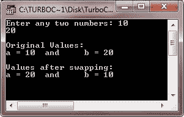
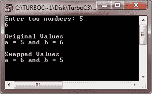
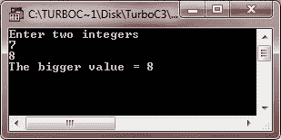
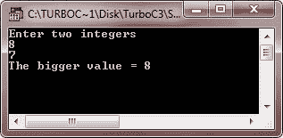
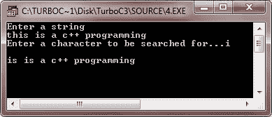

# C++指针和函数

> 原文：<https://codescracker.com/cpp/cpp-pointers-functions.htm>

函数是用户定义的操作，可以通过将调用运算符(“()”)应用于函数名来调用。如果函数期望接收参数，这些参数(实际参数)被放在调用操作符中。参数用逗号分隔。可以通过以下两种方式之一调用函数:

*   按值调用
*   引用调用

在第一种方法中，调用函数中每个实参的“值”被复制到被调用函数的相应形参上。被调用函数使用操作它自己的参数副本，因此，对被调用函数中形式参数的更改不会影响调用函数中实际参数的值。

第二种方法本身有两种用法:

*   通过传递引用
*   通过传递指针

由于引用调用方法有两种用法，我们必须非常熟悉引用和指针。

引用是变量的别名。例如，下面的代码

```
float value = 1700.25 ;
float & amt = value ;      // amt reference of value
```

将 amt 声明为变量值的别名。没有为 amt 分配单独的内存，而变量值现在可以用两个名字 value 和 amt 访问。

另一方面，指向变量的指针保存着它的内存地址，通过这个地址可以直接访问存储变量数据值的内存区域。例如，下面的代码

```
float value = 1700.25 ;
float ∗fp = &value ;      // fp stores the address of value
```

使浮点指针∫FP 指向浮点变量值。变量值现在也可以通过 fp 来访问(使用∫FP)。

变量值现在可以用以下任何一种方式打印:

```
cout << value ;       // using variable name
cout << amt ;       // using reference name
cout << ∗fp ;        // using the pointer
```

## 在 C++中通过传递引用来调用函数

当参数通过引用传递给函数时，形参就成为调用函数中实际参数的引用(或别名)。这意味着(在这个方法中)被调用的函数不创建它自己的原始值的副本，而是通过不同的名称引用原始值，即它们的引用。因此，被调用的函数使用原始数据，值的任何变化都会反映到数据中。

引用调用方法在使用函数改变原始变量的值的情况下很有用。

### 例子

让我们举一个例子，以实际的方式演示这个概念。

```
/* C++ Pointers and Functions. This C++ program
 * demonstrates about invoking the functions by
 * passing the references in C++ */

#include<iostream.h>
#include<conio.h>
void swap(int &, int &);
void main()
{
   clrscr();
   int a, b;

   cout<<"Enter any two numbers: ";
   cin>>a>>b;
   cout<<"\nOriginal Values:\n";
   cout<<"a = "<<a<<"\tand\tb = "<<b<<"\n";
   swap(a, b);
   cout<<"\nValues after swapping:\n";
   cout<<"a = "<<a<<"\tand\tb = "<<b<<"\n";

   getch();
}
void swap(int &x, int &y)
{
   int temp;
   temp = x;
   x = y;
   y = temp;
}
```

下面是这个 C++程序的运行示例:



## 在 C++中通过传递指针来调用函数

当指针传递给函数时，调用函数中实际参数的地址被复制到被调用函数的形参中。这意味着使用被调用函数中的形式参数(原始值的地址)，我们可以改变调用函数的实际参数。因此，在这里，被调用的函数也不创建原始值的副本，而是通过它接收的地址(通过指针传递)引用原始值。

### 例子

以下示例将通过指针传递地址来交换两个值:

```
/* C++ Pointers and Functions. This C++ program
 * demonstrates about invoking the functions by
 * passing the pointers in C++ */

#include<iostream.h>
#include<conio.h>
void swap(int *x, int *y);
void main()
{
   clrscr();
   int a, b;
   cout<<"Enter two numbers: ";
   cin>>a>>b;
   cout<<"\nOriginal Values\n";
   cout<<"a = "<<a<<" and b = "<<b<<"\n";
   swap(&a, &b);
   cout<<"\nSwapped Values\n";
   cout<<"a = "<<a<<" and b = "<<b<<"\n";
   getch();
}
void swap(int *x, int *y)
{
   int temp;
   temp = *x;
   *x = *y;
   *y = temp;
}
```

当编译并执行上述 C++程序时，它将产生以下输出:



上面的程序通过传递 a 和 b 的地址来调用 swap()；参见函数调用语句

```
swap(&a, &b);
```

&a 和&b 分别传递 a 和 b 的地址。

函数定义接收相应指针 x 和 y 中的输入地址。

## C++中通过引用返回的函数

函数也可以返回一个引用，即别名。考虑以下函数:

```
float & min(float &a, float &b)
{
   if(a < b)
   {
      return a ;
   }
   else
   {
      return b ;
   }
}
```

上面的函数 min()的返回类型是 float &也就是说，该函数返回一个对变量的 float 类型的引用。上面的函数返回对 a 或 b 的引用，这取决于两者中哪个更小。它不返回任何值。函数调用 min(x，y)将产生对 a 或 b 中较小者的引用。这意味着如果你想将两个值中的最小值设置为-1，那么你可以在赋值语句的左边使用这个函数，因为它返回一个变量的引用。它将如下所示完成:

```
min(x, y) = -1 ;
```

上述语句将-1 赋给两个 x 和 y 中较小的值。

**提示** -返回引用的函数可以出现在赋值语句的左侧。

## C++中返回指针的函数

函数可以返回 int、float、double、reference 或任何其他数据类型，它甚至可以返回一个指针。但是，函数声明必须替换它。也就是说，应该在函数的原型中明确地提到它。返回指针的函数的原型的一般形式是

```
type ∗ function-name(argument list) ;
```

其中 type 指定由 function-name 指定的函数返回的指针类型(int、float、double 或任何其他数据类型)。返回指针的函数的返回类型必须是已知的，因为指针算法是相对于其基类型的，编译器必须知道指针所指向的数据类型，以便使它指向下一个数据项。

### 例子

下面的示例程序说明了如何从函数中返回指针:

```
/* C++ Pointers and Functions. This C++ program
 * demonstrates about functions returning
 * pointers in C++ */

#include<iostream.h>
#include<conio.h>
int *biger(int &, int &);
void main()
{
   clrscr();
   int num1, num2, *c;
   cout<<"Enter two integers\n";
   cin>>num1>>num2;
   c = biger(num1, num2);
   cout<<"The bigger value = "<<*c;
   getch();
}
int *biger(int &x, int &y)
{
   if(x>y)
   {
      return(&x);
   }
   else
   {
      return(&y);
   }
}
```

当编译并执行上述程序时，它将产生以下输出:




上面的程序通过引用函数 big()传递两个整数，该函数比较传递给它的两个整数值，并返回较大值的内存地址。由于 big()的返回值是 int∫即一个 int 指针，所以在 int 指针 c 中接收(注意语句 c = big(a，b)；).然后指针 c 指向的值被打印在屏幕上。

函数返回指针的概念可以在处理字符串时使用。这里有一个程序来说明这一点

```
/* C++ Pointers and Functions. This C++ program
 * search for a given character inside a string
 * and to print the string from the point of match.
 * This program demonstrates the concept of
 * function returning pointers in C++ */

#include<iostream.h>
#include<conio.h>
char *match(char, char *);
void main()
{
   clrscr();
   char str[80];
   char *cptr, ch;
   cout<<"Enter a string\n";
   cin.getline(str, 80);
   cout<<"Enter a character to be searched for...";
   cin>>ch;
   cptr = NULL;
   cptr = match(ch, str);
   if(*cptr)
   {
      cout<<"\n";
      for(; (*cptr != '\0'); cptr++)
      {
         cout<<*cptr;
      }
   }
   else
   {
      cout<<"No match found..!!";
   }
   getch();
}
char *match(char c, char *s)
{
   while((c != *s) && (*s))
   {
      s++;
   }
   return(s);
}
```

下面是上述 C++程序的运行示例:



[C++在线测试](/exam/showtest.php?subid=3)

* * *

* * *