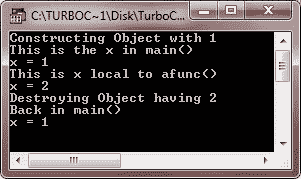
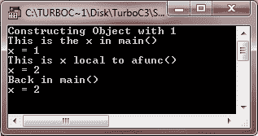

# C++ 对象作为函数参数

> 原文：<https://codescracker.com/cpp/cpp-objects-as-function-arguments.htm>

对象传递给函数的方式与传递任何其他类型的变量的方式相同。也就是说，对象可以双向传递:通过按值调用或通过按引用调用机制。我们来讨论一下这些机制。

## C++ 通过按值调用传递对象

当说对象通过按值调用机制传递时，这意味着被调用的函数创建了被传递对象的副本。然而，创建副本的事实实质上意味着创建了另一个对象。这提出了两个相关的问题:

*   当复制传递的对象时，是否执行对象的构造函数？
*   销毁副本时是否执行析构函数？

让我们来看看下面的 C++ 程序，找出上述问题的答案:

```
/* C++ Objects as Function Arguments */

#include<iostream.h>
#include<conio.h>
class Sample
{
   int x;
   public:
      Sample(int i)  // constructor
      {
         x = i;
         cout<<"Constructing Object with "<<i<<"\n";
      }
      ~Sample()      // destructor
      {
         cout<<"Destroying Object having "<<x<<"\n";
      }
      void put_x(int i)
      {
         x = i;
      }
      int get_x(void)
      {
         return x;
      }
};
void afunc(Sample S1)
{
   S1.put_x(2) ;      // change value of x in the object
   cout<<"This is x local to afunc()\n";
   cout<<"x = "<<S1.get_x()<<"\n";
}
void main()
{
   clrscr();
   Sample S(1);      // create object with value 1
   cout<<"This is the x in main()\n";
   cout<<"x = "<<S.get_x()<<"\n";
   afunc(S);        // pass object S by value to afunc()
   cout<<"Back in main()\n";
   cout<<"x = "<<S.get_x()<<"\n";
   getch();
}
```

当编译并执行上述 C++ 程序时，它将产生以下输出:



**注意**执行了两次对析构函数的调用，但是只调用了一次构造函数。从输出中可以清楚地看到，当 afunc()创建 S 的副本时，没有调用 构造函数。这样做的原因是当一个对象被传递给一个函数 (通过值调用机制)时，对象的当前状态被传递。如果被调用的函数调用构造函数，就会发生(对象的)初始化 ，可能会改变对象。因此，当一个函数接收一个对象作为它的参数 时，不涉及构造函数，而是它为被调用函数复制被传递对象的成员，并作为被传递对象的副本。

**注意**——一个被调用的函数接收一个对象作为参数，在不调用构造函数的情况下创建该对象的副本。然而，当函数 终止时，它通过调用析构函数销毁对象的副本。

然而，在从函数返回之前，销毁被调用函数正在处理的对象的副本是非常必要的。因此，当这个副本被销毁时，析构函数必须被执行。

## C++ 通过引用传递对象

正如您所知道的，当一个对象通过值传递给一个函数时，该对象的副本是在不调用其构造函数的情况下生成的。但是，当函数终止时，会调用副本的析构函数。

如果您希望被调用的函数使用原始对象，这样就不需要创建和销毁它的副本，您可以传递对象的引用。然后，被调用的函数使用其引用或别名来引用原始对象。以下程序说明了这一点:

```
/* C++ Objects as Function Arguments */

#include<iostream.h>
#include<conio.h>
class Sample
{
   int x;
   public:
      Sample(int i)
      {
         x = i;
         cout<<"Constructing Object with "<<i<<"\n";
      }
      ~Sample()
      {
         cout<<"Destroying Object having "<<x<<"\n";
      }
      void put_x(int i)
      {
         x = i;
      }
      int get_x(void)
      {
         return x;
      }
};
void afunc(Sample &amp; S1)
{
   S1.put_x(2);
   cout<<"This is x local to afunc()\n";
   cout<<"x = "<<S1.get_x()<<"\n";
}
void main()
{
   clrscr();
   Sample S(1);
   cout<<"This is the x in main()\n";
   cout<<"x = "<<S.get_x()<<"\n";
   afunc(S);
   cout<<"Back in main()\n";
   cout<<"x = "<<S.get_x()<<"\n";
   getch();
}
```

当编译并执行上述 C++ 程序时，它将产生以下输出:



现在将这个输出与前一个程序的输出进行比较。与前面的输出相反，这里只调用了一次构造函数和一次析构函数。这是因为当对象通过引用传递给函数时，afunc()的形参(这里是 S1)就变成了实参(这里是别名)的引用。这意味着被调用的函数 afunc()引用了具有别名的原始对象；它不会复制传递的对象。因此，没有调用任何构造函数，因为没有创建新的对象。

此外，当函数 afunc()终止时，不会调用析构函数，因为对于要销毁的 afunc()不存在任何专用的对象副本。

但是，当对象 S 被语句 Sample S(1)声明时，构造函数被调用；而析构函数是在这个对象 S 被销毁的时候，也就是 main()终止的时候调用的。

当通过引用传递参数时，请记住对函数内部对象的更改会影响调用对象。

[C++ 在线测试](/exam/showtest.php?subid=3)

* * *

* * *