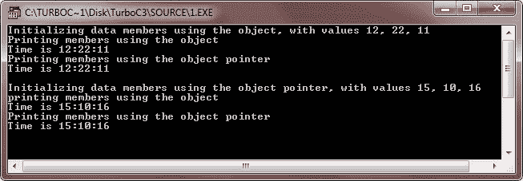
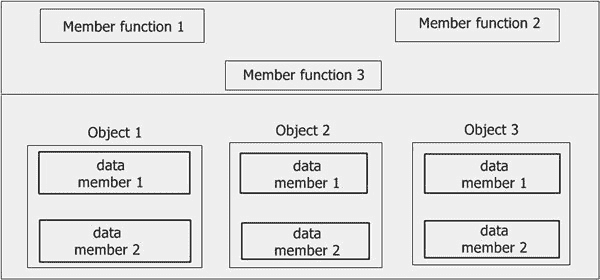
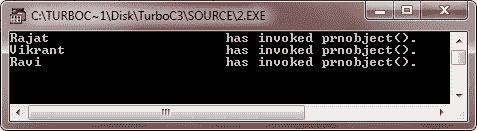

# C++ 指针和对象

> 原文：<https://codescracker.com/cpp/cpp-pointers-objects.htm>

C++ 允许你拥有指向对象的指针。指向对象的指针称为对象指针。

## C++ 声明和对象指针的使用

就像其他指针一样，对象指针是通过放在对象指针名称的前面来声明的。它采用以下一般形式:

```
class-name ∗ object-pointer ;
```

其中 class-name 是已经定义的类的名称，object-pointer 是指向该类类型的对象的指针。例如，要将 optr 声明为 Sample 类类型的对象指针，我们应该编写

```
Sample ∗optr ;
```

其中样本是已经定义的类。当使用对象指针访问类的成员时，使用箭头操作符(-->)而不是点操作符。

下面的程序演示了如何访问一个给定了指针的对象。这个 C++ 程序演示了对象指针的使用

```
/* C++ Pointers and Objects. Declaration and Use
 * of Pointers. This program demonstrates the
 * use of pointers in C++ */

#include<iostream.h>
#include<conio.h>
class Time
{
   short int hh, mm, ss;
   public:
      Time()
      {
         hh = mm = ss = 0;
      }
      void getdata(int i, int j, int k)
      {
         hh = i;
         mm = j;
         ss = k;
      }
      void prndata(void)
      {
         cout<<"\nTime is "<<hh<<":"<<mm<<":"<<ss<<"\n";
      }
};
void main()
{
   clrscr();
   Time T1, *tptr;
   cout<<"Initializing data members using the object, with values 12, 22, 11\n";
   T1.getdata(12,22,11);
   cout<<"Printing members using the object ";
   T1.prndata();
   tptr = &T1;
   cout<<"Printing members using the object pointer ";
   tptr->prndata();
   cout<<"\nInitializing data members using the object pointer, with values 15, 10, 16\n";
   tptr->getdata(15, 10, 16);
   cout<<"printing members using the object ";
   T1.prndata();
   cout<<"Printing members using the object pointer ";
   tptr->prndata();
   getch();
}
```

在编译和执行上述程序时，它将产生以下输出:



上面的程序不言自明。使用对象访问公共成员时使用点运算符，使用对象指针访问公共成员时使用箭头运算符。

正如你所知道的，当指针递增时，它指向该类型的下一个元素。指向对象的指针也是如此。

## C++ 这个指针

一旦定义了一个类，成员函数就被创建并只放在内存空间中一次。也就是说，只维护一个成员函数的副本，由该类的所有对象共享。仅为每个对象单独分配数据成员的空间(见下图)。



这有一个相关的问题。如果一个成员函数只有一个实例，那么如何知道哪个对象的数据成员将被操作呢？例如，如果成员函数 3 能够更改数据成员 2 的值，而我们想要更改对象 1 的数据成员 2 的值。成员函数 3 如何知道哪个对象的数据成员 2 将被改变？

这个问题的答案就是这个指针。当成员函数被调用时，它会被自动传递一个隐式(内置)参数，该参数是指向调用该函数的对象的指针。这个指针叫做这个。也就是说，如果对象 1 正在调用成员函数 3，则指向对象 1 的隐式参数被传递给成员函数 3，即，该指针现在指向对象 1。这个指针可以被认为类似于 ATM 卡。例如，在一家银行有许多账户。账户持有人可以通过自动取款机取钱或查看银行对账单。现在，这些自动取款机可以从银行的任何账户中取款，但是它们应该在哪个账户上工作呢？这是通过 ATM 卡解决的，ATM 卡提供用户及其账户的身份证明，从那里取款。

类似地，this 指针是对象的 ATM 卡，它标识当前调用的对象。this 指针存储当前调用对象的地址。为了理解这一点，考虑下面的示例程序(下面的程序说明了这个指针的功能) :

```
/* C++ Pointers and Objects. The this pointer.
 * This C++ program demonstrates about the this
 * pointer in C++ */

#include<iostream.h>
#include<conio.h>
#include<string.h>
class Salesman
{
   char name[1200];
   float total_sales;
   public:
      Salesman(char *s, float f)
      {
         strcpy(name, "");
         strcpy(name, s);
         total_sales = f;
      }
      void prnobject(void)
      {
         cout.write(this->name, 26);         // use of this pointer
         cout<<" has invoked prnobject().\n";
      }
};
void main()
{
   clrscr();
   Salesman Rajat("Rajat", 21450), Ravi("Ravi", 23190), Vikrant("Vikrant", 19142);
   /* above statement creates three objects */
   Rajat.prnobject();
   Vikrant.prnobject();
   Ravi.prnobject();
   getch();
}
```

上面的 C++ 程序会产生以下输出:



从上面的输出可以明显看出，当对象 Rajat 调用成员函数 prnobject()时，它指向 Rajat，从而打印出 Rajat 的名称数据成员。同样，这也指向了调用 prnobject()时的 Vikrant 和 Ravi 对象。

在成员函数中，可以直接访问类的成员，无需任何对象或类限定。因此，在 prnobject()中，语句:

```
cout.write(this->name, 26) ;
```

与相同

```
cout.write(name,26);
```

**记得**，this 指针指向被调用的对象 prnobject()。因此，这个- >名指的是那个对象的复制名。 (这个)是指物体本身。用(*this)，点(。)运算符来访问 对象的成员元素，因为它不是对象的指针，而是对象本身。

[C++ 在线测试](/exam/showtest.php?subid=3)

* * *

* * *