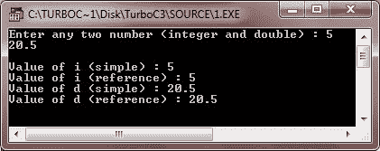

# C++参考

> 原文：<https://codescracker.com/cpp/cpp-references.htm>

引用用于操作 C++程序中任何现有变量的内存地址:

## 在 C++中创建引用

在 C++中创建引用变量。让我们看看下面的例子。这里有一个简单变量的定义。

```
int i = 17;
```

我们可以这样声明 I 的引用变量:

```
int& ir = i;
```

阅读这些声明中的&作为参考。

## C++参考示例

下面是一个示例程序，演示了如何在 int 和 double 上使用引用:

```
/* C++ References */

#include<iostream.h>
#include<conio.h>
void main()
{
   clrscr();
   int i;
   double d;
   int &ir = i;
   double &dr = d;
   cout<<"Enter any two number (integer and double) : ";
   cin>>i>>d;
   cout<<"\nValue of i (simple) : "<<i<<"\n";
   cout << "Value of i (reference) : "<<ir<<"\n";
   cout<<"Value of d (simple) : "<<d<<"\n";
   cout<<"Value of d (reference) : "<<dr<<"\n";
   getch();
}
```

下面是上述 C++程序的运行示例:



[C++在线测试](/exam/showtest.php?subid=3)

* * *

* * *