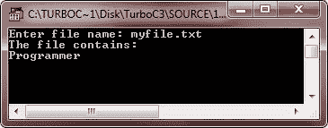

# C++ 文件处理

> 原文：<https://codescracker.com/cpp/cpp-data-file-handling.htm>

有时，将用户输入的信息存储到文件中以备将来使用是很重要的。将信息存储到文件中后，您可以从该文件中检索这些信息。文件有助于永久保存信息。

文件本身是存储在一些存储设备上的一串字节，如磁带或磁盘等。在 C++ 中，文件输入/输出操作是通过 C++ 标准库的组件头文件 fstream.h 来执行的。

在 C++ 中，是一个文件

*   在最底层，被简单地解释为一个字节序列或流。
*   在用户级——由一系列混合的数据类型组成，比如字符、算术值、类对象

fstream.h 库预定义了一组操作，用于处理与文件相关的输入和输出操作。它定义了一些帮助执行文件输入和输出操作的类。

你将学到所有关于 C++ 文件处理的知识。C++ 文件处理分为单独的章节，例如

*   [C++ 文件处理](/cpp/cpp-data-file-handling.htm)
*   [C++ 文件流](/cpp/cpp-files-streams.htm)
*   [C++ 数据文件](/cpp/cpp-data-files.htm)
*   [C++ 打开&关闭文件](/cpp/cpp-opening-closing-files.htm)
*   [C++ 处理文件的步骤](/cpp/cpp-process-files-in-program.htm)
*   [C++ 改变流行为](/cpp/cpp-change-stream-behaviour.htm)
*   [C++ 对文件的顺序输入/输出操作](/cpp/cpp-sequential-io-with-files.htm)
*   [C++ 检测 EOF](/cpp/cpp-detecting-eof.htm)
*   [C++ 文件指针随机存取](/cpp/cpp-file-pointers-random-access.htm)
*   [C++ 二进制文件操作](/cpp/cpp-binary-files-basic-operations.htm)
*   [文件操作期间的 C++ 错误处理](/cpp/cpp-error-handling.htm)

## C++ 文件处理程序

让我们举一些例子来了解一下，在 C++ 中，文件处理对于存储用户输入的信息以备后用是多么有用。这里列出了一些示例程序，演示了如何在 C++ 中处理文件。如上所述，你将在不同的章节中学习所有关于在 C++ 中处理文件的知识。如果你以前有 C++ 文件处理的知识，那么你会发现阅读下面列出的例子会更好。否则，只看例子，并遵循下一个教程。过一段时间，你也会发现在 C++ 中处理文件更好更容易。

```
/* C++ File Handling - Store information into the file in C++ */

#include<iostream.h>
#include<conio.h>
#include<fstream.h>
void main()
{
   ofstream fout;
   char fname[20];
   char rec[80];
   clrscr();

   cout<<"Enter file name: ";
   cin>>fname;

   fout.open(fname, ios::out);
   cout<<"Enter a word: ";
   cin>>rec;
   fout<<rec;
   cout<<"Data inserted successfully..!!";

   fout.close();
   getch();
}
```

这里，这个 C++ 程序要求您输入一个文件名来创建/覆盖文件，然后要求您输入一个单词来将这个单词存储在文件中。下面是上述 C++ 程序的运行示例:


运行上述程序后，输入与上述输出相同的信息。你会发现，一个名为“myfile.txt”的文件上写着“程序员”。因此，以后您可以随时从这个文件中检索这个单词。

我们再举一个例子，知道如何检索这个单词。

```
/* C++ File Handling - Retrieve information from the file in C++ */

#include<iostream.h>
#include<conio.h>
#include<fstream.h>
void main()
{
   ifstream fin;
   char fname[20];
   char rec[80];
   clrscr();

   cout<<"Enter file name: ";
   cin>>fname;

   cout<<"The file contains:\n";
   fin.open(fname, ios::in);
   fin.get(rec, 80);
   cout<<rec;

   fin.close();
   getch();
}
```

以下是上述 C++ 程序的示例输出:



从上面的输出可以看出，这个单词是从我们之前用来存储单词(名为 programmer)的文件(名为 myfile.txt)中检索出来的。让我们再举一个例子。这是上述两个程序的修改后的完整版本。

```
/* C++ File Handling - This program demonstrates
 * how to handle file in C++. That is, how to
 * write some content to a file and retrieve
 * the content from the file to display it on
 * the screen in C++. */

#include<iostream.h>
#include<conio.h>
#include<fstream.h>
#include<stdlib.h>
void main()
{
   char rec[80], ch;
   ofstream fout("file.txt", ios::out);
   clrscr();

   cout<<"Enter 4 lines of information: \n";
   for(int i=0; i<4; i++)
   {
      cin.get(rec, 80);
      cin.get(ch);
      fout<<rec<<"\n";
   }
   fout.close();
   ifstream fin("file.txt", ios::in);
   fin.seekg(0);
   cout<<"\n";
   for(i=0; i<4; i++)
   {
      fin.get(rec, 80);
      fin.get(ch);
      cout<<rec<<"\n";
   }
   fin.close();
   getch();
}
```

下面是这个 C++ 程序的运行示例:


这里是上述程序的完整版本。这个程序是 C++ 文件处理程序的完整版本。

```
/* C++ File Handling - This is the complete
 * version of the C++ file handling program.
 * This program creates a file (entered by user)
 * and store some content (entered by user).
 * Then display those content (if user want)
 * on the output screen in C++ */

#include<iostream.h>
#include<conio.h>
#include<fstream.h>
#include<stdlib.h>
void main()
{
   char rec[80], ch;
   char fname[20];
   int count=0, i;
   char ans='y';
   clrscr();

   cout<<"Enter file name: ";
   cin.get(fname, 20);
   ofstream fout(fname, ios::out);

   if(!fout)
   {
      cout<<"Error in creating the file..!!\n";
      cout<<"Press any key to exit...\n";
      getch();
      exit(1);
   }
   cin.get(ch);

   cout<<"Enter information to store..\n";
   while(ans=='y' || ans=='Y')
   {
      cin.get(rec, 80);
      fout<<rec<<"\n";
      cout<<"Want to enter more ? (y/n).. ";
      cin>>ans;
      count++;
      cin.get(ch);
   }
   cout<<"\nThe information successfully stored in the file..!!\n";
   fout.close();

   cin.get(ch);
   cout<<"Want to see ? (y/n)..";
   cin>>ans;

   if(ans=='y' || ans=='Y')
   {
      ifstream fin(fname, ios::in);
      if(!fin)
      {
         cout<<"Error in opening the file..!!\n";
         cout<<"Press any key to exit..\n";
         getch();
         exit(2);
      }
      fin.seekg(0);
      cout<<"\n";

      cout<<"The file contains:\n";
      for(i=0; i<count; i++)
      {
         fin.get(rec, 80);
         fin.get(ch);
         cout<<rec<<"\n";
      }
      fin.close();
   }

   getch();
}
```

下面是上述 C++ 程序的两个运行示例:


### 更多示例

这里列出了更多文件处理的例子，您可以参考:

*   [读取文件](/cpp/program/cpp-program-read-file.htm)
*   [写入文件](/cpp/program/cpp-program-write-file.htm)
*   [读取&显示文件](/cpp/program/cpp-program-read-and-display-file.htm)
*   [复制文件](/cpp/program/cpp-program-copy-file.htm)
*   [合并两个文件](/cpp/program/cpp-program-merge-two-files.htm)
*   [列出目录](/cpp/program/cpp-program-list-files-in-directory.htm)中的文件
*   [删除文件](/cpp/program/cpp-program-delete-file.htm)
*   [加密和解密文件](/cpp/program/cpp-program-encrypt-file.htm)

[C++ 在线测试](/exam/showtest.php?subid=3)

* * *

* * *