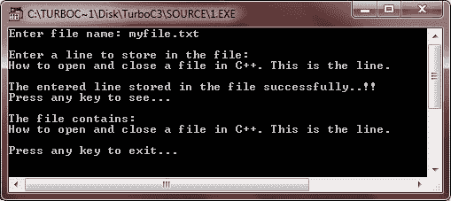

# C++ 打开和关闭文件

> 原文：<https://codescracker.com/cpp/cpp-opening-closing-files.htm>

在 C++ 中，你打开一个文件，你必须首先获得一个流。有以下三种类型的流:

*   投入
*   输出
*   输入/输出

### 创建输入流

要创建输入流，必须将该流声明为 ifstream 类。下面是语法:

```
ifstream fin;
```

### 创建输出流

要创建输出流，必须将其声明为流的类。这里有一个例子:

```
ofstream fout;
```

### 创建输入/输出流

将执行输入和输出操作的流必须声明为 fstream 类。这里有一个例子:

```
fstream fio;
```

## 在 C++ 中打开文件

一旦创建了流，下一步就是将文件与它相关联。并且此后该文件可用于(打开)处理。

可以通过以下两种方式打开文件:

1.  使用 stream 类的构造函数。
2.  使用函数 open()。

当单个文件与流一起使用时，首选第一种方法。但是，对于管理具有相同流的多个文件，首选第二种方法。让我们逐一讨论这些方法。

## 使用构造函数打开文件

我们知道一个类的构造函数在它(对象)被创建时初始化它的类的一个对象。同样，stream 类的构造函数(if stream、of stream 或 fstream)被用来用传递给它们的文件名初始化文件流对象。如下所述执行:
打开一个名为 myfile 的文件作为输入文件(即需要其中的数据，并且不会对该文件进行其他操作，如写入或修改)， 我们将创建一个输入类型的文件流对象，即 ifstream 类型。这里有一个例子:

```
ifstream fin("myfile", ios::in) ;
```

上面给出的语句创建了一个输入文件流的对象 fin。对象名称是用户定义的名称(即可以给出任何有效的标识符名称)。在创建 ifstream 对象 fin 之后，文件 myfile 被打开并附加到输入流 fin。现在，从 myfile 中读取的数据都已经通过输入流对象进行了通道化。

现在要从这个文件中读取数据，将使用 getfrom 操作符(">>")来使用这个流对象。这里有一个例子:

```
char ch;
fin >> ch ;       // read a character from the file
float amt ;
fin >> amt ;       // read a floating-point number form the file
```

类似地，当你想让一个程序写一个文件，也就是打开一个输出文件时(除了写之外不能进行任何操作)。这将通过以下方式实现

1.  创建 ofstream 对象以管理输出流
2.  将该对象与特定文件相关联

这里有一个例子，

```
ofstream fout("secret" ios::out) ;     // create ofstream object named as fout
```

这将创建一个输出流，名为 fout 的对象，并附带文件 secret。

现在，要向其中写入内容，您可以以熟悉的方式使用<

```
int code = 2193 ;
fout << code << "xyz" ;    /* will write value of code
            and "xyz" to fout's associated
            file namely "secret" here. */
```

当输入和输出流对象过期时，即当它们超出范围时，与文件的连接自动关闭。(例如，当程序终止时，全局对象过期)。此外，您可以使用 close()方法显式关闭与文件的连接:

```
fin.close() ;     // close input connection to file
fout.close() ;     // close output connection to file
```

关闭这样的连接不会消除流；它只是把它从文件上断开。小溪仍然留在那里。例如，在上述语句之后，流 fin 和 fout 仍然与它们管理的缓冲区一起存在。如果需要，您可以将流重新连接到同一个文件或另一个文件。关闭一个文件会刷新缓冲区，这意味着保留在缓冲区(输入或输出流)中的数据会按照它应该出现的方向移出缓冲区。例如，当输入文件的连接关闭时，数据从输入缓冲区移动到程序，当输出文件的连接关闭时，数据从输出缓冲区移动到磁盘文件。

## 使用 Open()函数打开文件

可能会出现要求程序打开多个文件的情况。打开多个文件的策略取决于它们的使用方式。如果需要同时处理两个文件，那么您需要为每个文件创建一个单独的流。但是，如果情况要求对文件进行顺序处理(即一个接一个地处理)，那么您可以打开单个流，并依次将它与每个文件相关联。要使用这种方法，声明一个 stream 对象而不初始化它，然后使用第二条语句将该流与一个文件相关联。举个例子，

```
ifstream fin;                        // create an input stream
fin.open("Master.dat", ios::in);     // associate fin stream with file Master.dat
:                                    // process Master.dat                       
fin.close();                         // terminate association with Master.dat

fin.open("Tran.dat", ios::in);       // associate fin stream with file Tran.dat
:                                    // process Tran.dat
fin.close();                         // terminate association
```

上面的代码让你可以连续读取两个文件。请注意，在打开第二个文件之前，第一个文件是关闭的。这是必要的，因为一个流一次只能连接到一个文件。

### 文件模式的概念

filemode 描述了如何使用文件:读取、写入、追加等等。

当您将流与文件相关联时，通过用文件名初始化文件流对象或使用 open()方法，您可以提供第二个参数来指定文件模式，如下所述:

```
stream_object.open("filename", (filemode) ) ;
```

open()的第二个方法参数 filemode 的类型是 int，您可以从 ios 类中定义的几个常量中选择一个。

### C++ 中的文件模式列表

下表列出了 C++ 中可用的文件模式及其含义:

| 常数 | 意义 | 流类型 |
| ios :: in | 它打开文件进行阅读，即在输入模式。 | ifstream 车 |
| ios :: out | 它打开文件进行写入，即在输出模式下。默认情况下，这也会以 ios :: trunc 模式打开文件。
这意味着当 打开时，现有文件被截断，
，即其先前的内容被丢弃。 | ofstream |
| ios :: ate | 这将在打开文件时寻找文件结尾。I/O 操作仍然可以发生在文件中的任何地方。 | ofstream
ifstream |
| ios :: app | 这将导致该文件的所有输出都附加到末尾。
该值只能用于能够输出的文件。 | ofstream |
| ios :: trunc | 该值导致同名文件
的内容被破坏，并将文件截断为零长度。 | ofstream |
| ios :: nocreate | 如果文件不存在，这会导致 open()函数失败。它不会以该名称创建新文件。 | ofstream |
| ios :: noreplace | 如果文件已经存在，这会导致 open()函数失败。
当你想同时创建一个新文件时使用。 | ofstream |
| ios :: binary | 这将导致文件以二进制模式打开。默认情况下，文件以文本模式打开。
在文本模式下打开文件时，
可能会发生各种字符转换 ，
如回车转换成换行符。
然而，在以二进制模式打开的文件中不会出现这种字符转换。 | ofstream
ifstream |

如果 ifstream 和 ofstream 构造函数以及 open()方法各有两个参数，那么在前面的例子中，我们如何只使用一个参数呢？正如您可能已经猜到的，这些类成员函数的原型为第二个参数(filemode 参数)提供了默认值。例如，ifstream open()方法和构造函数使用 ios :: in(打开进行读取)作为 mode 参数的默认值，而 ofstream open()方法和构造函数使用 ios :: out(打开进行写入)作为默认值。

默认情况下，fstream 类不提供模式，因此，在使用 fstream 类的对象时，必须显式指定模式。

ios::ate 和 ios::app 都把你放在刚打开的文件的末尾。两者的区别在于，ios::app 模式只允许在文件末尾添加数据，而 ios::ate 模式允许在文件的任意位置写入数据，甚至覆盖旧数据。

可以使用 C++ 按位 or 运算符(符号|)组合两个或多个 filemode 常量。例如，下面的语句:

```
ofstream fout;
fout.open("Master", ios :: app | ios :: nocreate);
```

如果文件存在，将以追加模式打开文件，如果文件不存在，将放弃文件打开操作。

要打开二进制文件，您需要指定 ios :: binary 以及文件模式，例如，

```
fout.open("Master", ios :: app | ios :: binary);
```

或者，

```
fout.open("Main", ios :: out | ios :: nocreate | ios :: binary);
```

## 在 C++ 中关闭文件

如前所述，一个文件的关闭是通过断开它与相关流的连接来实现的。close()函数完成此任务，它采用以下通用形式:

```
stream_object.close();
```

例如，如果一个主文件与一个 ofstream 对象 fout 连接，它与流 fout 的连接可以由下面的语句终止:

```
fout.close() ;
```

## C++ 打开和关闭文件的例子

这里给出一个例子，以便完全理解:

*   如何用 C++ 打开一个文件？
*   如何在 C++ 中关闭一个文件？

让我们来看看这个程序。

```
/* C++ Opening and Closing a File
 * This program demonstrates, how
 * to open a file to store or retrieve
 * information to/from it. And then how
 * to close that file after storing
 * or retrieving the information to/from it. */

#include<conio.h>
#include<string.h>
#include<stdio.h>
#include<fstream.h>
#include<stdlib.h>
void main()
{
   ofstream fout;
   ifstream fin;
   char fname[20];
   char rec[80], ch;
   clrscr();

   cout<<"Enter file name: ";
   cin.get(fname, 20);

   fout.open(fname, ios::out);

   if(!fout)
   {
      cout<<"Error in opening the file "<<fname;
      getch();
      exit(1);
   }
   cin.get(ch);

   cout<<"\nEnter a line to store in the file:\n";
   cin.get(rec, 80);
   fout<<rec<<"\n";
   cout<<"\nThe entered line stored in the file successfully..!!";
   cout<<"\nPress any key to see...\n";
   getch();
   fout.close();

   fin.open(fname, ios::in);
   if(!fin)
   {
      cout<<"Error in opening the file "<<fname;
      cout<<"\nPress any key to exit...";
      getch();
      exit(2);
   }

   cin.get(ch);
   fin.get(rec, 80);
   cout<<"\nThe file contains:\n";
   cout<<rec;
   cout<<"\n\nPress any key to exit...\n";
   fin.close();

   getch();
}
```

下面是上述 C++ 程序的运行示例:



### 更多示例

这里列出了一些 C++ 程序的例子，你可以去看看。这些程序使用文件:

*   [读取文件](/cpp/program/cpp-program-read-file.htm)
*   [写入文件](/cpp/program/cpp-program-write-file.htm)
*   [读取&显示文件](/cpp/program/cpp-program-read-and-display-file.htm)
*   [复制文件](/cpp/program/cpp-program-copy-file.htm)
*   [合并两个文件](/cpp/program/cpp-program-merge-two-files.htm)
*   [列出目录](/cpp/program/cpp-program-list-files-in-directory.htm)中的文件
*   [删除文件](/cpp/program/cpp-program-delete-file.htm)
*   [加密和解密文件](/cpp/program/cpp-program-encrypt-file.htm)

[C++ 在线测试](/exam/showtest.php?subid=3)

* * *

* * *