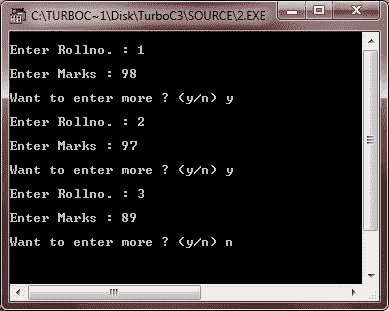

# 在程序中处理文件的 C++ 步骤

> 原文：<https://codescracker.com/cpp/cpp-process-files-in-program.htm>

在您真正开始在 C++ 程序中使用和操作文件之前，让我们讨论一下在 C++ 程序中使用文件需要遵循的步骤。

下面列出了在 C++ 程序中处理文件时需要遵循的步骤。在 C++ 程序中使用文件的五个步骤是:

1.  确定所需的链接类型。
2.  为所需类型的链接声明一个流。
3.  将所需文件附加到流中。
4.  现在根据需要进行处理。
5.  关闭与流的文件链接。

现在让我们详细讨论这些步骤。为了便于您理解，我将用一个例子来说明它。例如，如果您必须为以下内容编写一个程序:

获取一个班级的学生的 rollnumber 和 marks(从用户处获取这些详细信息),并将这些详细信息存储到一个名为 marks.dat 的文件中。

现在让我们借助上面的例子来讨论上面提到的五个步骤。但在此之前，我要告诉你一件有趣的事情——从 C++ 编程的第一天起，你就一直在处理文件流。这是因为，在 C++ 中，(I/O)设备是作为文件实现的。这个 cin 和 cout 实际上是用于输入和输出的流。输入流 cin 连接到键盘和计算机，输出流连接到显示器。

## 步骤 1 -确定所需的链路类型

第一步需要确定所需的链接类型。如果数据是从一个文件到内存，这个链接可以说是文件到内存的链接。类似地，如果数据(经过一些处理后)要从内存发送到文件，那么这个链接可以说是内存到文件的链接。如果一种情况需要两种类型的链接，那么可以创建双向(文件到内存和内存到文件)链接。

预定义的流 cin 是文件到内存链接的一个例子。由于设备被视为文件，键盘也被视为文件。对于 cin，数据来自文件，即键盘到内存，因此是文件到内存的链接，而对于 cout，数据从内存到文件，即显示器，因此是内存到文件的链接。我们可以将这些联系总结如下:

| 环 | 用于 |
| 文件到内存
(进入内存) | 输入目的，即将数据从文件带入内存以供进一步处理。 |
| 内存到文件
(从内存中取出) | 输出目的，即将处理过的数据从内存发送到文件。 |
| 文件到内存/内存到文件 | 输入/输出目的。 |

#### 示例处理:步骤 1

在上面给出的示例问题中，给出了将从用户读取数据，即，通过键盘(文件)将数据带入存储器(已经声明了 cin ),然后将这些读取的细节存储在文件中，即，从存储器，数据应在名为 marks.dat 的文件中发送

出于读取的目的，键盘需要文件到内存的链接，但是对于这个 cin 已经声明，并且为了在文件中存储这个数据，需要内存到文件的链接。因为对于 marks.dat，没有预定义的链接可用，所以我们必须创建这种类型的链接。

因此，我们已经确定了文件 marks.dat 所需的链接类型，即内存到文件类型的链接。

## 步骤 2 -为所需类型的链接声明一个流

在确定了所需的链接类型之后，下一步是为它创建一个流。为了创建文件流，程序中包含了头文件 fstream.h，如果已经包含了 fstream.h，则不需要包含 iostream.h。作为 cin，cout 声明也可以在 fstream.h 中使用

对于不同类型的链接，不同的流类用于流声明。对于文件到内存(即输入)类型的链接，如果声明了流类类型的流。举个例子，

```
ifstream fin;       //stream name here is fin
```

您可以为正在声明的流选择任何名称(符合标识符命名规则和约定)。对于内存到文件(即输出)类型的链接，声明 ofstream 类类型的流。而对于文件到内存/内存到文件(即 I/O)类型的链接，则声明 fstream class-type 的流。举个例子，

```
ofstream fout;       //stream name here is fout.
fstream fio ;       //stream name here is fio.
```

下表总结了这些流类型:

| 链接类型 | 流类 | 示例声明 |
| 文件到内存(在内存中) | ifstream 车 | ifstream fin |
| 内存到文件(从内存中取出) | ofstream | ofstream fout |
| 文件到内存/内存到文件 | fstream | fstream fio |

#### 示例处理:步骤 2

对于上面提到的例子，我们已经为文件 marks.dat 确定了内存到文件的链接类型。

```
ofstream fout ;       //stream name here is fout
```

## 步骤 3 -将所需的文件附加到声明的流中

声明流之后，下一步是将文件与声明的流链接起来。这可以通过打开所需的文件来完成。

例如，如果要以输入模式打开名为 sample.dat 的文件，即链接到 ifstream 类型的流，我们可以通过以下两种方式来实现:

1st Way:

```
ifstream fin("Sample.dat", ios::in) ;        //using constructor
```

2nd Way:

```
fin open("Sample.dat", ios::in) ;        //using open()
```

注意，在上面的例子中，使用了文件模式(这里是 ios::in)。ios::in 是流的 ifstream 类型的默认文件模式。

类似地，为了在输出模式下打开一个文件，比如 oput.txt，也就是说，为了将它与流类型的流链接，我们可以编写:

```
ofstream fout("oput.txt", ios::out) ;     //using constructor
```

或截至以下日期:

```
fout.open("oput.txt", ios::out) ;      //using open()
```

要以 I/O 模式(fstream 流)类型打开一个文件，比如说 newfile.txt，我们可以这样写

```
fstream fio("newfile.txt", ios::in | ios::out) ;       //using constructor
```

或作为 fstream fio:

```
fio.open("newfile.txt", ios::in | ios::out) ;       //using open
```

请注意，多个文件模式由按位或(|)管道符号分隔。

#### 示例处理:步骤 3

现在，有了这么多的信息/知识，让我们把它应用到上面给出的例子中。

我们可以将步骤 2 和步骤 3 合并如下:

```
ofstream fout("marks.dat", ios::out) ;
```

或者我们可以分别写为:

```
ofstream fout ;
fout.open("marks.dat", ios::out) ;
```

## 步骤 4 -根据需要进行处理

在这个步骤中，执行给定问题所需的任何处理，例如，我们给定的示例问题要求我们读取某个班级学生的分数和点名，并将它们存储到名为 marks.dat 的文件中。

#### 示例处理:步骤 4

为此，我们已经声明了流，并将我们的文件 marks.dat 与它链接起来。现在是处理的时候了。下面给出了用于处理的代码片段:

```
:
char ans = 'y' ;
int rollno ;
float marks ;

while(ans == 'y' || ans == 'Y')
{
   cout << "\nEnter roll number : " ;
   cin >> rollno ;
   cout << "\nEnter marks : " ;
   cin >> marks ;

      /* now student's rollno and marks have been read these details are to be
       * put into the file's buffer, in order to store them on to the file 
       */

   fout << rollno << '\n' << marks << '\n' ;

      /* Notice that the way we send details to output buffer cout, same way we have
       * sent those details to output buffer fout. Also, notice that we have also
       * sent new line ('\n') after every piece of data. It is done to separate various
       * data items. 
       */

   cout << "\nWant to enter more ? (y/n) " ;
   cin >> ans ;

}   //end of while
```

## 步骤 5 -关闭流文件链接

这是我们解除文件与流链接的最后一步。这是通过 close()函数执行的。例如，如果文件流是 fin，那么我们需要写成:

```
fin.close();
```

类似地，如果流名是 fio，我们将把它写成:

```
fio.close();
```

请注意，要解除文件链接，不需要提及文件名，只需要流名(文件链接到的流名)。

#### 示例处理:步骤 5

要解除我们的文件 marks.dat 与流 fout 的链接，我们需要编写:

```
fout.close() ;
```

### 完整的示例程序

如果我们将用于我们的示例问题的所有代码片段放在一起，程序看起来将如下所示:

获取一个班级的学生人数和分数(从用户处获取),并将这些详细信息存储到名为 marks.dat 的文件中:

```
/* C++ Steps to Process a File in a Program
 * This program demonstrates, how to process
 * a file in a C++ program */

#include<conio.h>
#include<fstream.h>
void main()
{
   clrscr();
   ofstream fout;         // stream decided and declared - step 1 & 2
   fout.open("marks.dat", ios::out);       // file linked - step 3
   char ans = 'y' ;         // process as required - step 4 begins
   int rollno;
   float marks ;
   while(ans == 'y' || ans == 'Y')
   {
      cout << "\nEnter Rollno. : " ;
      cin >> rollno ;
      cout << "\nEnter Marks : " ;
      cin >> marks ;
      fout << rollno << '\n' << marks << '\n' ;
      cout << "\nWant to enter more ? (y/n) " ;
      cin >> ans ;
   }

   fout.close() ;        // de-link the file - step 5
   getch();
}
```

下面是上述 C++ 程序的运行示例:



现在在你存放程序的同一个文件夹里。cpp 文件，您会发现一个名为 marks.dat 的文件，这个文件是您通过上面的 C++ 程序创建的。您可以在记事本、写字板或任何其他文本编辑器中打开该文件，查看其内容。这个文件将包含所有用换行符分隔的卷号。

要通过 TurboC++ 查看该文件，您也可以按照下面几行的说明来做。

在 TurboC++ 中执行完上述程序后，做一件事。点击文件部分下的 DOS 外壳选项，该选项大约位于左上角。然后在 dos 提示符下，键入以下命令:

```
type marks.dat
```

你将通过你的程序看到你刚才创建的文件的内容。要返回到 TurboC++ 的程序屏幕，在提示符下键入 EXIT 并按 enter 键。

### 更多示例

这里列出了更多的 C++ 示例程序，你可以去看看。这些程序还处理文件:

*   [读取一个文件](/cpp/program/cpp-program-read-file.htm)
*   [写入文件](/cpp/program/cpp-program-write-file.htm)
*   [读取&显示文件](/cpp/program/cpp-program-read-and-display-file.htm)
*   [复制文件](/cpp/program/cpp-program-copy-file.htm)
*   [合并两个文件](/cpp/program/cpp-program-merge-two-files.htm)
*   [列出目录](/cpp/program/cpp-program-list-files-in-directory.htm)中的文件
*   [删除文件](/cpp/program/cpp-program-delete-file.htm)
*   [加密和解密文件](/cpp/program/cpp-program-encrypt-file.htm)

[C++ 在线测试](/exam/showtest.php?subid=3)

* * *

* * *