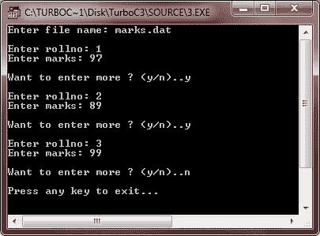

# C++ 改变流的行为

> 原文：<https://codescracker.com/cpp/cpp-change-stream-behaviour.htm>

我们已经讨论了各种文件模式。但是现在让我们来谈谈它们在控制流的行为中的作用。

当您使用构造函数打开一个文件(即，将它与流链接)时，流在其默认模式下被激活。输入类型流(ifstream 类型)的默认模式是 ios::in，输出类型流(ofstream 类型)的默认模式是 ios::out。

ifstream 类型流的默认行为(在打开文件时)允许用户从文件中读取内容。如果文件模式是仅 ios::in(例如，fin.open("abc.dat "，ios::in))，则在文本文件上执行读取，如果文件模式是 ios::in | ios::binary(例如，fin.open("abc.dat "，ios::in | ios::binary))，则在二进制文件上执行读取。

## 更改 ofstream 类型流的默认行为

ofstream 类型流(ios::out 文件模式)在打开文件时的默认行为是，如果文件尚不存在，则创建该文件，如果文件已经存在，则截断该文件(即删除其先前的内容)。如果您想改变这种默认行为，那么您可以通过用 open()函数指定以下任何一种文件模式来实现:

| 模式 | 描述 |
| ios :: app | 要保留文件以前的内容并附加到现有文件内容的末尾，请使用
而不是截断它们。 |
| ios :: ate | 把文件指针放在文件的末尾，但是你可以在文件的任何地方写数据。 |
| ios :: trunc | 它会导致现有文件被截断。 |
| ios :: nocreate | 如果文件不存在，这个 filemode 确保不创建任何文件，因此 open()会失败。然而，如果文件存在，它就会被打开。 |
| ios :: noreplace | 如果文件不存在，创建一个新文件，但是如果文件已经存在，
open()失败。 |

## 例子

下面是一个示例程序:

```
/* C++ Changing the Behaviour of Streams */

#include<fstream.h>
#include<conio.h>
#include<stdlib.h>
void main()
{
   char fname[20], ch;
   char ans='y';
   int rollno;
   float marks;
   ofstream fout;
   clrscr();

   cout<<"Enter file name: ";
   cin.get(fname, 20);
   cin.get(ch);

   fout.open(fname, ios::app);
   while(ans=='y' || ans=='Y')
   {
      cout<<"\nEnter rollno: ";
      cin>>rollno;
      cout<<"Enter marks: ";
      cin>>marks;
      fout<<rollno<<"\n"<<marks<<"\n";
      cout<<"\nWant to enter more ? (y/n)..";
      cin>>ans;
   }

   cout<<"\nPress any key to exit...\n";
   getch();
}
```

下面是上述 C++ 程序的运行示例:



### 更多示例

这里列出了更多的例子，你可以去看看:

*   [读取一个文件](/cpp/program/cpp-program-read-file.htm)
*   [写入文件](/cpp/program/cpp-program-write-file.htm)
*   [读取&显示文件](/cpp/program/cpp-program-read-and-display-file.htm)
*   [复制文件](/cpp/program/cpp-program-copy-file.htm)
*   [合并两个文件](/cpp/program/cpp-program-merge-two-files.htm)
*   [列出目录](/cpp/program/cpp-program-list-files-in-directory.htm)中的文件
*   [删除文件](/cpp/program/cpp-program-delete-file.htm)
*   [加密和解密文件](/cpp/program/cpp-program-encrypt-file.htm)

[C++ 在线测试](/exam/showtest.php?subid=3)

* * *

* * *