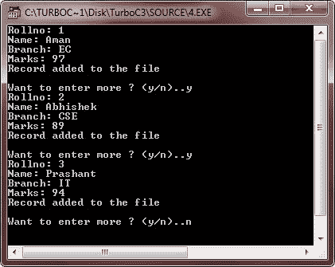
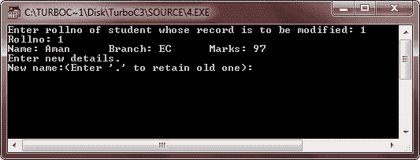
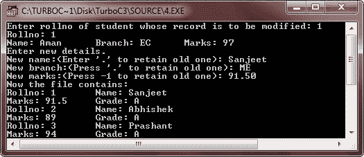

# C++文件指针和随机存取

> 原文：<https://codescracker.com/cpp/cpp-file-pointers-random-access.htm>

每个文件都有两个指针，称为 get_pointer(在输入模式文件中)和 put_pointer(在输出模式文件中),它们告诉我们文件中当前的位置，在那里将进行读或写。(在这种情况下，文件指针不像 C++指针，但它像书上的书签一样工作。).这些指针有助于实现文件的随机存取。这意味着直接移动到文件中的任何位置，而不是顺序移动。

可能存在随机访问是最佳选择的情况。例如，如果您必须修改第 21 条记录中的值，那么使用随机存取技术，您可以将文件指针放在第 21 条记录的开头，然后直接处理该记录。如果使用顺序访问，那么为了到达记录 21，您将不得不不必要地遍历前二十个记录。

## seekg()、seekp()、tellg()和 tellp()函数

在 C++中，随机访问是通过操纵 seekg()、seekp()、tellg()和 tellp()函数来实现的。seekg()和 tellg()函数允许您设置和检查 get_pointer，seekp()和 tellp()函数在 put_pointer 上执行这些操作。

seekg()和 tellg()函数用于输入流(ifstream)，seekp()和 tellp()函数用于输出流(ofstream)。但是，如果将它们用于 fstream 对象，那么 tellg()和 tellp()将返回相同的值。seekg()和 seekp()在 fstream 对象中的工作方式也是一样的。这些功能最常见的形式是:

| seekg() | istream & seekg(长型)；
istream & seekg(long，seek _ dir)； | 表格 1
表格 2 |
| seekp() | of stream & seekp(long)；
ofstream & seekp(long，seek _ dir)； | 表格 1
表格 2 |
| tellg() | 朗特尔格() |  |
| tellp() | long tellp() |  |

seekg() & seekp()和 tellg() & tellp()的工作方式完全相同，只是 seekg()和 tellg()适用于 ifstream 对象，而 seekp()和 tellp()适用于 ofstream 对象。上表中 seek_dir 取定义 enum seek_dir { beg，cur，end }；。

当根据形式 1 使用 seekg()或 seekp()时，它将 get_pointer 或 put_pointer 移动到一个绝对位置。这里有一个例子:

```
ifstream fin;
ofstream fout;
:         // file opening routine
fin.seekg(30);      // will move the get_pointer (in ifstream) to byte number 30 in the file
fout.seekp(30);      // will move the put_pointer (in ofstream) to byte number 30 in the file
```

当根据形式 2 使用 seekg()或 seekp()函数时，则它按照 seek_dir 的定义，将 get_pointer 或 put_pointer 移动到相对于当前位置的位置。因为 seek_dir 是头文件 iostream.h 中定义的枚举，它具有以下值:

```
ios::beg,      // refers to the beginning of the file
ios::cur,      // refers to the current position in the file
ios::end}      // refers to the end of the file
```

这里有一个例子。

```
fin.seekg(30, ios::beg);   // go to byte no. 30 from beginning of file linked with fin
fin.seekg(-2, ios::cur);   // back up 2 bytes from the current position of get pointer
fin.seekg(0, ios::end);      // go to the end of the file
fin.seekg(-4, ios::end);   // backup 4 bytes from the end of the file
```

tellg()和 tellp()函数分别返回 put_pointer 和 get_pointer 在输出文件和输入文件中的位置，以字节数表示。

## C++文件指针和随机访问示例

下面是一个示例程序，演示了 C++程序中文件指针和随机访问的概念:

```
/* C++ File Pointers and Random Access
 * This program demonstrates the concept
 * of file pointers and random access in
 * C++ */

#include<fstream.h>
#include<conio.h>
#include<stdlib.h>
#include<stdio.h>
#include<string.h>

class student
{
   int rollno;
   char name[20];
   char branch[3];
   float marks;
   char grade;

   public:
      void getdata()
      {
         cout<<"Rollno: ";
         cin>>rollno;
         cout<<"Name: ";
         cin>>name;
         cout<<"Branch: ";
         cin>>branch;
         cout<<"Marks: ";
         cin>>marks;

         if(marks>=75)
         {
            grade = 'A';
         }
         else if(marks>=60)
         {
            grade = 'B';
         }
         else if(marks>=50)
         {
            grade = 'C';
         }
         else if(marks>=40)
         {
            grade = 'D';
         }
         else
         {
            grade = 'F';
         }
      }

      void putdata()
      {
         cout<<"Rollno: "<<rollno<<"\tName: "<<name<<"\n";
         cout<<"Marks: "<<marks<<"\tGrade: "<<grade<<"\n";
      }

      int getrno()
      {
         return rollno;
      }

      void modify();
}stud1, stud;

void student::modify()
{
   cout<<"Rollno: "<<rollno<<"\n";
   cout<<"Name: "<<name<<"\tBranch: "<<branch<<"\tMarks: "<<marks<<"\n";

   cout<<"Enter new details.\n";
   char nam[20]=" ", br[3]=" ";
   float mks;
   cout<<"New name:(Enter '.' to retain old one): ";
   cin>>nam;
   cout<<"New branch:(Press '.' to retain old one): ";
   cin>>br;
   cout<<"New marks:(Press -1 to retain old one): ";
   cin>>mks;

   if(strcmp(nam, ".")!=0)
   {
      strcpy(name, nam);
   }
   if(strcmp(br, ".")!=0)
   {
      strcpy(branch, br);
   }
   if(mks != -1)
   {
      marks = mks;
      if(marks>=75)
      {
         grade = 'A';
      }
      else if(marks>=60)
      {
         grade = 'B';
      }
      else if(marks>=50)
      {
         grade = 'C';
      }
      else if(marks>=40)
      {
         grade = 'D';
      }
      else
      {
         grade = 'F';
      }
   }
}

void main()
{
   clrscr();

   fstream fio("marks.dat", ios::in | ios::out);
   char ans='y';
   while(ans=='y' || ans=='Y')
   {
      stud1.getdata();
      fio.write((char *)&stud1, sizeof(stud1));
      cout<<"Record added to the file\n";
      cout<<"\nWant to enter more ? (y/n)..";
      cin>>ans;
   }

   clrscr();
   int rno;
   long pos;
   char found='f';

   cout<<"Enter rollno of student whose record is to be modified: ";
   cin>>rno;

   fio.seekg(0);
   while(!fio.eof())
   {
      pos = fio.tellg();
      fio.read((char *)&stud1, sizeof(stud1));
      if(stud1.getrno() == rno)
      {
         stud1.modify();
         fio.seekg(pos);
         fio.write((char *)&stud1, sizeof(stud1));
         found = 't';
         break;
      }
   }
   if(found=='f')
   {
      cout<<"\nRecord not found in the file..!!\n";
      cout<<"Press any key to exit...\n";
      getch();
      exit(2);
   }

       fio.seekg(0);
       cout<<"Now the file contains:\n";
       while(!fio.eof())
       {
      fio.read((char *)&stud, sizeof(stud));
      stud.putdata();
       }
       fio.close();
       getch();
}
```

以下是上述 C++程序的运行示例:



输入 3 条记录后，只需按 n，然后按回车键。如上所示执行此操作后，按 ENTER，下面是按 ENTER 按钮后的运行示例:



现在输入要修改记录的学生的编号。这里我们输入 1，然后输入该卷号的新信息，如上面和下面的输出所示:



[C++在线测试](/exam/showtest.php?subid=3)

* * *

* * *