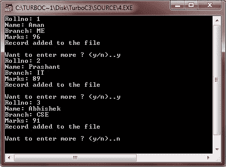
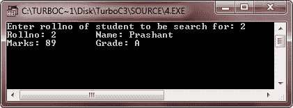
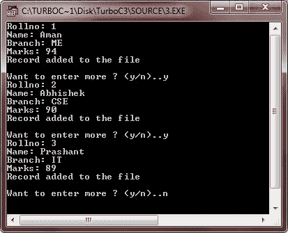
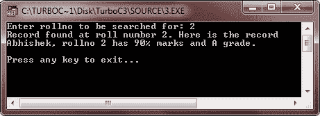
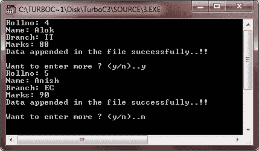
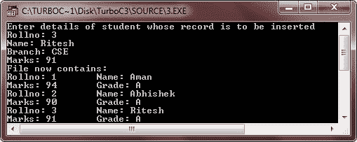

# 对二进制文件的 C++基本操作

> 原文：<https://codescracker.com/cpp/cpp-binary-files-basic-operations.htm>

现在让我们来学习对文件的基本操作。到目前为止，您所学的操作适用于文本和二进制文件。唯一的区别是，在处理二进制文件时，您需要在打开文件时用 ios::binary 作为文件模式的前缀。您已经学习了如何创建文件(在 ios::out 或 ios::app 模式下打开文件，如果文件不存在，它将创建一个文件)，如何从二进制文件中读取记录(通过附加文件的流对象调用 read()函数)，如何在二进制文件中写入记录(通过附加文件的流对象调用 write()函数)。).

在本教程中，我们将对二进制文件执行以下基本操作:

*   搜索
*   追加数据
*   在排序文件中插入数据
*   删除记录
*   修改数据

先说搜索操作。

## 在 C++中搜索

我们可以在以输入模式打开的二进制文件中执行搜索，方法是读取每条记录，然后检查它是否是我们想要的记录。例如，如果您想在 marks.dat 文件中搜索 rollno 为 1 的学生的记录，您可以用两种方式在 C++中实现这个搜索过程:

1.  通过结构实现记录。
2.  记录通过类实现。

通过结构实现记录时，您可以执行搜索，如下例所示:

```
struct student
{
   int rollno;
   char name[20];
   char branch[3];
   float marks;
   char grade;
}stud1;

ifstream fin("marks.dat", ios::in | ios::binary);
:                      // Read rollno to be searched for

while(!fin.eof())
{
   fin.read((char *)&stud1, sizeof(stud1));    // read record
   if(stud1.rollno == rn)                  // if true, record is found
   {
      :                  // process desired record here

      found = 'y';       // after processing you may jump from the
      break;             // loop employed form searching purpose
   }
}

if(found == 'n')                    // record not found
{
   :                          // display error message here or process as desired
}
```

让我们举一个例子来全面理解 C++中的搜索操作。

### C++搜索示例

这是一个示例程序，演示了在 C++中搜索二进制文件的操作。

```
/* C++ Basic Operations on Binary Files
 * This program demonstrates the searching
 * operation in a C++ program. Here the
 * searching operations performed, on
 * the records implemented through structures
 */

#include<fstream.h>
#include<conio.h>
#include<stdlib.h>

class student
{
   int rollno;
   char name[20];
   char branch[3];
   float marks;
   char grade;

   public:
      void getdata()
      {
         cout<<"Rollno: ";
         cin>>rollno;
         cout<<"Name: ";
         cin>>name;
         cout<<"Branch: ";
         cin>>branch;
         cout<<"Marks: ";
         cin>>marks;

         if(marks>=75)
         {
            grade = 'A';
         }
         else if(marks>=60)
         {
            grade = 'B';
         }
         else if(marks>=50)
         {
            grade = 'C';
         }
         else if(marks>=40)
         {
            grade = 'D';
         }
         else
         {
            grade = 'F';
         }
      }

      void putdata()
      {
         cout<<"Rollno: "<<rollno<<"\tName: "<<name<<"\n";
         cout<<"Marks: "<<marks<<"\tGrade: "<<grade<<"\n";
      }

      int getrno()
      {
         return rollno;
      }
}stud1;

void main()
{
   clrscr();

   fstream fio("marks.dat", ios::in | ios::out);
   char ans='y';
   while(ans=='y' || ans=='Y')
   {
      stud1.getdata();
      fio.write((char *)&stud1, sizeof(stud1));
      cout<<"Record added to the file\n";
      cout<<"\nWant to enter more ? (y/n)..";
      cin>>ans;
   }

   clrscr();
   int rno;
   long pos;
   char found='f';

   cout<<"Enter rollno of student to be search for: ";
   cin>>rno;

   fio.seekg(0);
   while(!fio.eof())
   {
      pos=fio.tellg();
      fio.read((char *)&stud1, sizeof(stud1));
      if(stud1.getrno() == rno)
      {
         stud1.putdata();
         fio.seekg(pos);
         found='t';
         break;
      }
   }
   if(found=='f')
   {
      cout<<"\nRecord not found in the file..!!\n";
      cout<<"Press any key to exit...\n";
      getch();
      exit(2);
   }

       fio.close();
       getch();
}
```

以下是上述 C++程序的运行示例:



输入三条记录后，按 n，然后回车。现在来搜索一个具体的卷号。输入学生的编号，然后按回车键执行搜索操作。以下是运行示例:



当记录通过类实现时，您可能需要在类的 public:部分添加一个额外的访问器函数，该函数返回与用户指定的搜索值进行比较的数据成员的值。对于结构，这不是必需的，因为默认情况下所有的数据成员都是公共的，因此可以通过结构变量来访问。另一方面，通过对象，私有数据成员不能被访问。因此，为了读取私有数据成员的值，在 public 部分中添加了一个返回该值的函数。其余的处理与结构的处理类似。以下是演示这一点的示例代码片段:

```
class student
{
   int rollno;
   char name[20];
   char branch[3];
   float marks;
   char grade;

   public:
      void getdata();
      void putdata();
      int getrno()    // this function returns the value of private member rollno
      {
         return rollno;
      }
}stud1;

ifstream fin("marks.dat", ios::in);
:      // read rollno to be search for

while(!fin.eof())
{
   fin.read((char *)&stud1, sizeof(stud1));
   if(stud1.getrno() == rno)      // retrieve value of private member and compare
   {
      :      // process desired record here

      found = 't';
      break;
   }
}
if(found=='n')    // if record not found
{
   :      // display message for not found
}
```

让我们举一个例子来完整理解在 C++中通过类实现的对记录的搜索操作。

```
/* C++ Basic Operations on Binary Files
 * This program demonstrates the searching
 * operation in a C++ program. Here the
 * searching operations performed, on
 * the records implemented through classes
 */

#include<fstream.h>
#include<conio.h>
#include<stdlib.h>

class student
{
   int rollno;
   char name[20];
   char branch[3];
   float marks;
   char grade;

   public:
      void getdata()
      {
         cout<<"Rollno: ";
         cin>>rollno;
         cout<<"Name: ";
         cin>>name;
         cout<<"Branch: ";
         cin>>branch;
         cout<<"Marks: ";
         cin>>marks;

         if(marks>=75)
         {
            grade = 'A';
         }
         else if(marks>=60)
         {
            grade = 'B';
         }
         else if(marks>=50)
         {
            grade = 'C';
         }
         else if(marks>=40)
         {
            grade = 'D';
         }
         else
         {
            grade = 'F';
         }
      }

      void putdata()
      {
         cout<<name<<", rollno "<<rollno<<" has ";
         cout<<marks<<"% marks and "<<grade<<" grade."<<"\n";
      }

      int getrno()
      {
         return rollno;
      }
}stud1;

void main()
{
   clrscr();

   ofstream fout("marks.dat", ios::out);
   char ans='y';
   while(ans=='y' || ans=='Y')
   {
      stud1.getdata();
      fout.write((char *)&stud1, sizeof(stud1));
      cout<<"Record added to the file\n";
      cout<<"\nWant to enter more ? (y/n)..";
      cin>>ans;
   }
   fout.close();

   clrscr();
   int rno;
   char found;
   ifstream fin("marks.dat", ios::in);

   found = 'n';
   cout<<"Enter rollno to be searched for: ";
   cin>>rno;

   while(!fin.eof())       // end-of-file used here
   {
      fin.read((char *)&stud1, sizeof(stud1));
      if(stud1.getrno() == rno)
      {
         cout<<"Record found at roll number "<<rno<<". Here is the record\n";

         stud1.putdata();
         found = 't';
         break;
      }
    }
   if(found=='n')
   {
      cout<<"\nRecord not found at this roll number..!!\n";
      cout<<"Press any key to exit...\n";
      getch();
      exit(2);
   }

   fin.close();
   cout<<"\nPress any key to exit...\n";
   getch();
}
```

以下是上述 C++程序的运行示例:




## 在 C++中追加数据

要在文件中追加数据，文件将按照以下两种规范打开:

1.  文件以输出模式打开
2.  文件在 ios::app 模式下打开

一旦文件在 ios::app 模式下打开，以前的记录/信息将被保留，新数据将被追加到文件中。

让我们看看下面的代码片段，它向文件 marks.dat 追加新记录:

```
class student
{
   :
}stud1;
ofstream fout;
fout.open("marks.dat", ios::app } ios::binary);
/* Repeat following lines as many times */
{
   stud1.getdata();                             // Read Record
   fout.write((char *) & stud1, sizeof(stud1));    // record appended
}
```

### C++附加数据示例

这是一个示例程序，演示了如何用 C++在文件中追加数据。

```
/* C++ Basic Operations on Binary Files
 * This program demonstrates, how to
 * append data in a file in C++ */

#include<fstream.h>
#include<conio.h>
#include<stdlib.h>

class student
{
   int rollno;
   char name[20];
   char branch[3];
   float marks;
   char grade;

   public:
      void getdata()
      {
         cout<<"Rollno: ";
         cin>>rollno;
         cout<<"Name: ";
         cin>>name;
         cout<<"Branch: ";
         cin>>branch;
         cout<<"Marks: ";
         cin>>marks;

         if(marks>=75)
         {
            grade = 'A';
         }
         else if(marks>=60)
         {
            grade = 'B';
         }
         else if(marks>=50)
         {
            grade = 'C';
         }
         else if(marks>=40)
         {
            grade = 'D';
         }
         else
         {
            grade = 'F';
         }
      }

      void putdata()
      {
         cout<<name<<", rollno "<<rollno<<" has ";
         cout<<marks<<"% marks and "<<grade<<" grade."<<"\n";
      }

      int getrno()
      {
         return rollno;
      }
}stud1;

void main()
{
   clrscr();

   ofstream fout("marks.dat", ios::app);
   char ans='y';
   while(ans=='y' || ans=='Y')
   {
      stud1.getdata();
      fout.write((char *)&stud1, sizeof(stud1));
      cout<<"Data appended in the file successfully..!!\n";
      cout<<"\nWant to enter more ? (y/n)..";
      cin>>ans;
   }

   fout.close();
   cout<<"\nPress any key to exit...\n";
   getch();
}
```

下面是这个 C++程序的运行示例:



## C++在排序文件中插入数据

在一个分类文件中插入数据时，首先确定它的适当位置，然后将文件中在这个确定位置之前的记录复制到临时文件中，接着插入新记录，然后也复制文件中的其余记录。

例如，marks.dat 中的记录根据 rollno 按升序排序。假设在文件 marks.dat 中有大约 10 条记录，现在要插入一条 rollno 5 的新记录。这将通过以下方式实现:

㈠确定适当的位置。如果新记录的序号为 NREC，其中序号 5 小于第一个记录的序号，则位置为 1，新记录将被插入到该位置，因为它将被插入到文件的开头以保持排序顺序。

如果两个连续记录的新记录号(此处为 5)满足以下条件，比如(p <sup>第</sup>条和(p + 1) <sup>第</sup>条)

```
if prev.getrno() <= NREC.getrno() && (NREC.getrno() <= next.getrno())
```

那么适当的位置将是 prev + 1 的位置，即 p + 1。

如果新记录的序号大于上一记录的序号(比如第 n <sup>条</sup>条记录),那么合适的位置将是 n+1。

(ii)将确定位置之前的记录复制到临时文件，例如 temp.dat。

(iii)在临时文件 temp.dat 中添加新记录。

(iv)现在将剩余的记录追加到临时文件 temp.dat 中。

(v)使用以下代码删除文件 marks.dat。

```
remove("marks.dat");
```

(vi)现在，将文件 temp.dat 重命名为 marks.dat，如下所示:

```
rename("temp.dat", "marks.dat");
```

让我们举一个例子来完整地理解在 C++中在一个排序的文件中插入数据。

### C++在排序文件中插入数据的例子

这是一个示例程序，演示了如何在 C++中将数据插入到一个排序的文件中

```
/* C++ Basic Operations on Binary Files
 * This program demonstrates how to insert
 * data in a sorted file in C++ */

#include<fstream.h>
#include<conio.h>
#include<stdio.h>
#include<stdlib.h>

class student
{
   int rollno;
   char name[20];
   char branch[3];
   float marks;
   char grade;

   public:
      void getdata()
      {
         cout<<"Rollno: ";
         cin>>rollno;
         cout<<"Name: ";
         cin>>name;
         cout<<"Branch: ";
         cin>>branch;
         cout<<"Marks: ";
         cin>>marks;

         if(marks>=75)
         {
            grade = 'A';
         }
         else if(marks>=60)
         {
            grade = 'B';
         }
         else if(marks>=50)
         {
            grade = 'C';
         }
         else if(marks>=40)
         {
            grade = 'D';
         }
         else
         {
            grade = 'F';
         }
      }

      void putdata()
      {
         cout<<"Rollno: "<<rollno<<"\tName: "<<name<<"\n";
         cout<<"Marks: "<<marks<<"\tGrade: "<<grade<<"\n";
      }

      int getrno()
      {
         return rollno;
      }
}stud1, stud;

void main()
{
   clrscr();
   ifstream fin("marks.dat", ios::in);
   ofstream fout("temp.dat", ios::out);
   char last='y';
   cout<<"Enter details of student whose record is to be inserted\n";
   stud1.getdata();
   while(!fin.eof())
   {
      fin.read((char *)&stud, sizeof(stud));
      if(stud1.getrno()<=stud.getrno())
      {
         fout.write((char *)&stud1, sizeof(stud1));
         last = 'n';
         break;
      }
      else
      {
         fout.write((char *)&stud, sizeof(stud));
      }
   }
   if(last == 'y')
   {
      fout.write((char *)&stud1, sizeof(stud1));
   }
   else if(!fin.eof())
   {
      while(!fin.eof())
      {
         fin.read((char *)&stud, sizeof(stud));
         fout.write((char *)&stud, sizeof(stud));
      }
   }
   fin.close();
   fout.close();
   remove("marks.dat");
   rename("temp.dat", "marks.dat");
   fin.open("marks.dat", ios::in);
   cout<<"File now contains:\n";
   while(!fin.eof())
   {
      fin.read((char *)&stud, sizeof(stud));
      if(fin.eof())
      {
         break;
      }
      stud.putdata();
   }
   fin.close();
   getch();
}
```

下面是上述 C++程序的运行示例:



## 在 C++中删除记录

要删除记录，需要执行以下步骤:

(I)首先，通过在文件中进行搜索来确定要删除的记录的位置。

(ii)将除了要删除的记录之外的记录一直复制到一个临时文件中，例如 temp.dat。

(iii)不要将要删除的记录复制到临时文件 temp.dat 中

(iv)将其余记录复制到 temp.dat。

㈤删除原始文件，如 marks.dat:

```
remove("marks.dat");
```

㈥将 temp.dat 重命名为 marks.dat:

```
rename("temp.dat", "marks.dat");
```

例如程序，只需复制上面的代码，并按照上面的步骤进行修改，就可以处理记录的删除。

## 在 C++中修改数据

要修改一个记录，文件以输入输出方式打开，执行一个重要的步骤，给出被修改记录的起始地址。在内存中修改记录后，文件指针再次放在该记录的起始位置，然后记录被重写。以下代码说明了这一点:

```
class student
{
   :
   void modify();
}stud1;

fstream fio("marks.dat", ios::in | ios::out);
/* Read rollno whose data is to be modified */
long pos;
while(!fio.eof())
{
   pos = fio.tellg()          // determine the beginning position of record
   fio.read((char *) & stud1, sizeof(stud1));
   if(stud1.getrno() == rn)       // this is the record to be modified
   {
      stud1.modify();          // get the new data
      fio.seekg(pos);       // place file pointer at the beginning record position
      fio.write((char *) & stud1, sizeof(stud1));     // now write the modified record
   }
}
```

例如程序，只需复制上面的代码，并进行修改，如上图所示的代码片段来处理对文件中数据的修改。

### 更多示例

您还可以使用 C++中的文件浏览以下示例:

*   [读取一个文件](/cpp/program/cpp-program-read-file.htm)
*   [写入文件](/cpp/program/cpp-program-write-file.htm)
*   [读取&显示文件](/cpp/program/cpp-program-read-and-display-file.htm)
*   [复制文件](/cpp/program/cpp-program-copy-file.htm)
*   [合并两个文件](/cpp/program/cpp-program-merge-two-files.htm)
*   [列出目录](/cpp/program/cpp-program-list-files-in-directory.htm)中的文件
*   [删除文件](/cpp/program/cpp-program-delete-file.htm)
*   [加密和解密文件](/cpp/program/cpp-program-encrypt-file.htm)

[C++在线测试](/exam/showtest.php?subid=3)

* * *

* * *