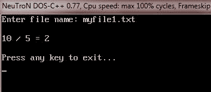
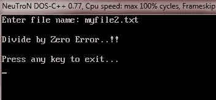
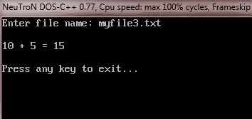
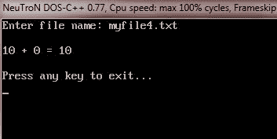

# 文件操作过程中的 C++ 错误处理

> 原文：<https://codescracker.com/cpp/cpp-error-handling.htm>

有时在文件操作过程中，错误也可能悄悄出现。例如，正在打开进行读取的文件可能不存在。或者用于新文件的文件名可能已经存在。或者试图读取文件结尾以外的内容。或者可以执行无效操作。磁盘中可能没有足够的空间来存储数据。

为了检查此类错误并确保顺利处理，C++ 文件流从 ios 类继承“流状态”成员，这些成员存储当前正在使用的文件的状态信息。I/O 系统的当前状态保存在一个整数中，其中编码了以下标志:

| 名字 | 意义 |
| eofbit | 当遇到文件结尾时为 1，否则为 0。 |
| 故障位 | 发生非致命 I/O 错误时为 1，否则为 0 |
| 强盗 | 发生致命 I/O 错误时为 1，否则为 0 |
| 古德比特 | 0 值 |

## C++ 错误处理函数

ios 类支持几个错误处理函数，帮助您读取和处理文件流中记录的状态。

下表列出了这些错误处理函数及其含义:

| 功能 | 意义 |
| int bad() | 如果尝试了无效操作或发生了任何不可恢复的错误，则返回非零值。但是，如果该值为零(假值)，则可以从报告的任何其他错误中恢复并继续操作。 |
| int eof() | 如果读取时遇到文件结尾，则返回非零值(真值)；否则返回零(假值)。 |
| int fail() | 当输入或输出操作失败时，返回非零值(true)。 |
| int good() | 如果没有发生错误，则返回非零值(true)。这意味着，上述所有功能都是假的。例如，如果 fin.good()为真，那么名为 fin 的流一切正常，我们可以继续执行 I/O 操作。当它返回零时，不能执行进一步的操作。 |
| 清除() | 重置错误状态，以便可以尝试进一步的操作。 |

以上函数可以概括为:如果设置了 eofbit，则 eof()返回 true 如果 badbit 被设置，bad()返回 true。如果设置了 failbit，fail()函数返回 truegood()返回 true，表示没有错误。否则，它们返回 false。

这些函数可以在程序中的适当位置使用，以定位文件流的状态，从而采取必要的纠正措施。例如:

```
:
ifstream fin;
fin.open("master", ios::in);
while(!fin.fail())
{
   :        // process the file
}
if(fin.eof())
{
   :         // terminate the program
}
else if(fin.bad())
{
   :         // report fatal error
}
else
{
   fin.clear();     // clear error-state flags
   :
}
:
```

## C++ 错误处理示例

下面是一个示例程序，说明了 C++ 程序中文件操作期间的错误处理:

```
/* C++ Error Handling During File Operations
 * This program demonstrates the concept of
 * handling the errors during file operations
 * in a C++ program */

#include<iostream.h>
#include<fstream.h>
#include<process.h>
#include<conio.h>
void main()
{
   clrscr();
   char fname[20];
   cout<<"Enter file name: ";
   cin.getline(fname, 20);
   ifstream fin(fname, ios::in);
   if(!fin)
   {
      cout<<"Error in opening the file\n";
      cout<<"Press a key to exit...\n";
      getch();
      exit(1);
   }
   int val1, val2;
   int res=0;
   char op;
   fin>>val1>>val2>>op;
   switch(op)
   {
      case '+':
         res = val1 + val2;
         cout<<"\n"<<val1<<" + "<<val2<<" = "<<res;
         break;
      case '-':
         res = val1 - val2;
         cout<<"\n"<<val1<<" - "<<val2<<" = "<<res;
         break;
      case '*':
         res = val1 * val2;
         cout<<"\n"<<val1<<" * "<<val2<<" = "<<res;
         break;
      case '/':
         if(val2==0)
         {
            cout<<"\nDivide by Zero Error..!!\n";
            cout<<"\nPress any key to exit...\n";
            getch();
            exit(2);
         }
         res = val1 / val2;
         cout<<"\n"<<val1<<" / "<<val2<<" = "<<res;
         break;

   }

   fin.close();

   cout<<"\n\nPress any key to exit...\n";
   getch();
}
```

假设我们有四个文件，其名称和数据如下表所示:

| 文件名 | 数据 |
| myfile1.txt | 10
5
/ |
| myfile2.txt | 10
0
/ |
| myfile3.txt | 10
5
+ |
| myfile4.txt | 10
0
+ |

现在，我们将展示上述 C++ 程序的运行示例，处理上表中列出的文件。下面是上述 C++ 程序的四个示例运行，处理上表中列出的所有四个文件。这是第一个文件的示例输出。



这个输出是针对第二个文件的



这是第三个文件



如果处理第四个文件，将产生以下输出。



### 更多示例

下面是一些更多的 C++ 例子，你可以去看看:

*   [读取一个文件](/cpp/program/cpp-program-read-file.htm)
*   [写入文件](/cpp/program/cpp-program-write-file.htm)
*   [读取&显示文件](/cpp/program/cpp-program-read-and-display-file.htm)
*   [复制文件](/cpp/program/cpp-program-copy-file.htm)
*   [合并两个文件](/cpp/program/cpp-program-merge-two-files.htm)
*   [列出目录](/cpp/program/cpp-program-list-files-in-directory.htm)中的文件
*   [删除文件](/cpp/program/cpp-program-delete-file.htm)
*   [加密和解密文件](/cpp/program/cpp-program-encrypt-file.htm)

[C++ 在线测试](/exam/showtest.php?subid=3)

* * *

* * *