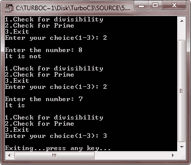

# C++函数重载

> 原文：<https://codescracker.com/cpp/cpp-function-overloading.htm>

当在同一个作用域中为一个函数名指定了几个函数声明时，这个(函数)名被称为重载。C++允许函数有相同的名字，如果它能通过参数的数量和类型来区分它们的话。例如，以下四个函数在 C++中是不同的

```
float divide(int a, int b);
float divide(int a, int b, int c);
float divide(float x, float y);
float divide(float x, float y, float z);
```

也就是说，采用两个 int 类型实参的 divide()与采用三个 int 类型实参的 divide()不同，采用两个 float 类型实参的 divide()与采用三个 float 类型实参的 divide()不同。

这就是所谓的函数重载。

## 声明和定义

函数重载的关键是函数的参数列表，也称为函数签名。启用函数重载的是签名，而不是函数类型。

如果两个函数具有相同数量和类型的相同顺序的参数，则称它们具有相同的签名。即使他们使用不同的变量名，也没有关系。例如，以下两个函数具有相同的签名:

```
void squar(int a, float b);   // function 1
void squar(int x, float y);     // same signature as that of function 1
```

C++允许你重载一个函数名，只要同名的函数有不同的签名。签名可以在参数的数量或类型上有所不同，或者两者都有所不同。要重载一个函数名，你需要做的就是，分别声明和定义所有同名但签名不同的函数。例如，下面的代码片段重载了函数名 printsquare()

```
void printsquare(int i);   // overloaded for integers #1
void printsquare(char c);   // overloaded for characters #2
void printsquare(float f);   // overloaded for floats #3
void printsquare(double d);   // overloaded for double floats #4
```

声明重载函数后，必须单独定义它们，如下所示:

```
void printsquare(int i)
{
   cout<<"Integer "<<i<<"'s square is "<<i*i<<"\n";
}
void printsquare(char c)
{
   cout<<c<<" is a character "<<"Thus No Square for it"<<"\n";
}
void printsquare(float f)
{
   cout<<"Float "<<f<<"'s square is "<<f*f<<"\n";
}
void printsquare(double d)
{
   cout<<"Double float "<<d<<"'s square is "<<d*d<<"\n";
}
```

因此，我们看到声明重载函数没有太大的困难:它们像其他函数一样被声明。只有一件事要记住，参数是足够不同的，允许使用不同的函数。

参数类型被认为是函数扩展名称的一部分。例如，上面指定的函数的名称可能是 printsquare()，但是它们的扩展名称是不同的。也就是说，它们分别具有 printsquare(int)、printsquare(char)、printsquare(float)和 printsquare(double)扩展名称。

当一个函数名在一个程序中被多次声明时，编译器会将第二次(以及随后的)声明解释如下:

(I)如果后续函数的签名与前一个函数的签名匹配，则第二个函数被视为第一个函数的重新声明。

(ii)如果两个函数的签名完全匹配，但返回类型不同，并且在编译时被标记为错误。

举个例子，

```
float square(float f);
double square(float x);         // error!!
```

C++中不允许使用具有相同签名和相同名称但不同返回类型的函数。您可以有不同的返回类型，但前提是签名也不同:

```
float square(float f);           // difference signature, hence
double square(double d);         // allowed
```

(iii)如果两个函数的签名在参数的数量或类型上不同，则这两个函数被认为是重载的。

有符号性(例如，int 对 unsigned int)和常数也有足够的不同，以区分函数，即具有这种差异的自变量的函数被认为是不同的函数。

### 对重载函数的限制

几个限制决定了一组可接受的重载函数:

(I)一组重载函数中的任意两个函数必须有不同的参数列表。

(ii)仅基于返回类型，用相同类型的参数列表重载函数是错误的。

(iii)成员函数不能仅仅因为一个是静态的而另一个是非静态的就重载。

(iv) Typedef 声明不定义新类型；他们引入了现有类型的同义词。它们不影响过载机制。
考虑以下代码:

```
typedef char * PSTR;
void Print(char * szToPrint);
void Print(PSTR szToPrint);
```

前面两个函数有相同的参数列表。PSTR 是 char *类型的同义词。在成员范围内，此代码会生成错误。

(v)枚举类型是不同的类型，可用于区分重载函数。

(vi)为了区分重载函数，类型“数组”和“指针”被认为是相同的。这只适用于一维数组。因此，下列重载函数会发生冲突并生成错误信息。

```
void Print(char * szToPrint);
void Print(char szToPrint[]);
```

对于多维数组，第二维和所有后续维度都被视为该类型的一部分。因此，它们用于区分重载函数:

```
void Print(char szToPrint[]);
void Print(char szToPrint[][7]);
void Print(char szToPrint[][9][42]);
```

## C++函数重载程序

下面是一些示例程序来说明 C++中函数重载的工作原理。让我们首先来看下面的例子，在这个例子中，同一个名为 print()的函数被用来打印不同的数据类型:

```
/* C++ Function Overloading - This C++ program
 * demonstrates the concept of function overloading
 * in C++ practically.
 */

#include<iostream.h>
#include<conio.h>

class printData
{
   public:
      void print(int i)         // function 1
      {
         cout<<"Printing int: "<<i<<"\n";
      }
      void print(double  f)     // function 2
      {
         cout<<"Printing float: "<<f<<"\n";
      }
      void print(char* c)
      {
         cout<<"Printing characters (string): "<<c<<"\n";
      }
};

void main()
{
   clrscr();
   printData pdobj;

   pdobj.print(5);               // called print() to print integer
   pdobj.print(50.434);         // called print() to print float
   pdobj.print("C++ Function Overloading");     // called print() to print string

   getch();
}
```

下面是上述 C++程序产生的输出:


这是另一个 C++程序，实际上也演示了 C++中的函数重载

```
/* C++ Function Overloading - This C++ program
 * demonstrates the working of default arguments
 * in C++
 */

#include<iostream.h>
#include<conio.h>
void amount(float pri, int tim=2, float rat=0.06);
void amount(float pri, int tim, float rat)
{
   cout<<"\n\tPrincipal Amount = "<<pri;
   cout<<"\n\tTime = "<<tim;
   cout<<"\n\tRate = "<<rat;
   cout<<"\n\tInterest Amount = "<<(pri*tim*rat)<<"\n";
}
void main()
{
   clrscr();
   cout<<"Results on amount(2000)";
      amount(2000);
   cout<<"\nResults on amount(2500, 3)";
      amount(2500, 3);
   cout<<"\nResults on amount(2300, 3, 0.11)";
      amount(2300, 3, 0.11);
   cout<<"\nResults on amount(2500, 0.12)";
      amount(2500, 0.12);
   getch();
}
```

下面是上述 C++程序的输出:


让我们看另一个 C++程序，它说明了 C++中的函数重载概念

```
/* C++ Function Overloading - This C++ program illustrates
 * the working of function overloading as compared to
 * default arguments in C++ */

#include<iostream.h>
#include<conio.h>
void amount(float pr, int ti, float ra)
{
   cout<<"\n\tPrincipal Amount = "<<pr;
   cout<<"\t\tTime = "<<ti<<" years";
   cout<<"\tRate = "<<ra;
   cout<<"\n\tInterest Amount = "<<(pr*ti*ra)<<"\n";
}
void amount(float pr, int ti)
{
   cout<<"\n\tPrincipal Amount = "<<pr;
   cout<<"\t\tTime = "<<ti;
   cout<<"\tRate = 0.04";
   cout<<"\n\tInterest Amount = "<<(pr*ti*0.04)<<"\n";
}
void amount(float pr, float ra)
{
   cout<<"\n\tPrincipal Amount = "<<pr;
   cout<<"\t\tTime = 2 years";
   cout<<"\tRate = "<<ra;
   cout<<"\n\tInterest Amount = "<<(pr*2*ra)<<"\n";
}
void amount(int ti, float ra)
{
   cout<<"\n\tPrincipal Amount = 2000";
   cout<<"\t\tTime = "<<ti;
   cout<<"\tRate = "<<ra;
   cout<<"\n\tInterest Amount = "<<(2000*ti*ra)<<"\n";
}
void amount(float pr)
{
   cout<<"\n\tPrincipal Amount = "<<pr;
   cout<<"\t\tTime = 2 years";
   cout<<"\tRate = 0.04";
   cout<<"\n\tInterest Amount = "<<(pr*2*0.04)<<"\n";
}
void main()
{
   clrscr();
   cout<<"Results on amount(2000.0F)";
      amount(2000.0F);
   cout<<"\nResults on amount(2500.0F, 3)";
      amount(2500.0F, 3);
   cout<<"\nResults on amount(2300.0F, 3, 0.11F)";
      amount(2300.0F, 3, 0.11F);
   cout<<"\nResults on amount(2, 0.12F)";
      amount(2, 0.12F);
   cout<<"\nResults on amount(6, 0.07F)";
      amount(6, 0.07F);
   getch();
}
```

下面是这个 C++程序的示例输出:


这里有一个 C++程序来说明 C++中函数重载的概念

```
/* C++ Function Overloading - C++ Program Example
 * demonstrating function overloading in C++ */

#include<iostream.h>
#include<conio.h>
#include<stdlib.h>
#include<math.h>
float calarea(float a, float b, float c)
{
   float s, are;
   s = (a+b+c)/2;
   are = sqrt(s*(s-a)*(s-b)*(s-c));
   return are;
}
float calarea(float a, float b)
{
   return a*b;
}
float calarea(float a)
{
   return a*a;
}
void main()
{
   clrscr();
   int choice, s1, s2, s3, a;
   do
   {
      cout<<"\nArea Calculation Main Menu\n";
      cout<<"1.Triangle\n";
      cout<<"2.Square\n";
      cout<<"3.Rectangle\n";
      cout<<"4.Exit\n";
      cout<<"Enter your choice (1-4): ";
      cin>>choice;
      cout<<"\n";
      switch(choice)
      {
         case 1: cout<<"Enter three sides: ";
            cin>>s1>>s2>>s3;
            a = calarea(s1, s2, s3);
            cout<<"Area = "<<a;
            break;
         case 2:   cout<<"Enter a side: ";
            cin>>s1;
            a = calarea(s1);
            cout<<"Area = "<<a;
            break;
         case 3:   cout<<"Enter length and breadth: ";
            cin>>s1>>s2;
            a = calarea(s1, s2);
            cout<<"Area = "<<a;
            break;
         case 4: cout<<"Exiting...press any key...";
            getch();
            exit(1);
         default:cout<<"Wrong choice..!!";
      }
      cout<<"\n";
   }while(choice>0 && choice<=4);
   getch();
}
```

下面是上述 C++程序的两个运行示例:


为了全面理解 C++中的函数重载，让我们再看一个 C++程序

```
/* C++ Function Overloading - Example program
 * demonstrating function overloading in C++
 */

#include<iostream.h>
#include<conio.h>
#include<stdlib.h>
int divide(int num, int den)
{
   if(den==0)
   {
      return -1;
   }
   if((num%den)==0)
   {
      return 1;
   }
   else
   {
      return 0;
   }
}
int divide(int a)
{
   int j = a/2, flag = 1, i;
   for(i=2; (i<=j) && (flag); i++)
   {
      if(a%i == 0)
      {
         flag = 0;
      }
   }
   return flag;
}
void main()
{
   clrscr();
   int choice, res, a, b;
   do
   {
      cout<<"1.Check for divisibility\n";
      cout<<"2.Check for Prime\n";
      cout<<"3.Exit\n";
      cout<<"Enter your choice(1-3): ";
      cin>>choice;
      cout<<"\n";
      switch(choice)
      {
         case 1: cout<<"Enter numerator and denominator: ";
            cin>>a>>b;
            res = divide(a, b);
            if(res == -1)
            {
               cout<<"Divide by zero error..!!\n";
               break;
            }
            cout<<((res) ? "It is" : "It is not")<<"\n";
            break;
         case 2:   cout<<"Enter the number: ";
            cin>>a;
            res = 0;
            res = divide(a);
            cout<<((res) ? "It is" : "It is not")<<"\n";
            break;
         case 3: cout<<"Exiting...press any key...";
            getch();
            exit(1);
         default:cout<<"Wrong choice..!!";
      }
      cout<<"\n";
   }while(choice>0 && choice<=3);
   getch();
}
```

以下是上述 C++程序的运行示例




[C++在线测试](/exam/showtest.php?subid=3)

* * *

* * *