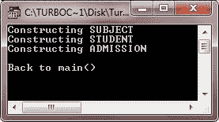
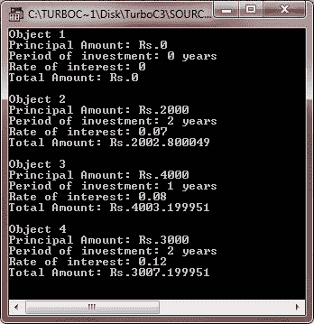
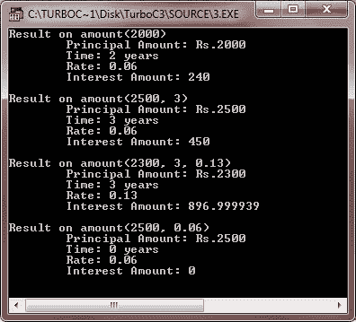
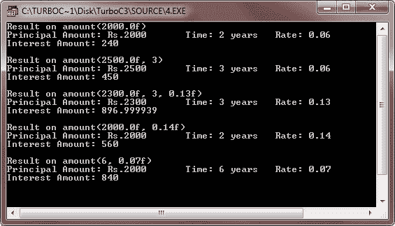

# C++ 构造函数和析构函数

> 原文：<https://codescracker.com/cpp/cpp-constructors-destructors.htm>

构造函数和析构函数是一个类的特殊成员函数，用于初始化和释放属于该类的对象。

C++ 提供了一个定义良好的机制，用于在创建对象时通过构造函数初始化对象；同样的，当一个对象不再被需要时，C++ 定义了一种方法来废弃它，通过一个析构函数。这些可以有多种变化。让我们详细讨论其中的每一个。

## C++ 构造函数

与其类同名的成员函数被称为构造函数，它用于用合法的初始值初始化该类类型的对象。

构造函数是一个类的成员函数，当创建该类的对象时，它会被自动调用。它(构造函数)与类名同名，它的主要工作是将对象初始化为该类的合法初始值。

如果一个类有一个构造函数，那么这个类的每个对象在使用之前都会被初始化。考虑以下具有构造函数的类:

```
class Student
{
   private :
      int rollno;
      float marks;
   public :
      :

      /* This ( Below i.e., Student() )is a constructor of class Student.
      See it has same name as that of its class and no return type */

      Student()
      {
         rollno = 0;
         marks = 0.0;
      }
      :
};
```

请参阅上面的类有一个成员函数，其名称与其类的名称相同，并为其数据成员提供初始值。现在，每当创建(声明)Student 类型的对象时，编译器将自动为新创建的对象调用构造函数 Student::Student()。

**注意**——构造函数和析构函数没有返回类型，甚至没有 void。

### 对构造函数的需求

C++ 中的结构或数组可以在声明时初始化。例如，考虑下面的代码片段:

```
struct Student
{
   int rollno;
   float marks;
};
int main()
{
   Student s1 = {0,0.0};
   int a[5] = {1,2,3,4,5};
   :
}
```

但是这样的初始化对一个类不起作用，因为类成员有它们相关的访问说明符。他们可能对外界不可用(在他们的类之外)。

对此可以有另一种解决办法。如果我们在类中定义一个成员函数(比如 init())来提供初始值，如下所示:

```
class Student
{
   private :
      int rollno;
      float marks;
   public :
      void init()
      {
         rollno = 0;
         marks = 0.0;
      }
      :        //other public members
};
int main()
{
   Student senior ;          //create an object
   senior.init();            //initialize it
   :
}
```

看，现在有一个函数(称为 init())提供初始值，但是程序员仍然必须显式地调用它，以便初始化对象。换句话说，初始化的责任完全在于程序员。如果程序员调用 init()失败了怎么办？在这种情况下，对象充满了垃圾，可能会对程序造成严重破坏。

那么，出路是什么？很简单，把初始化的责任从程序员那里拿走，交给编译器，因为正是编译器确切地知道对象何时被创建。每次创建一个对象，编译器都会通过调用初始化函数自动初始化它。并且当且仅当初始化函数具有与类(即构造函数)相同的名称时，该责任由编译器接管。

**注意** -需要一个类的构造函数，这样编译器会在一个对象被创建时自动初始化它。一个类构造函数， 如果被定义，每当程序创建一个该类的对象时就会被调用。

## C++ 构造函数声明和定义

构造函数的定义类似于类的其他成员函数。它可以在类定义内部定义，也可以在类定义外部定义。

下面的代码片段在类定义中定义了一个构造函数:

```
class X
{
   int i;
   public :
      int j, k;
      X()
      {
         i = j = k = 0;    //constructor
      }
      :                   //other members
};
```

这个简单的构造函数(X::X())是一个内联成员函数。构造函数也可以写成大纲函数，如下所示:

```
class X
{
   int i;
   public :
      int j, k;
      X();             //only declaration i.e., prototype here
      :                //other members
};
X::X()            //constructor defined outside
{
   i = j = k = 0;
}
```

在上面给出的两个类定义中，构造函数已经被定义为公共成员函数。您甚至可以在私有或受保护的节下定义一个构造函数。构造函数也遵循类的常规访问规则。这意味着，私有或受保护的构造函数对非成员函数不可用。换句话说，使用私有或受保护的构造函数，您不能在非成员函数中创建同一类的对象，但是在成员函数和友元函数中是允许的。

### 默认构造函数

不接受任何参数的构造函数称为默认构造函数。在前一节中，X::X()是类 X 的默认构造函数，因为它没有参数。然而，构造函数 XYZ :: XYZ()不是默认的构造函数。使用默认构造函数，创建对象的方式与创建其他数据类型的变量的方式相同。举个例子，

```
X Ob1;
```

将通过调用默认构造函数创建 X 类型的对象 Ob1。但是当构造函数接受一些参数时，初始值必须在对象创建时传递。

当用户定义的类不包含显式构造函数时，编译器会自动提供一个没有参数的默认构造函数。这个隐式声明的默认构造函数是其类的内联公共成员。

例如，考虑下面的代码片段:

```
class A
{
   int i;
   public :
      void getval(void);
      void prnval(void);
      :          //member functions definitions
};
A Ob1;       /*uses default constructor for creating Ob1\. Since user can use it,
      that means, this implicitly defined default constructor is
      public member of the class */
Ob1.getval();
Ob1.prnval();
```

拥有一个默认的构造函数仅仅意味着应用程序可以声明类的实例，因为 C++ 要求每当创建一个类的实例时，都要调用它的构造函数。

**提示** -如果一个类没有明确定义的构造函数，编译器将提供一个默认的构造函数。

**注意**——编译器提供的默认构造函数不做任何特定的事情。它只是将内存分配给对象的数据成员。

### 参数化构造函数

接受参数进行调用的构造函数称为参数化构造函数。

像其他函数一样，你也可以编写接受参数的构造函数。这种构造函数称为参数化构造函数(或常规构造函数)。

一旦声明了带参数的构造函数，默认的构造函数就被隐藏了。此后，您不能调用默认的构造函数。

这意味着每当声明类的实例(对象)时，都必须指定参数。考虑下面的代码片段:

```
class Test
{
   int ant;
   public :
      Test(int i)          //constructor with arguments
      {
         ant = i;
      }
      :                  //other members
};
int main()
{
   Test object1(45);             //ok, Argument value provided
   Test object2;                 //Error !! No default constructor available
   :
}
```

**提示**——用参数声明一个构造函数会隐藏默认的构造函数。

### 复制构造函数

复制构造函数是 classname (classname &)形式的构造函数。每当您使用相同类型的另一个实例的值初始化一个实例时，编译器都会使用复制构造函数。举个例子，

```
Sample S1;         //default constructor used
Sample S2 = S1;        //copy constructor used
```

在上面的代码中，对于第二条语句，编译器会将实例 S1 逐个成员地复制到 S2。如果没有定义复制构造函数，编译器会自动创建它，并且它是公共的。

您也可以定义自己的复制构造函数。复制构造函数将对同一类的对象的引用作为参数。考虑下面的类定义:

```
class Sample
{
   int i, j;
   public :
      Sample(int a, int b)           //constructor
      {
         i = a;
         j = b;
      }
      Sample(Sample & s)        //copy constructor
      {
         j = s.j;
         i = s.j;
         cout << "\nCopy constructor working \n" ;
      }
      void print(void)
      {
         cout << i << j << "\n" ;
      }
      :
};
```

上面的定义定义了两个构造函数:一个参数化的构造函数用于提供初始值，另一个是复制构造函数，用于将一个样本对象的数据值复制到另一个样本对象上。这些构造函数可以按如下方式使用:

```
Sample S1(4, a);        //S1 initialize first constructor used
Sample S2(S1);         //S1 copied to S2\. Copy constructor called.
Sample S3 = S1;        //S1 copied to S3\. Copy constructor called again.
```

但是如果你给出一个赋值语句

```
S4 = S1;
```

它不会调用复制构造函数。但是，如果 S4 和 S1 是同一类型的对象，这个语句是合法的，它只是逐个成员地将 S1 的值赋给 S4。

通过复制构造函数进行初始化的过程称为复制初始化。

### 构造函数调用的顺序

下面是一个示例程序，说明了构造函数调用的顺序

```
/* C++ Constructors and Destructors - Example Program */

#include<iostream.h>
#include<conio.h>
class SUBJECT
{
   int days;
   int subjectno;
   public:
      SUBJECT(int d=123, int sn=101);
      void printsubject(void)
      {
         cout<<"Subject No: "<<subjectno<<"\n";
         cout<<"Days: "<<days<<"\n";
      }
};
SUBJECT::SUBJECT(int d, int sn)
{
   cout<<"Constructing SUBJECT\n";
   days=d;
   subjectno=sn;
}
class STUDENT
{
   int rollno;
   float marks;
   public:
      STUDENT()
      {
         cout<<"Constructing STUDENT\n";
         rollno=0;
         marks=0.0;
      }
      void getvalue(void)
      {
         cout<<"Enter roll number and marks: ";
         cin>>rollno>>marks;
      }
      void print(void)
      {
         cout<<"Roll No: "<<rollno<<"\n";
         cout<<"Marks: "<<marks<<"\n";
      }
};
class ADMISSION
{
   SUBJECT sub;
   STUDENT stud;
   float fees;
   public:
      ADMISSION()
      {
         cout<<"Constructing ADMISSION\n";
         fees=0.0;
      }
      void print(void)
      {
         stud.print();
         sub.printsubject();
         cout<<"Fees: "<<fees<<"\n";
      }
};
void main()
{
   clrscr();
   ADMISSION adm;
   cout<<"\nBack to main()\n";
   getch();
}
```

下面是上述 C++ 程序的运行示例:



### 对象的动态初始化

动态初始化意味着可以在运行时提供初始值。甚至类对象也可以动态初始化，即使用运行时提供的值。

以下代码片段对此进行了解释:

```
class sample
{
   int rollno;
   float marks;
   public :
      sample(int a, float b)
      {
         rollno = a;
         marks = b;
      }
      sample(sample & s)     //copy constructor
      {
         rollno = s.rollno;
         marks = s.marks;
         cout << "\n copy constructor at work \n";
      }
      :
      :                    //other members
};
int main()
{
   int x;
   float y;
   cout << "Enter rollno of the student : ";
   cin >> x;
   cout << "\n Enter marks of the student : ";
   cin >> y;
   cout << "\n";
   sample s1(x, y);
      //dynamic initialization with values x and y
   :
}
```

动态初始化的好处是它提供了在运行时分配初始值的灵活性。

### 构造函数重载

就像任何其他函数一样，类的构造函数也可能被重载，因此即使初始值的数量和类型不同，对象仍然可以被初始化。例如，考虑下面的示例程序(下面的程序使用重载的构造函数) :

```
/* C++ Constructors and Destructors - Example Program */

#include<iostream.h>
#include<conio.h>
#include<stdlib.h>
class DEPOSIT
{
   long int principal;
   int time;
   float rate;
   float totalamount;
   public:
      DEPOSIT();                         // #1
      DEPOSIT(long p, int t, float r);      // #2
      DEPOSIT(long p, int t);               // #3
      DEPOSIT(long p, float r);             // #4
      void calculateamount(void);
      void display(void);
};
DEPOSIT::DEPOSIT()
{
   principal = time = rate = 0.0;
}
DEPOSIT::DEPOSIT(long p, int t, float r)
{
   principal = p;
   time = t;
   rate = r;
}
DEPOSIT::DEPOSIT(long p, int t)
{
   principal = p;
   time = t;
   rate = 0.08;
}
DEPOSIT::DEPOSIT(long p, float r)
{
   principal = p;
   time = 2;
   rate = r;
}
void DEPOSIT::calculateamount(void)
{
   totalamount = principal + (principal*time*rate)/100;
}
void DEPOSIT::display(void)
{
   cout<<"Principal Amount: Rs."<<principal<<"\n";
   cout<<"Period of investment: "<<time<<" years\n";
   cout<<"Rate of interest: "<<rate<<"\n";
   cout<<"Total Amount: Rs."<<totalamount<<"\n";
}
void main()
{
   clrscr();
   DEPOSIT d1;
   DEPOSIT d2(2000, 2, 0.07f);
   DEPOSIT d3(4000, 1);
   DEPOSIT d4(3000, 0.12f);
   d1.calculateamount();
   d2.calculateamount();
   d3.calculateamount();
   d4.calculateamount();
   cout<<"Object 1\n";
   d1.display();
   cout<<"\nObject 2\n";
   d2.display();
   cout<<"\nObject 3\n";
   d3.display();
   cout<<"\nObject 4\n";
   d4.display();
   getch();
}
```

上面的 C++ 程序会显示以下输出:



上面的程序通过调用不同的构造函数来构造不同的对象。每个类只有一个析构函数，也就是说，析构函数不能重载。

这是另一个说明默认参数工作的示例程序

```
/* C++ Constructors and Destructors - Example Program */

#include<iostream.h>
#include<conio.h>
void amount(float prin, int time=2, float rate=0.06);
void amount(float prin, int time, float rate)
{
   cout<<"\tPrincipal Amount: Rs."<<prin<<"\n";
   cout<<"\tTime: "<<time<<" years\n";
   cout<<"\tRate: "<<rate<<"\n";
   cout<<"\tInterest Amount: "<<(prin*rate*time)<<"\n";
}
void main()
{
   clrscr();
   cout<<"Result on amount(2000)\n";
      amount(2000);
   cout<<"\nResult on amount(2500, 3)\n";
      amount(2500, 3);
   cout<<"\nResult on amount(2300, 3, 0.13)\n";
      amount(2300, 3, 0.13);
   cout<<"\nResult on amount(2500, 0.06)\n";
      amount(2500, 0.06);
   getch();
}
```

下面是这个 C++ 程序的示例输出:



下面是另一个示例程序，说明了函数重载与默认参数的工作原理

```
/* C++ Constructors and Destructors - Example Program */

#include<iostream.h>
#include<conio.h>
void amount(float prin, int time, float rate)
{
   cout<<"Principal Amount: Rs."<<prin;
   cout<<"\tTime: "<<time<<" years";
   cout<<"\tRate: "<<rate;
   cout<<"\nInterest Amount: "<<(prin*time*rate);
}
void amount(float prin, int time)
{
   cout<<"Principal Amount: Rs."<<prin;
   cout<<"\tTime: "<<time<<" years";
   cout<<"\tRate: 0.06";
   cout<<"\nInterest Amount: "<<(prin*time*0.06);
}
void amount(float prin, float rate)
{
   cout<<"Principal Amount: Rs."<<prin;
   cout<<"\tTime: 2 years";
   cout<<"\tRate: "<<rate;
   cout<<"\nInterest Amount: "<<(prin*2*rate);
}
void amount(int time, float rate)
{
   cout<<"Principal Amount: Rs.2000";
   cout<<"\tTime: "<<time<<" years";
   cout<<"\tRate: "<<rate;
   cout<<"\nInterest Amount: "<<(2000*time*rate);
}
void amount(float prin)
{
   cout<<"Principal Amount: Rs."<<prin;
   cout<<"\tTime: 2 years";
   cout<<"\tRate: 0.06";
   cout<<"\nInterest Amount: "<<(prin*2*0.06);
}
void main()
{
   clrscr();
   cout<<"Result on amount(2000.0f)\n";
      amount(2000.0f);
   cout<<"\n\nResult on amount(2500.0f, 3)\n";
      amount(2500.0f, 3);
   cout<<"\n\nResult on amount(2300.0f, 3, 0.13f)\n";
      amount(2300.0f, 3, 0.13f);
   cout<<"\n\nResult on amount(2000.0f, 0.14f)\n";
      amount(2000.0f, 0.14f);
   cout<<"\n\nResult on amount(6, 0.07f)\n";
      amount(6, 0.07f);
   getch();
}
```

下面是上述 C++ 程序的运行示例:



### 构造函数的特殊特性

构造函数有一些特殊的特征。这些是:

*   创建对象时会自动调用构造函数。
*   如果一个类有一个构造函数，那么这个类的每个对象在使用之前都会被初始化。
*   构造函数遵循通常的访问规则。也就是说，私有和受保护的构造函数只对成员和友元函数可用，而公共构造函数对所有函数都可用。只有有权访问类的构造函数的函数才能创建该类的对象。
*   不能为构造函数指定返回类型(甚至不能指定 void)。
*   它们不能被继承，通过派生类可以调用基类的构造函数。
*   构造函数可能不是静态的。
*   缺省构造函数和复制构造函数是由编译器在需要的地方生成的。生成的构造函数是公共的。
*   像其他 C++ 函数一样，构造函数也可以有默认参数。
*   不可能获取构造函数的地址。
*   具有构造函数的类的对象不能是联合的成员。
*   成员函数可以从构造函数中调用。
*   使用语法，可以显式使用构造函数来创建其类类型的新对象。
    【class-name(expression-list)
    例如，Sample obj1 = Sample(13，22.42)；

## C++ 析构函数

正如物体被创造一样，它们也被毁灭。如果一个类可以有一个构造函数来设置事物，那么它也应该有一个析构函数来析构对象。析构函数，顾名思义，是用来销毁由构造函数创建的对象的。析构函数销毁被销毁对象的值。

析构函数也是一个成员函数，其名称与类名相同，但前面有波浪号(“~”)。例如，类 Sample 的析构函数将命名为~Sample()。

析构函数不带参数，也不能为它指定返回类型(甚至 void 也不行)。当对象被销毁时，编译器会自动调用它。(对于块来说是局部的局部自动对象在块结束时被销毁；当程序终止时，全局或静态对象被销毁)。析构函数清理不再可访问的存储(对象的内存区域)。

**注意**一个析构函数的名字，它是~classname()。符号~指的是 NOT，也就是说，析构函数是 NOT 构造函数。一个构造函数初始化一个对象，一个片段给出了一个析构函数的例子:

```
class Sample
{
   int i, j;
   public :
      Sample(int a, int b)       //constructor
      {
         i = a;
         j = b;
      }
      ~Sample()
      {
         cout << "Destructor at work\n" ;
      }
      :                  //other members
};
int main()
{
   Sample s1(3, 4);        //local object s1 constructed with values 3 & 4 using Sample()
   .
   .
   .
   /* automatically s1 is destructed at the end of the block using destructor ~Sample()
}
```

### 需要析构函数

在构造函数构造对象的过程中，可能会分配资源供使用。例如，一个构造函数可能已经打开了一个文件，并且可能给它分配了一个内存区域。类似地，构造函数可能已经将内存分配给了其他一些对象。

这些分配的资源必须在对象销毁之前释放。现在是谁的责任？这里有一个析构函数自愿完成这项任务，并自动执行所有清理任务(比如关闭文件、释放内存区域)。因此，析构函数和构造函数一样有用。

## C++ 析构函数声明和定义

析构函数是一个成员函数，可以像其他成员函数一样定义。但是，它不接受任何参数，也不返回任何值。

作为成员函数的析构函数遵循成员函数通常的访问规则。也就是说，如果被定义为私有或受保护的成员函数，它就只能用于成员函数，并且只有这些成员函数才能创建、使用和销毁该类类型的对象。但是，如果一个类定义了一个公共析构函数，它的对象可以被任何函数创建、使用和销毁。以下代码片段说明了这一点:

```
class Sample
{
   int i, j;
   ~Sample()                  //private destructor.
   {
      cout << "Destructing\n" ;
   }
   public :
      Sample()            //constructor.
      {
         i = 0;
         j = 0;
      }
      void memb1(void);
      void memb2(void);
};
void Sample::memb1(void)
{
   Sample s1;        /*valid. object can be used here. It is a member function and 
            thus has an access to its private destructor */
}
void Sample::memb2(void)
{
   Sample s2;       /*valid. abc() is a friend function and thus has an access to
         sample's private members. */
   .
   .
   .
}
int main()
{
   Sample s4;         /* invalid main() is a non-member function and thus 
         cannot access private members (destructor also as it is private). */
   .
   .
   .
}
```

如果你没有为一个类定义析构函数，编译器会自动生成一个，默认的析构函数。如果要析构多个对象，析构函数的调用顺序与构造函数的调用顺序相反。

举个例子，

```
{
   Sample s1;                     // s1 constructed
   Sample s2;                     // s2 constructed
      Sample s3;          // s3 constructed
      :
               // s3 destructed
               // s4 destructed
}               // s5 destructed
```

**注意**——一般来说，析构函数应该定义在类的 public 节下，这样它的对象就可以在任何函数中被(使用然后)销毁。

### 析构函数的一些特征

析构函数有一些相关的特殊特征。这些是:

*   当对象被销毁时，析构函数被自动调用。
*   一个类只能有一个析构函数。换句话说，析构函数不能重载。
*   如果一个类有一个析构函数，那么该类的每个对象都会在对象超出范围之前被反初始化。(局部对象在定义它们的块的末尾，全局和静态对象在程序的末尾。)
*   析构函数也像其他成员函数一样遵守通常的访问规则。
*   不能向析构函数提供任何参数，它也不返回值。
*   它们不能被继承。
*   析构函数可能不是静态的。
*   不可能获取析构函数的地址。
*   成员函数可以从析构函数中调用。
*   具有析构函数的类的对象不能是联合的成员。

[C++ 在线测试](/exam/showtest.php?subid=3)

* * *

* * *