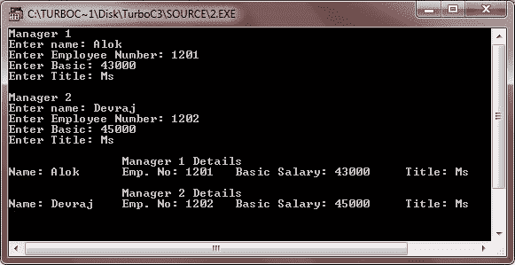

# C++ 继承

> 原文：<https://codescracker.com/cpp/cpp-inheritance.htm>

继承是一个类从另一个类继承属性的能力。继承最重要的优势是代码的可重用性。一旦编写并调试了基类，就可以在各种情况下使用它，而不必重新定义或重写它。已经测试和保存以前的代码可以重复使用。

重用现有的代码可以节省时间、金钱和精力，并增加程序的可靠性。无需重新定义旧类，您可以向派生类添加新属性，甚至可以重新定义继承的类成员函数。

## 继承的需要

继承是面向对象语言的一个极好的概念。以下是引入继承的几个原因:

*   表达继承关系的能力，这确保了与真实世界模型的接近。
*   可重用性的概念。可复用性的优点是:开发时间更快，维护更容易，易于扩展。
*   继承的传递性。

## 不同形式的继承

继承可以有多种形式:

*   **单一继承**——当一个子类只继承一个基类时，称为单一继承
*   **多重继承** -当一个子类从多个基类继承时，称为多重继承
*   **层次继承** -当许多子类从一个基类继承时，称为层次继承
*   **多级继承**——这种形式的继承反映了继承的传递性。当一个子类继承了一个 类，而这个类本身又继承了另一个类，这就是多级继承
*   **混合遗传** -混合遗传结合了两种或多种形式的遗传

### 能见度模式

这里，下表指定了可见性模式的作用:

| 可见性模式是 | 可继承的公共成员变成(在派生类中) | 可继承的受保护成员变成(在派生类中) | 派生类不能直接访问基类的私有成员 |
| 公众的 | 公众的 | 保护 |
| 保护 | 保护 | 保护 |
| 私人的 | 私人的 | 私人的 |

## 继承和访问控制

当一个类从另一个类继承一些成员时，必须有一种方法来控制被继承成员的访问。如你所知，我们可以公开或私有地派生一个类。让我们看看这些。

### 公共派生类中的访问控制

下面是一个示例程序，说明了类的公共派生中的访问控制

```
/* C++ Inheritance - Example Program */

#include<iostream.h>
#include<stdio.h>
#include<conio.h>
class EMPLOYEE
{
   private:
      char name[30];
      unsigned long enumb;
   public:
      void getdata()
      {
         cout<<"Enter name: ";
         gets(name);
         cout<<"Enter Employee Number: ";
         cin>>enumb;
      }
      void putdata()
      {
         cout<<"Name: "<<name<<"\t";
         cout<<"Emp. No: "<<enumb<<"\t";
         cout<<"Basic Salary: "<<basic;
      }
   protected:
      float basic;
      void getbasic()
      {
         cout<<"Enter Basic: ";
         cin>>basic;
      }
};
class MANAGER:public EMPLOYEE
{
   private:
      char title[30];
   public:
      void getdata()
      {
         EMPLOYEE::getdata();
         getbasic();
         cout<<"Enter Title: ";
         gets(title);
      }
      void putdata()
      {
         EMPLOYEE::putdata();
         cout<<"\tTitle: "<<title<<"\n";
      }
};
void main()
{
   clrscr();
   MANAGER m1, m2;
   cout<<"Manager 1\n";
   m1.getdata();
   cout<<"\nManager 2\n";
   m2.getdata();
   cout<<"\n\t\tManager 1 Details\n";
   m1.putdata();
   cout<<"\n\t\tManager 2 Details\n";
   m2.putdata();
   getch();
}
```

下面是上述 C++ 程序的运行示例:


### 私有派生类中的访问控制

下面是一个示例程序，演示了私有派生类中继承成员的访问控制

```
/* C++ Inheritance - Example Program */

#include<iostream.h>
#include<stdio.h>
#include<conio.h>
class EMPLOYEE
{
   private:
      char name[30];
      unsigned long enumb;
   public:
      void getdata()
      {
         cout<<"Enter name: ";
         gets(name);
         cout<<"Enter Employee Number: ";
         cin>>enumb;
      }
      void putdata()
      {
         cout<<"Name: "<<name<<"\t";
         cout<<"Emp. No: "<<enumb<<"\t";
         cout<<"Basic Salary: "<<basic;
      }
   protected:
      float basic;
      void getbasic()
      {
         cout<<"Enter Basic: ";
         cin>>basic;
      }
};
class MANAGER:private EMPLOYEE
{
   private:
      char title[30];
   public:
      void getdata()
      {
         EMPLOYEE::getdata();
         getbasic();
         cout<<"Enter Title: ";
         gets(title);
      }
      void putdata()
      {
         EMPLOYEE::putdata();
         cout<<"\tTitle: "<<title<<"\n";
      }
};
void main()
{
   clrscr();
   MANAGER mng1, mng2;
   cout<<"Manager 1\n";
   mng1.getdata();
   cout<<"\nManager 2\n";
   mng2.getdata();
   cout<<"\n\t\tManager 1 Details\n";
   mng1.putdata();
   cout<<"\n\t\tManager 2 Details\n";
   mng2.putdata();
   getch();
}
```

下面是这个 C++ 程序的示例输出:



派生类继承基类的所有成员。但是，派生类只对基类的非私有成员具有直接访问权限。让我们举一个例子。

```
/* C++ Inheritance - Example Program */

#include<iostream.h>
#include<conio.h>
class BASE
{
   int a;
   public:
      int b;
      void getdata()
      {
         cin>>a;
      }
      void putdata()
      {
         cout<<a;
      }
};
class DERIVED:public BASE
{
   int p;
   public:
      int q;
};
void main()
{
   clrscr();
   cout<<"Size of BASE Class: "<<sizeof(BASE)<<"\n";
   cout<<"Size of DERIVED Class: "<<sizeof(DERIVED)<<"\n";
   BASE bobj;
   DERIVED dobj;
   cout<<"\nSize of BASE Class Object: "<<sizeof(bobj)<<"\n";
   cout<<"Size of DERIVED Class Object: "<<sizeof(dobj);
   getch();
}
```

下面是上述 C++ 程序的示例输出:


## 多重继承中的构造函数

下面是一个示例程序，说明在多重继承中[构造函数和](/cpp/cpp-constructors-destructors.htm)析构函数 的工作原理

```
/* C++ Inheritance - Example Program */

#include<iostream.h>
#include<conio.h>
class BASE1
{
   protected:
      int a;
   public:
      BASE1(int x)
      {
         a=x;
         cout<<"Constructing BASE1\n";
      }
      ~BASE1()
      {
         cout<<"Destructing BASE1\n";
      }
};
class BASE2
{
   protected:
      int b;
   public:
      BASE2(int y)
      {
         b=y;
         cout<<"Constructing BASE2\n";
      }
      ~BASE2()
      {
         cout<<"Destructing BASE2\n";
      }
};
class DERIVED:public BASE2, public BASE1
{
   int c;
   public:
      DERIVED(int i, int j, int k):BASE2(i),BASE1(j)
      {
         c=k;
         cout<<"Constructing DERIVED\n";
      }
      ~DERIVED()
      {
         cout<<"Destructing DERIVED\n";
      }
      void show()
      {
         cout<<"1."<<a<<"\t2."<<b<<"\t3."<<c<<"\n";
      }
};
void main()
{
   clrscr();
   DERIVED obj(10,11,12);
   obj.show();
   getch();
}
```

以下是上述 C++ 程序的示例输出:


## 虚拟基类

下面是一个示例程序，展示了虚拟基类的工作原理

```
/* C++ Inheritance - Example Program */

#include<iostream.h>
#include<conio.h>
class BASE
{
   public:
      int a;
};
class DERIVED1:virtual public BASE
{
   public:
      int b;
};
class DERIVED2:virtual public BASE
{
   public:
      int c;
};
class DERIVED3:public DERIVED1, public DERIVED2
{
   public:
      int total;
};
void main()
{
   clrscr();
   DERIVED3 obj;
   obj.a=15;
   obj.b=20;
   obj.c=25;
   obj.total=obj.a+obj.b+obj.c;
   cout<<obj.a<<"\t"<<obj.b<<"\t"<<obj.c<<"\t"<<obj.total<<"\n";
   getch();
}
```

下面是这个 C++ 程序的运行示例:


[C++ 在线测试](/exam/showtest.php?subid=3)

* * *

* * *