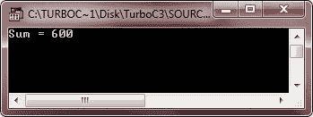
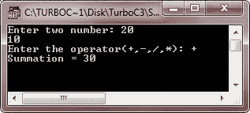
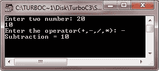
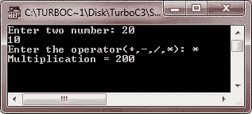
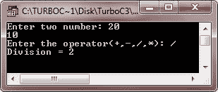
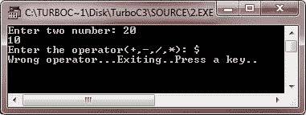

# C++ 数据封装

> 原文：<https://codescracker.com/cpp/cpp-encapsulation.htm>

封装是指将数据和相关功能打包成一个单元。封装是一种面向对象的编程(OOP)概念，它将数据和操作数据的功能绑定在一起，并使二者免受外部干扰和误用。数据封装导致了重要的面向对象的数据隐藏概念。这里有一个例子:

```
class JAVAENCAPSULATIONEXAMPLE
{
   public:
      double getVol(void)
      {
         return len * bre * hei;
      }
   private:
      double len;
      double bre; 
      double hei;
};
```

变量 len、bre 和 hei 是私有的。这意味着它们只能由 JAVAENCAPSULATIONEXAMPLE 类的其他成员访问，而不能由程序的任何其他部分访问。这是实现封装的一种方式。

### C++ 中的访问级别

以下是提供了详细信息的访问级别，有助于您向外界显示/隐藏数据:

*   **公共** -所有对象都可以访问
*   **受保护的** -访问权限仅限于同一类的成员或后代
*   **私人** -只有同级成员才能进入

## C++ 数据封装示例

任何实现具有公共和私有成员的类的 C++ 程序都是数据封装和数据抽象的例子。考虑下面的例子:

```
/* C++ Data Encapsulation - C++ Data Encapsulation Example
 * This program demonstrates the concept
 * of data encapsulation in C++ */

#include<iostream.h>
#include<conio.h>

class JAVAENCAPSULATIONEXAMPLE
{
   public:
      JAVAENCAPSULATIONEXAMPLE(int temp=0) 
      {
         tot=temp;
      }
      void add_num(int num)
      {
         tot = tot+num;
      }
      int get_tot()
      {
         return tot;
      };
   private:
      int tot;
};

void main()
{
   clrscr();
   JAVAENCAPSULATIONEXAMPLE a;
   a.add_num(100);
   a.add_num(200);
   a.add_num(300);
   cout<<"Sum = "<<a.get_tot() <<endl;
   getch();
}
```

以下是上述 C++ 程序的示例输出:



让我们再举一个例子，实际演示 C++ 中的数据封装:

```
/* C++ Data Encapsulation - Example Program */

#include<iostream.h>
#include<stdlib.h>
#include<conio.h>
class CALC
{
   public:
      CALC(int i=0)
      {
         res=i;
      }
      void addnumber(int num1, int num2)
      {
         res=num1+num2;
      }
      void subnumber(int num1, int num2)
      {
         res=num1-num2;
      }
      void mulnumber(int num1, int num2)
      {
         res=num1*num2;
      }
      void divnumber(int num1, int num2)
      {
         res=num1/num2;
      }
      int getresult()
      {
         return res;
      }
   private:
      // hidden from outside the world
      int res;
};
void main()
{
   clrscr();
   CALC cob;
   int a, b;
   char ch;
   cout<<"Enter two number: ";
   cin>>a>>b;
   cout<<"Enter the operator(+,-,/,*): ";
   cin>>ch;
   switch(ch)
   {
      case '+':
         cob.addnumber(a, b);
         cout<<"Summation = "<<cob.getresult()<<"\n";
         break;
      case '-':
         cob.subnumber(a, b);
         cout<<"Subtraction = "<<cob.getresult()<<"\n";
         break;
      case '*':
         cob.mulnumber(a, b);
         cout<<"Multiplication = "<<cob.getresult()<<"\n";
         break;
      case '/':
         cob.divnumber(a, b);
         cout<<"Division = "<<cob.getresult()<<"\n";
         break;
      default:
         cout<<"Wrong operator...Exiting..Press a key..";
         getch();
         exit(1);
   }
   getch();
}
```

以下是上述 C++ 程序的一些运行示例:







[C++ 在线测试](/exam/showtest.php?subid=3)

* * *

* * *