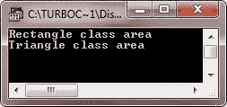
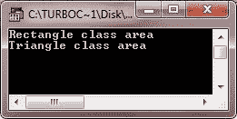
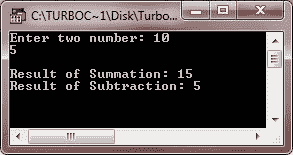

# C++ 多态性

> 原文：<https://codescracker.com/cpp/cpp-polymorphism.htm>

在 C++ 中，多态性意味着有许多形式。通常，当存在类的层次结构并且它们通过继承相关时，就会出现多态性。

## C++ 多态性示例

这是一个演示 C++ 多态性的例子。这里的基类是由另外两个类派生而来的:

```
/* C++ Polymorphism - Example Program */

#include<iostream.h>
#include<conio.h>
class JAVAPOLYMORPHISMEXAMPLE
{
   protected:
      int wid, hei;
   public:
      JAVAPOLYMORPHISMEXAMPLE(int a=0, int b=0)
      {
         wid=a;
         hei=b;
      }
      int area()
      {
         cout<<"Parent class area\n";
         return 0;
      }
};
class RECTANGLE:public JAVAPOLYMORPHISMEXAMPLE
{
   public:
      RECTANGLE(int a=0, int b=0):JAVAPOLYMORPHISMEXAMPLE(a, b)
      {
      }
      int area()
      {
         cout<<"Rectangle class area\n";
         return(wid*hei);
      }
};
class TRIANGLE:public JAVAPOLYMORPHISMEXAMPLE
{
   public:
      TRIANGLE(int a=0, int b=0):JAVAPOLYMORPHISMEXAMPLE(a, b)
      {
      }
      int area()
      {
         cout<<"Triangle class area\n";
         return(wid*hei/2);
      }
};
void main()
{
   clrscr();
   JAVAPOLYMORPHISMEXAMPLE *sh;
   RECTANGLE rec(10, 7);
   TRIANGLE tri(10, 5);
   sh = &rec;
   sh->area();
   sh = &tri;
   sh->area();
   getch();
}
```

以下是上述 C++ 程序的示例输出:


如您所见，产生的输出是不正确的。现在我们要在 JAVAPOLYMORPHISMEXAMPLE 类中做一些小的改动

```
class JAVAPOLYMORPHISMEXAMPLE
{
   protected:
   int wid, hei;
   public:
   JAVAPOLYMORPHISMEXAMPLE(int a=0, int b=0)
   {
        wid=a;
        hei=b;
   }
   virtual int area()
    {
        cout<<"Parent class area\n";
        return 0;
    }
};
```

下面是修改代码后的上述程序的完整版本:

```
/* C++ Polymorphism - Example Program */

#include<iostream.h>
#include<conio.h>
class JAVAPOLYMORPHISMEXAMPLE
{
   protected:
      int wid, hei;
   public:
      JAVAPOLYMORPHISMEXAMPLE(int a=0, int b=0)
      {
         wid=a;
         hei=b;
      }
      virtual int area()
      {
         cout<<"Parent class area\n";
         return 0;
      }
};
class RECTANGLE:public JAVAPOLYMORPHISMEXAMPLE
{
   public:
      RECTANGLE(int a=0, int b=0):JAVAPOLYMORPHISMEXAMPLE(a, b)
      {
      }
      int area()
      {
         cout<<"Rectangle class area\n";
         return(wid*hei);
      }
};
class TRIANGLE:public JAVAPOLYMORPHISMEXAMPLE
{
   public:
      TRIANGLE(int a=0, int b=0):JAVAPOLYMORPHISMEXAMPLE(a, b)
      {
      }
      int area()
      {
         cout<<"Triangle class area\n";
         return(wid*hei/2);
      }
};
void main()
{
   clrscr();
   JAVAPOLYMORPHISMEXAMPLE *sh;
   RECTANGLE rec(10, 7);
   TRIANGLE tri(10, 5);
   sh = &rec;
   sh->area();
   sh = &tri;
   sh->area();
   getch();
}
```

以下是上述 C++ 程序的示例输出:



## 虚拟功能

只需使用关键字 virtual，就可以在 C++ 中自由声明虚函数。下面是一小段代码，展示了 C++ 中纯虚函数的例子:

```
class JAVAPOLYMORPHISMEXAMPLE
{
   protected:
      int wid, hei;
   public:
      JAVAPOLYMORPHISMEXAMPLE(int a=0, int b=0)
      {
         wid=a;
         hei=b;
      }
      // this is the pure virtual function
      virtual int area() = 0;
};
```

这里 **= 0** 告诉 C++ 编译器这个函数没有体，上面的虚函数在 C++ 中会被称为纯虚函数 。以下是上述 C++ 程序的完整版本:

```
/* C++ Polymorphism - Example Program */

#include<iostream.h>
#include<conio.h>
class JAVAPOLYMORPHISMEXAMPLE
{
   protected:
      int wid, hei;
   public:
      JAVAPOLYMORPHISMEXAMPLE(int a=0, int b=0)
      {
         wid=a;
         hei=b;
      }
      virtual int area() = 0;
};
class RECTANGLE:public JAVAPOLYMORPHISMEXAMPLE
{
   public:
      RECTANGLE(int a=0, int b=0):JAVAPOLYMORPHISMEXAMPLE(a, b)
      {
      }
      int area()
      {
         cout<<"Rectangle class area\n";
         return(wid*hei);
      }
};
class TRIANGLE:public JAVAPOLYMORPHISMEXAMPLE
{
   public:
      TRIANGLE(int a=0, int b=0):JAVAPOLYMORPHISMEXAMPLE(a, b)
      {
      }
      int area()
      {
         cout<<"Triangle class area\n";
         return(wid*hei/2);
      }
};
void main()
{
   clrscr();
   JAVAPOLYMORPHISMEXAMPLE *sh;
   RECTANGLE rec(10, 7);
   TRIANGLE tri(10, 5);
   sh = &rec;
   sh->area();
   sh = &tri;
   sh->area();
   getch();
}
```

下面是这个 C++ 程序的运行示例:



### 更多示例

这里还有一个示例程序，演示了 C++ 中的多态性

```
/* C++ Polymorphism - Example Program */

#include<iostream.h>
#include<conio.h>
class BASE
{
   protected:
      int a;
      int b;
      int res;
   public:
      void setvar(int x, int y)
      {
         a=x;
         b=y;
      }
      virtual void op() = 0;
      int getresult()
      {
         return res;
      }
};
class ADD:public BASE
{
   public:
      void op()
      {
         res=a+b;
      }
};
class SUB:public BASE
{
   public:
      void op()
      {
         res=a-b;
      }
};
void main()
{
   clrscr();
   int m, n;
   BASE *bo;
   ADD ao;
   SUB so;
   cout<<"Enter two number: ";
   cin>>m>>n;
   bo=&ao;
   bo->setvar(m, n);
   bo->op();
   cout<<"\nResult of Summation: "<<bo->getresult();
   bo=&so;
   bo->setvar(m, n);
   bo->op();
   cout<<"\nResult of Subtraction: "<<bo->getresult();
   getch();
}
```

下面是上述 C++ 程序的运行示例:



[C++ 在线测试](/exam/showtest.php?subid=3)

* * *

* * *