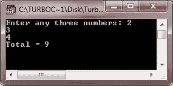
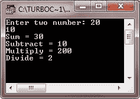

# C++数据抽象

> 原文：<https://codescracker.com/cpp/cpp-data-abstraction.htm>

数据抽象是表示基本特性的过程，不包括实现细节。换句话说，你可以说，数据抽象指的是，通过隐藏背景细节，只提供必要的特性。

要创建抽象，或者从外部世界抽象数据，那么遵循以下两个步骤来提供或隐藏外部世界的实现细节:

*   用公共标签定义的成员可以被程序的所有部分访问。
*   并且使用私有标签定义的成员对于使用该类的代码是不可访问的。

## C++中的数据抽象示例程序

让我们用一些例子程序来说明 C++中的数据抽象。这是第一个演示 C++数据抽象的示例程序

```
/* C++ Data Abstraction - Example Program */

#include<iostream.h>
#include<conio.h>
class ADD
{
   public:
      ADD(int i=0)
      {
         tot=i;
      }
      void addnumber(int num)
      {
         tot=tot+num;
      }
      int gettotal()
      {
         return tot;
      }
   private:
      // hidden from outside the world
      int tot;
};
void main()
{
   clrscr();
   ADD aob;
   int a, b, c;
   cout<<"Enter any three numbers: ";
   cin>>a>>b>>c;
   aob.addnumber(a);
   aob.addnumber(b);
   aob.addnumber(c);
   cout<<"Total = "<<aob.gettotal();
   getch();
}
```

下面是上述 C++程序的运行示例:



这是另一个示例程序，也展示了 C++中的数据抽象

```
/* C++ Data Abstraction - Example Program */

#include<iostream.h>
#include<conio.h>
class CALC
{
   public:
      CALC(int i=0)
      {
         res=i;
      }
      void addnumber(int num1, int num2)
      {
         res=num1+num2;
      }
      void subnumber(int num1, int num2)
      {
         res=num1-num2;
      }
      void mulnumber(int num1, int num2)
      {
         res=num1*num2;
      }
      void divnumber(int num1, int num2)
      {
         res=num1/num2;
      }
      int getresult()
      {
         return res;
      }
   private:
      int res;
};
void main()
{
   clrscr();
   CALC cob;
   int a, b;
   cout<<"Enter two number: ";
   cin>>a>>b;
   cob.addnumber(a, b);
   cout<<"Sum = "<<cob.getresult()<<"\n";
   cob.subnumber(a, b);
   cout<<"Subtract = "<<cob.getresult()<<"\n";
   cob.mulnumber(a, b);
   cout<<"Multiply = "<<cob.getresult()<<"\n";
   cob.divnumber(a, b);
   cout<<"Divide = "<<cob.getresult()<<"\n";
   getch();
}
```

下面是上述 C++程序的运行示例:



[C++在线测试](/exam/showtest.php?subid=3)

* * *

* * *