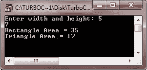
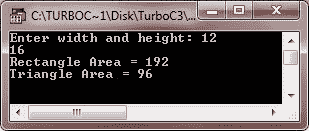

# C++ 接口

> 原文：<https://codescracker.com/cpp/cpp-interfaces.htm>

在 C++ 中，接口基本上是用来描述 C++ 类的行为，而不是谈论同一类的特定实现。这里有一个例子:

```
class JAVAINTERFACEEXAMPLE
{
   public:
      virtual double get_vol() = 0;
   private:
      double len;
      double bre;
      double hei;
};
```

## C++ 接口示例

这是一个示例程序，实际说明了 C++ 中接口或抽象类的概念

```
/* C++ Interfaces - Example Program */

#include<iostream.h>
#include<conio.h>
class JAVAINTERFACEEXAMPLE
{
   public:
      // here is a pure virtual function, providing the interface framework
      virtual int get_area()=0;
      void setwidth(int wi)
      {
         wid=wi;
      }
      void setheight(int he)
      {
         hei = he;
      }
   protected:
      int wid;
      int hei;
};
class RECTANGLE:public JAVAINTERFACEEXAMPLE
{
   public:
      int get_area()
      {
         return (wid*hei);
      }
};
class TRIANGLE:public JAVAINTERFACEEXAMPLE
{
   public:
      int get_area()
      {
         return (wid*hei)/2;
      }
};
void main()
{
   clrscr();
   RECTANGLE rob;
   TRIANGLE tob;
   int a, b;
   cout<<"Enter width and height: ";
   cin>>a>>b;
   rob.setwidth(a);
   rob.setheight(b);
   cout<<"Rectangle Area = "<<rob.get_area()<<"\n";
   tob.setwidth(a);
   tob.setheight(b);
   cout<<"Triangle Area = "<<tob.get_area();
   getch();
}
```

下面是上述 C++ 程序的两个运行示例:




[C++ 在线测试](/exam/showtest.php?subid=3)

* * *

* * *