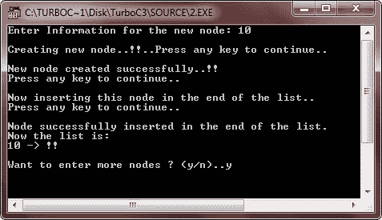
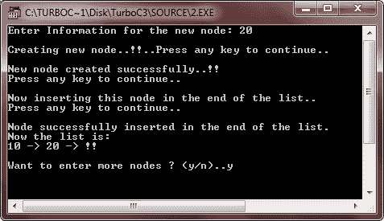

# C++ 链表

> 原文：<https://codescracker.com/cpp/cpp-linked-lists.htm>

术语“列表”指的是数据的线性集合。线性列表的一种形式是数组。如你所知，数组中数据元素之间的线性关系是由内存中数据的物理关系(即顺序分配)来反映的，而不是由数据元素本身包含的任何信息来反映的。然而，列表也可以被存储为具有指向序列中下一个的数据元素(即，链接分配)，即，链表。

链表是数据元素的线性集合，称为节点，通过指针指向下一个节点。每个节点分为两部分:

*   第一部分包含元素的信息
*   第二部分称为链接或下一个指针，包含列表中下一个节点的地址

## 需要链表

数据结构中最简单的一种，即数组，只有当它的元素数量和元素大小都预先确定时才能使用，因为在处理之前要预留内存。因此，数组被称为密集列表或静态数据结构。现在考虑一种情况，其中不知道元素的确切数量。在这种情况下，估计可能会出错。也就是说，在处理期间，要么需要更多的存储器，要么数组中存在额外的空闲空间。与数组相关的另一个问题是元素插入和删除的复杂性。

## 内存分配(动态与静态)

存储在内存中的每个数据元素都被赋予了一定的内存。这个给予内存的过程叫做内存分配。内存(主内存)可以以两种方式分配:动态和静态。

### 静态内存分配

静态内存分配技术在实际处理发生之前保留固定数量的内存，因此，必须预先确定要存储的元素数量。这种类型的内存分配称为静态内存分配。仅使用静态内存分配技术为数组分配内存。

### 动态存储分配

动态内存分配技术有助于在程序执行期间按需分配内存。这种内存分配技术称为动态内存分配。如果不再需要内存，动态内存分配也有助于释放内存。像链表和树这样的数据结构使用这种技术来分配内存。

## 单链表

具有元素的一般列表的单向实现:“链接”、“列表”、“是”、“数据”、“结构”可以如下所示:


指针 START 是一个特殊的指针，它存储链表的第一个地址。最后一个节点的 Next 指针存储空值(显示为地球符号)，这意味着该节点没有指向任何其他节点，即它是列表中的最后一个节点。

## C++ 链表示例

让我们举几个例子来全面理解 C++ 中链表的概念。这里列出的程序有:

*   在列表的开头插入
*   在列表末尾插入
*   从列表的开头删除
*   列表中的遍历

### 在列表的开头插入

在这个项目中

*   指针 start 指向列表的开头
*   函数 create_new_node()接受一个整数参数，分配内存以创建一个新节点，并返回指向新节点的指针。(返回类型:节点*)
*   函数 insert_at_beg()将 node *类型指针作为参数，并将该节点插入列表的开头。
*   函数 display()将 node *类型指针作为参数，显示从该指针开始的列表，直到列表的末尾。

```
/* C++ Linked Lists - Example Program of Linked Lists
 * Inserting in the beginning of the list */

#include<iostream.h>
#include<conio.h>
#include<process.h>

struct node
{
   int info;
   node *next;
} *start, *newptr, *save, *ptr;

node *create_new_node(int);
void insert_at_beg(node *);
void display(node *);

void main()
{
   clrscr();
   start = NULL;
   int inf;
   char ch='y';

   while(ch=='y' || ch=='Y')
   {
      clrscr();
      cout<<"Enter Information for the new node: ";
      cin>>inf;
      cout<<"\nCreating new node..!!..Press any key to continue..";
      getch();
      newptr = create_new_node(inf);
      if(newptr != NULL)
      {
         cout<<"\n\nNew node created successfully..!!\n";
         cout<<"Press any key to continue..";
         getch();
      }
      else
      {
         cout<<"\nSorry..!!..cannot create new node..!!..Aborting..!!";
         cout<<"\nPress any key to exit..";
         getch();
         exit(1);
      }
      cout<<"\n\nNow inserting this node at the beginning of the list..\n";
      cout<<"Press any key to continue..\n";
      getch();
      insert_at_beg(newptr);
      cout<<"\nNode successfully inserted at the beginning of the list.\n";
      cout<<"Now the list is:\n";
      display(start);
      cout<<"\nWant to enter more nodes ? (y/n)..";
      cin>>ch;
   }
   getch();
}

node *create_new_node(int n)
{
   ptr = new node;
   ptr->info = n;
   ptr->next = NULL;
   return ptr;
}

void insert_at_beg(node *np)
{
   if(start==NULL)
   {
      start = np;
   }
   else
   {
      save = start;
      start = np;
      np->next = save;
   }
}

void display(node *np)
{
   while(np != NULL)
   {
      cout<<np->info<<" -> ";
      np = np->next;
   }
   cout<<"!!\n";
}
```

以下是上述 C++ 程序的运行示例:


### 在列表末尾插入

在这个项目中

*   开始指针指向列表的开始，后面指向最后一个节点
*   函数 create_new_node()只接受一个参数，分配内存来创建一个新节点，并返回指向新节点的指针。(返回类型:节点*)
*   函数 insert_in_end()将 node *类型指针作为参数，并将该节点插入列表的末尾。
*   函数 display()将 node *类型指针作为参数，显示从该指针开始的列表，直到列表的末尾。

```
/* C++ Linked Lists - Example Program of Linked Lists
 * Insertion in the end of the list */

#include<iostream.h>
#include<conio.h>
#include<process.h>

struct node
{
   int info;
   node *next;
} *start, *newptr, *save, *ptr, *rear;

node *create_new_node(int);
void insert_in_end(node *);
void display(node *);

void main()
{
   clrscr();
   start = rear = NULL;
   int inf;
   char ch='y';

   while(ch=='y' || ch=='Y')
   {
      clrscr();
      cout<<"Enter Information for the new node: ";
      cin>>inf;
      cout<<"\nCreating new node..!!..Press any key to continue..";
      getch();
      newptr = create_new_node(inf);
      if(newptr != NULL)
      {
         cout<<"\n\nNew node created successfully..!!\n";
         cout<<"Press any key to continue..";
         getch();
      }
      else
      {
         cout<<"\nSorry..!!..cannot create new node..!!..Aborting..!!";
         cout<<"\nPress any key to exit..";
         getch();
         exit(1);
      }
      cout<<"\n\nNow inserting this node in the end of the list..\n";
      cout<<"Press any key to continue..\n";
      getch();
      insert_in_end(newptr);
      cout<<"\nNode successfully inserted in the end of the list.\n";
      cout<<"Now the list is:\n";
      display(start);
      cout<<"\nWant to enter more nodes ? (y/n)..";
      cin>>ch;
   }
   getch();
}

node *create_new_node(int n)
{
   ptr = new node;
   ptr->info = n;
   ptr->next = NULL;
   return ptr;
}

void insert_in_end(node *np)
{
   if(start==NULL)
   {
      start = rear = np;
   }
   else
   {
      rear -> next = np;
      rear = np;
   }
}

void display(node *np)
{
   while(np != NULL)
   {
      cout<<np->info<<" -> ";
      np = np->next;
   }
   cout<<"!!\n";
}
```

以下是上述 C++ 程序的一些运行示例:





### 从列表的开头删除

在这个项目中

*   开始指针指向列表的开始，后面指针指向最后一个节点
*   函数 create_new_node()接受一个整数参数，分配内存以创建一个新节点，并返回指向新节点的指针。(返回类型:节点*)
*   函数 insert_node()将 node *类型指针作为参数，并将该节点插入到列表的末尾。
*   函数 delete_node()从开始指针所指向的列表的开始处删除一个节点

```
/* C++ Linked Lists - Example Program of Linked Lists
 * Deletion from the beginning of the list.
 * This program first creates the linked list, then
 * allows user to delete nodes from the beginning
 * of the list */

#include<iostream.h>
#include<conio.h>
#include<process.h>

struct node
{
   int info;
   node *next;
} *start, *newptr, *save, *ptr, *rear;

node *create_new_node(int);
void insert_node(node *);
void display_node(node *);
void delete_node();

void main()
{
   clrscr();
   start = rear = NULL;
   int inf;
   char ch='y';

   while(ch=='y' || ch=='Y')
   {
      clrscr();
      cout<<"Enter Information for the new node: ";
      cin>>inf;
      newptr = create_new_node(inf);
      if(newptr == NULL)
      {
         cout<<"\nSorry..!!..cannot create new node..!!..Aborting..!!";
         cout<<"\nPress any key to exit..";
         getch();
         exit(1);
      }
      insert_node(newptr);
      cout<<"\nWant to enter more nodes ? (y/n)..";
      cin>>ch;
   }
   clrscr();
   do
   {
      cout<<"The list now is:\n";
      display_node(start);
      cout<<"\nWant to delete first node ? (y/n)..";
      cin>>ch;
      if(ch=='y' || ch=='Y');
      {
         delete_node();
      }
   }while(ch=='y' || ch=='Y');
   getch();
}

node *create_new_node(int n)
{
   ptr = new node;
   ptr->info = n;
   ptr->next = NULL;
   return ptr;
}

void insert_node(node *np)
{
   if(start==NULL)
   {
      start = rear = np;
   }
   else
   {
      rear -> next = np;
      rear = np;
   }
}

void delete_node()
{
   if(start == NULL)
   {
      cout<<"Underflow...!!\n";
   }
   else
   {
      ptr = start;
      start = start->next;
      delete ptr;
   }
}

void display_node(node *np)
{
   while(np != NULL)
   {
      cout<<np->info<<" -> ";
      np = np->next;
   }
   cout<<"!!\n";
}
```

以下是上述 C++ 程序的一些运行示例:


### 列表中的遍历

在这个项目中

*   开始指针指向列表的开始，后面指针指向最后一个节点
*   函数 create_new_node()接受一个参数，分配内存以创建一个新节点，并返回指向新节点的指针。(返回类型:节点*)
*   函数 insert_node()将 node *类型指针作为参数，并将该节点插入到列表的末尾。
*   函数 traversal()将 node *类型指针作为参数，显示从该指针开始的列表，直到列表的末尾。

```
/* C++ Linked Lists - Example Program of Linked Lists
 * Traversal in a list */

#include<iostream.h>
#include<conio.h>
#include<process.h>

struct node
{
   int info;
   node *next;
} *start, *newptr, *save, *ptr, *rear;

node *create_new_node(int);
void insert_node(node *);
void travers(node *);

void main()
{
   clrscr();
   start = rear = NULL;
   int inf;
   char ch='y';

   while(ch=='y' || ch=='Y')
   {
      cout<<"Enter Information for the new node: ";
      cin>>inf;
      newptr = create_new_node(inf);
      if(newptr == NULL)
      {
         cout<<"\nSorry..!!..cannot create new node..!!..Aborting..!!";
         cout<<"\nPress any key to exit..";
         getch();
         exit(1);
      }
      insert_node(newptr);
      cout<<"Want to enter more nodes ? (y/n)..";
      cin>>ch;
      cout<<"\n";
   }
   cout<<"The list now is:\n";
   travers(start);
   getch();
}

node *create_new_node(int n)
{
   ptr = new node;
   ptr->info = n;
   ptr->next = NULL;
   return ptr;
}

void insert_node(node *np)
{
   if(start==NULL)
   {
      start = rear = np;
   }
   else
   {
      rear -> next = np;
      rear = np;
   }
}

void travers(node *np)
{
   while(np != NULL)
   {
      cout<<np->info<<" -> ";
      np = np->next;
   }
   cout<<" !!\n";
}
```

下面是这个 C++ 程序的运行示例。


[C++ 在线测试](/exam/showtest.php?subid=3)

* * *

* * *