# C++ 堆栈

> 原文：<https://codescracker.com/cpp/cpp-stacks.htm>

堆栈是一种后进先出(LIFO)结构，在物理上可以实现为数组或链表。作为数组实现的堆栈继承了数组的所有属性，如果作为链表实现，那么链表的所有特征都被它拥有。但是不管栈是如何实现的，插入和删除只发生在栈顶。堆栈中的插入称为压入，堆栈中的删除称为弹出。

## 数组堆栈

由于数组是静态数据结构，即它们所需的空间必须预先确定，即在任何时间点总共有多少元素将一起存在必须预先知道。因此，将堆栈创建为数组需要预先确定元素的数量。

### 作为数组插入堆栈

在堆栈中推进一个元素可能会涉及到元素的移动(取决于你是如何实现的),因为新元素只会被插入到顶部。例如，在任何时间点，我们都有如图 1(a)所示的堆栈(作为一个数组)。

按下 P 后，堆栈变成如图 1(b)所示。在推动另一个元素 L 之后，堆栈变成如图 1(c)所示。

Fig.1
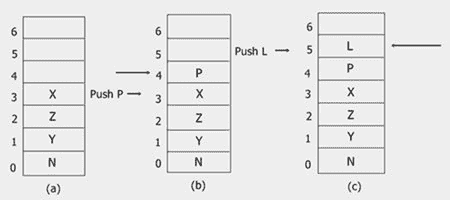

如果数组已满，无法容纳新元素，这种情况称为栈满情况。这种情况也称为溢出。

### 作为数组在堆栈中删除

弹出，即从堆栈中删除一个元素，会移除最顶端位置的元素。正如你看到的前推图，弹出图是相同的，但以相反的方式，即弹出一个元素后，它将被删除。

## 链式栈

链接栈是一种动态数据结构，其中空间需求不需要预先确定。作为链表实现的堆栈也继承了所有这些属性。栈(作为链表)的创建与链表的创建是相同的，即，在获得要插入的项目的节点之后，TOP(指向顶部的指针)指向新插入的节点。

### 在链接堆栈中插入

因为推送只能发生在顶部，所以每次都会修改顶部。

### 从链接堆栈中删除

删除即弹出也需要修改 TOP，即 TOP 指向序列中的下一个节点。

## C++ 堆栈示例

下面是一些实际演示 C++ 中堆栈概念的示例程序。

## 推

如前所述，在堆栈中插入被称为压入。

#### 推入堆栈阵列

```
/* C++ Stack - Example Program of C++ Stack
 * This C++ program demonstrates the concept
 * of Pushing in the stack-array in C++ */

#include<iostream.h>
#include<stdlib.h>
#include<conio.h>

int push(int [], int &, int);
void display(int [], int);
const int SIZE = 50;

void main()
{
   clrscr();
   int stack[SIZE], item, top=-1, res;
   char ch='y';
   while(ch=='y' || ch=='Y')
   {
      cout<<"Enter item for insertion: ";
      cin>>item;
      res = push(stack, top, item);
      if(res == -1)
      {
         cout<<"Overflow..!!..Aborting..Press a key to exit..\n";
         getch();
         exit(1);
      }
      cout<<"Element inserted successfully..!!\n";
      cout<<"\nThe Stack now is:\n";
      display(stack, top);
      cout<<"\nWant to enter more ? (y/n).. ";
      cin>>ch;
   }
   getch();
}

int push(int stack[], int &top, int elem)
{
   if(top == SIZE-1)
   {
      return -1;
   }
   else
   {
      top++;
      stack[top] = elem;
   }
   return 0;
}
void display(int stack[], int top)
{
   cout<<stack[top]<<" <-- "<<"\n";
   for(int i=top-1; i>=0; i--)
   {
      cout<<stack[i]<<"\n";
   }
}
```

以下是上述 C++ 程序的示例输出:

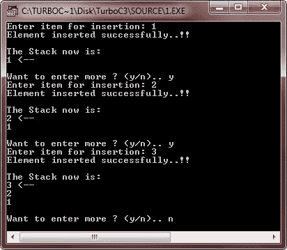

#### 推入链接堆栈

```
/* C++ Stack - Example Program of C++ Stack
 * This C++ program demonstrates the concept
 * of Pushing in the linked-stack in C++ */

#include<iostream.h>
#include<stdlib.h>
#include<conio.h>

struct node
{
   int info;
   node *next;
} *top, *newptr, *save, *ptr;

node *create_new_node(int);
void push(node *);
void display(node *);

void main()
{
   clrscr();
   int inf;
   char ch='y';
   top=NULL;
   while(ch=='y' || ch=='Y')
   {
      cout<<"Enter information for the new node.. ";
      cin>>inf;
      newptr = create_new_node(inf);
      if(newptr == NULL)
      {
         cout<<"\nSorry..!!..Cannot create new node..!!..Aborting..!!\n";
         cout<<"Press any key to exit..\n";
         getch();
         exit(1);
      }
      push(newptr);
      cout<<"\nNow the linked-stack is:\n";
      display(top);
      cout<<"\nWant to enter more ? (y/n).. ";
      cin>>ch;
   }
   getch();
}

node *create_new_node(int x)
{
   ptr = new node;
   ptr->info = x;
   ptr->next = NULL;
   return ptr;
}

void push(node *n)
{
   if(top==NULL)
   {
      top=n;
   }
   else
   {
      save = top;
      top = n;
      n->next = save;
   }
}

void display(node *n)
{
   while(n != NULL)
   {
      cout<<n->info<<" -> ";
      n = n->next;
   }
   cout<<"!!\n";
}
```

下面是这个 C++ 程序的示例输出:

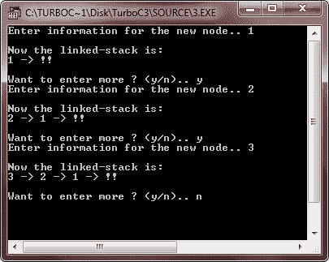

## 间歇的

如前所述，从堆栈中删除被称为弹出。

#### 从数组堆栈中弹出

```
/* C++ Stack - Example Program of C++ Stack
 * This C++ program demonstrates the concept
 * of Popping from the stack-array in C++ */

#include<iostream.h>
#include<stdlib.h>
#include<conio.h>

int pop(int [], int &);
int push(int [], int &, int);
void display(int [], int);
const int SIZE = 50;

void main()
{
   clrscr();
   int stack[SIZE], item, top=-1, res;
   char ch='y';
   while(ch=='y' || ch=='Y')
   {
      cout<<"Enter item for insertion: ";
      cin>>item;
      res = push(stack, top, item);
      if(res == -1)
      {
         cout<<"Overflow..!!..Aborting..Press a key to exit..\n";
         getch();
         exit(1);
      }
      cout<<"\nThe Stack now is:\n";
      display(stack, top);
      cout<<"\nWant to enter more ? (y/n).. ";
      cin>>ch;
   }
   cout<<"Now the deletion of elements starts..\n";
   ch='y';
   while(ch=='y' || ch=='Y')
   {
      res = pop(stack, top);
      if(res==-1)
      {
         cout<<"\nUnderflow..!!..Aborting..!!..Press a key to exit..\n";
         getch();
         exit(2);
      }
      else
      {
         cout<<"\nElement deleted is: "<<res<<endl;
         cout<<"\nThe Stack now is:\n";
         display(stack, top);
      }
      cout<<"Want to delete more ? (y/n).. ";
      cin>>ch;
   }
   getch();
}

int push(int stack[], int &top, int elem)
{
   if(top == SIZE-1)
   {
      return -1;
   }
   else
   {
      top++;
      stack[top] = elem;
   }
   return 0;
}

int pop(int stack[], int &top)
{
   int ret;
   if(top==-1)
   {
      return -1;
   }
   else
   {
      ret=stack[top];
      top--;
   }
   return ret;
}

void display(int stack[], int top)
{
   if(top==-1)
   {
      return;
   }
   cout<<stack[top]<<" <-- "<<"\n";
   for(int i=top-1; i>=0; i--)
   {
      cout<<stack[i]<<"\n";
   }
}
```

以下是上述 C++ 程序的一些示例输出:

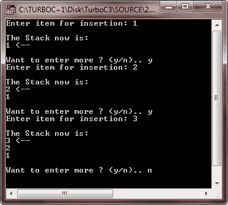
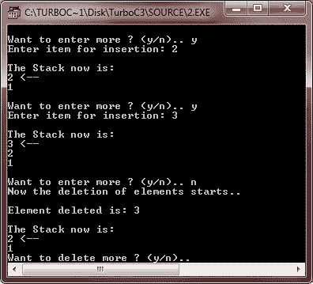
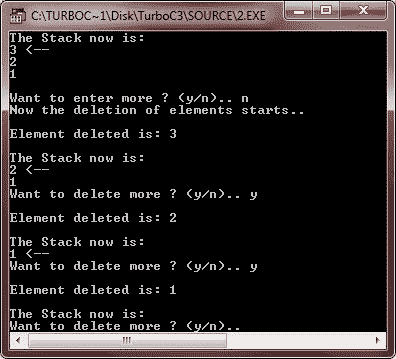
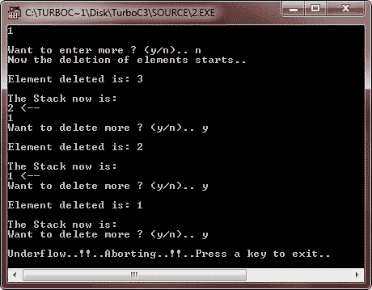

#### 从链接栈中弹出

```
/* C++ Stack - Example Program of C++ Stack
 * This C++ program demonstrates the concept
 * of Popping from the linked-stack in C++ */

#include<iostream.h>
#include<stdlib.h>
#include<conio.h>

struct node
{
   int info;
   node *next;
} *top, *newptr, *save, *ptr;

node *create_new_node(int);
void push(node *);
void pop();
void display(node *);

void main()
{
   clrscr();
   int inf;
   char ch='y';
   top=NULL;
   while(ch=='y' || ch=='Y')
   {
      cout<<"Enter information for the new node.. ";
      cin>>inf;
      newptr = create_new_node(inf);
      if(newptr == NULL)
      {
         cout<<"\nSorry..!!..Cannot create new node..!!..Aborting..!!\n";
         cout<<"Press any key to exit..\n";
         getch();
         exit(1);
      }
      push(newptr);
      cout<<"\nWant to enter more ? (y/n).. ";
      cin>>ch;
   }
   clrscr();
   do
   {
      cout<<"The Stack now is: \n";
      display(top);
      cout<<"\nWant to pop an element ? (y/n).. ";
      cin>>ch;
      if(ch=='y' || ch=='Y')
      {
         pop();
      }
      cout<<"\n";
   }while(ch=='y' || ch=='Y');

   getch();
}

node *create_new_node(int x)
{
   ptr = new node;
   ptr->info = x;
   ptr->next = NULL;
   return ptr;
}

void push(node *n)
{
   if(top==NULL)
   {
      top=n;
   }
   else
   {
      save = top;
      top = n;
      n->next = save;
   }
}

void pop()
{
   if(top==NULL)
   {
      cout<<"\nUnderflow..!!..Press any key to exit..\n";
      getch();
      exit(2);
   }
   else
   {
      ptr = top;
      top = top->next;
      delete ptr;
   }
}

void display(node *n)
{
   while(n != NULL)
   {
      cout<<n->info<<" -> ";
      n = n->next;
   }
   cout<<"!!\n";
}
```

以下是上述 C++ 程序的一些运行示例:

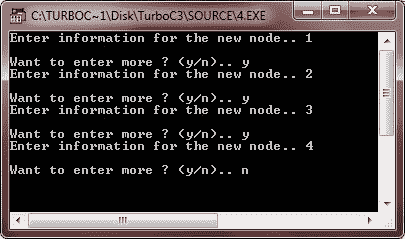
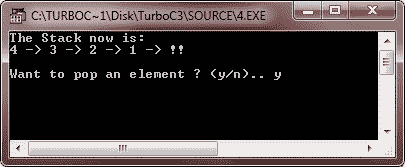
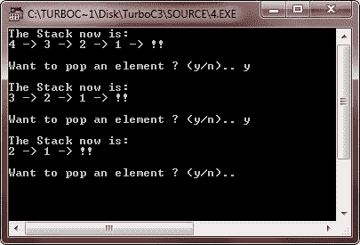
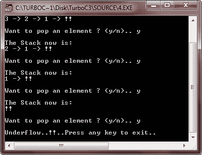

[C++ 在线测试](/exam/showtest.php?subid=3)

* * *

* * *