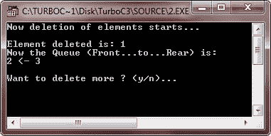
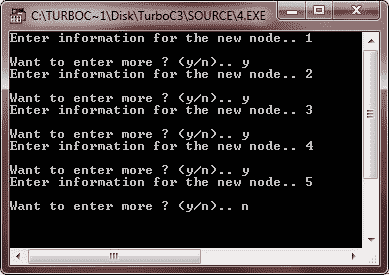

# C++ 队列

> 原文：<https://codescracker.com/cpp/cpp-queues.htm>

队列是一种 FIFO(先进先出)结构，在物理上它可以被实现为数组或链表。无论以何种方式实现队列，插入发生在“后端”,删除发生在“前端”。

## 数组队列

当一个队列被创建为一个数组时，它的元素数在处理之前被声明。数组的开头成为它的“前”端，数组的结尾成为它的“后”端。术语“前端”和“后端”仅在实现为队列时用于描述线性列表。

“前端”存储队列中第一个元素的索引，“后端”存储队列中最后一个元素的索引。在任何给定的时间，队列中元素的数量可以从“前端”和“后端”的值中计算出来。
如果 front = 0 那么元素个数= 0
否则元素个数= front - rear + 1。

## C++ 队列示例

这里列出了一些示例程序，实际演示了 C++ 中队列的概念。

### 数组队列中的插入

```
/* C++ Queue - Example Program of C++ Queue
 * This program demonstrates the concept of
 * insertion in an array queue in C++ */

#include<iostream.h>
#include<conio.h>
#include<stdlib.h>

int insert_in_queue(int [], int);
void display(int [], int, int);

const int SIZE = 50;

int queue[SIZE];
int front=-1;
int rear=-1;

void main()
{
   clrscr();
   int item, check;
   char ch='y';

   while(ch=='y' || ch=='Y')
   {
      cout<<"Enter item for insertion: ";
      cin>>item;
      check = insert_in_queue(queue, item);
      if(check == -1)
      {
         cout<<"\nOverflow..!!..Aborting..!!..Press a key to exit..\n";
         getch();
         exit(1);
      }
      cout<<"Item inserted successfully..!!\n";
      cout<<"\nNow the Queue (Front...to...Rear) is:\n";
      display(queue, front, rear);
      cout<<"\nWant to insert more ? (y/n).. ";
      cin>>ch;
   }
   getch();
}

int insert_in_queue(int queue[], int elem)
{
   if(rear == SIZE-1)
   {
      return -1;
   }
   else if(rear == -1)
   {
      front = rear = 0;
      queue[rear] = elem;
   }
   else
   {
      rear++;
      queue[rear] = elem;
   }
   return 0;
}

void display(int queue[], int front, int rear)
{
   if(front == -1)
   {
      return;
   }
   for(int i=front; i<rear; i++)
   {
      cout<<queue[i]<<" <- ";
   }
   cout<<queue[rear]<<"\n";
}
```

以下是上述 C++ 程序的示例输出:


### 从数组队列中删除

```
/* C++ Queue - Example Program of C++ Queue
 * This program demonstrates the concept of
 * deletion in an array queue in C++ */

#include<iostream.h>
#include<conio.h>
#include<stdlib.h>

int delete_from_queue(int []);
int insert_in_queue(int [], int);
void display(int [], int, int);

const int SIZE = 50;

int queue[SIZE];
int front=-1;
int rear=-1;

void main()
{
   clrscr();
   int item, check;
   char ch='y';

   while(ch=='y' || ch=='Y')
   {
      cout<<"Enter item for insertion: ";
      cin>>item;
      check = insert_in_queue(queue, item);
      if(check == -1)
      {
         cout<<"\nOverflow..!!..Aborting..!!..Press a key to exit..\n";
         getch();
         exit(1);
      }
      cout<<"Item inserted successfully..!!\n";
      cout<<"\nNow the Queue (Front...to...Rear) is:\n";
      display(queue, front, rear);
      cout<<"\nWant to insert more ? (y/n).. ";
      cin>>ch;
   }

   clrscr();
   cout<<"Now deletion of elements starts...\n";
   ch='y';
   while(ch=='y' || ch=='Y')
   {
      check = delete_from_queue(queue);
      if(check == -1)
      {
         cout<<"\nUnderflow..!!..Aborting..!!..Pres a key to exit..\n";
         getch();
         exit(2);
      }
      else
      {
         cout<<"\nElement deleted is: "<<check<<"\n";
         cout<<"Now the Queue (Front...to...Rear) is:\n";
         display(queue, front, rear);
      }
      cout<<"\nWant to delete more ? (y/n)... ";
      cin>>ch;
   }

   getch();
}

int insert_in_queue(int queue[], int elem)
{
   if(rear == SIZE-1)
   {
      return -1;
   }
   else if(rear == -1)
   {
      front = rear = 0;
      queue[rear] = elem;
   }
   else
   {
      rear++;
      queue[rear] = elem;
   }
   return 0;
}

int delete_from_queue(int queue[])
{
   int retn;
   if(front == -1)
   {
      return -1;
   }
   else
   {
      retn = queue[front];
      if(front == rear)
      {
         front = rear = -1;
      }
      else
      {
         front++;
      }
   }
   return retn;
}

void display(int queue[], int front, int rear)
{
   if(front == -1)
   {
      return;
   }
   for(int i=front; i<rear; i++)
   {
      cout<<queue[i]<<" <- ";
   }
   cout<<queue[rear]<<"\n";
}
```

以下是上述 C++ 程序的一些运行示例:





## 链式队列

链接队列是在其元素之间具有链接的队列。保持两个指针来存储“前”和“后”位置。

### 链接队列中的插入

```
/* C++ Queue - Example Program of C++ Queue
 * This program demonstrates the concept of
 * insertion in the linked queue in C++ */

#include<iostream.h>
#include<conio.h>
#include<stdlib.h>

struct node
{
   int info;
   node *next;
} *front, *newptr, *save, *ptr, *rear;

node *create_new_node(int);
void insert(node *);
void display(node *);

void main()
{
   clrscr();
   front = rear = NULL;
   int inf;
   int count=0;
   char ch='y';

   while(ch=='y' || ch=='Y')
   {
      cout<<"Enter information for the new node.. ";
      cin>>inf;
      newptr = create_new_node(inf);
      if(newptr == NULL)
      {
         cout<<"\nSorry..!!..Cannot create new node..!!..Aborting..!!\n";
         cout<<"Press any key to exit..\n";
         getch();
         exit(1);
      }
      insert(newptr);
      cout<<"\nNow the Queue (Front...to...Rear) is:\n";
      display(front);
      cout<<"\nWant to enter more ? (y/n).. ";
      cin>>ch;
   }

   getch();
}

node *create_new_node(int x)
{
   ptr = new node;
   ptr->info = x;
   ptr->next = NULL;
   return ptr;
}

void insert(node *n)
{
   if(front == NULL)
   {
      front = rear = n;
   }
   else
   {
      rear->next = n;
      rear = n;
   }
}

void display(node *n)
{
   while(n != NULL)
   {
      cout<<n->info<<" -> ";
      n = n->next;
   }
   cout<<"!!\n";
}
```

下面是上述 C++ 程序的示例运行:


### 从链接队列中删除

```
/* C++ Queue - Example Program of C++ Queue
 * This program demonstrates the concept of
 * deletion from the linked queue in C++ */

#include<iostream.h>
#include<conio.h>
#include<stdlib.h>

struct node
{
   int info;
   node *next;
} *front, *newptr, *save, *ptr, *rear;

node *create_new_node(int);
void insert(node *);
void delete_node_queue();
void display(node *);

void main()
{
   clrscr();
   front = rear = NULL;
   int inf;
   int count=0;
   char ch='y';

   while(ch=='y' || ch=='Y')
   {
      cout<<"Enter information for the new node.. ";
      cin>>inf;
      newptr = create_new_node(inf);
      if(newptr == NULL)
      {
         cout<<"\nSorry..!!..Cannot create new node..!!..Aborting..!!\n";
         cout<<"Press any key to exit..\n";
         getch();
         exit(1);
      }
      insert(newptr);
      cout<<"\nNow the Queue (Front...to...Rear) is:\n";
      display(front);
      cout<<"\nWant to enter more ? (y/n).. ";
      cin>>ch;
   }

   clrscr();
   do
   {
      cout<<"The Linked-Queue now is (Front...to...Rear) is:\n";
      display(front);
      if(count==0)
      {
         cout<<"\nWant to delete ? (y/n).. ";
         count++;
      }
      else
      {
         cout<<"\nWant to delete more ? (y/n).. ";
      }
      cin>>ch;
      if(ch=='y' || ch=='Y')
      {
         delete_node_queue();
      }
      cout<<"\n";
   }while(ch=='y' || ch=='Y');

   getch();
}

node *create_new_node(int x)
{
   ptr = new node;
   ptr->info = x;
   ptr->next = NULL;
   return ptr;
}

void insert(node *n)
{
   if(front == NULL)
   {
      front = rear = n;
   }
   else
   {
      rear->next = n;
      rear = n;
   }
}

void delete_node_queue()
{
   if(front == NULL)
   {
      cout<<"\nOverflow..!!..Press a key to exit..\n";
      getch();
      exit(2);
   }
   else
   {
      ptr = front;
      front = front->next;
      delete ptr;
   }
}

void display(node *n)
{
   while(n != NULL)
   {
      cout<<n->info<<" -> ";
      n = n->next;
   }
   cout<<"!!\n";
}
```

下面是这个 C++ 程序的一些运行示例:




[C++ 在线测试](/exam/showtest.php?subid=3)

* * *

* * *