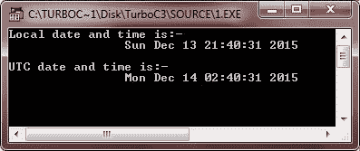
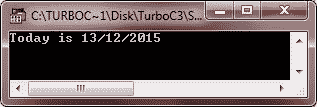
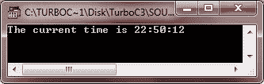
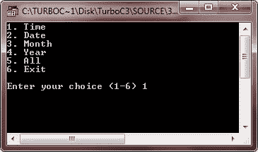
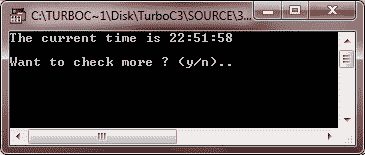
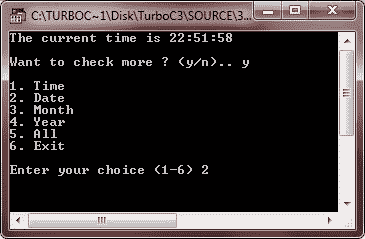
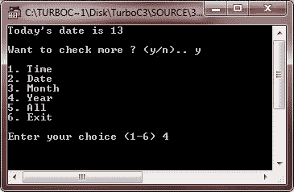
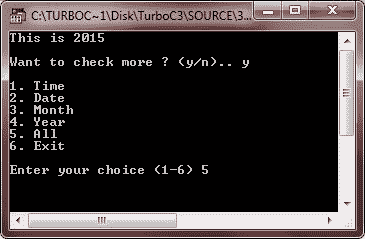
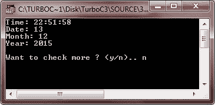

# C++ 日期和时间

> 原文：<https://codescracker.com/cpp/cpp-date-time.htm>

C++ 标准库不提供任何适当的日期类型。C++ 继承了 C 语言中用于日期和时间操作的结构和函数。要访问与日期和时间相关的函数和结构，必须在 C++ 程序中使用/包含一个名为 time.h 的头文件。

有四种与时间相关的类型:clock_t、time_t、size_t 和 tm。类型 clock_t、size_t 和 time_t 能够将系统时间和日期表示为某种整数。

结构类型 tm 以 C 结构的形式保存日期和时间，C 结构具有以下语句中给出的元素:

```
struct tm
{
   int tm_sec;      // seconds of minutes from 0 to 61
   int tm_min;      // minutes of hour from 0 to 59
   int tm_hour;     // hours of day from 0 to 24
   int tm_mday;     // day of month from 1 to 31
   int tm_mon;      // month of year from 0 to 11
   int tm_year;     // year since 1900
   int tm_wday;     // days since Sunday
   int tm_yday;     // days since January 1st
   int tm_isdst;    // hours of daylight savings time
}
```

在 C 或 C++ 语言中处理日期和时间时，tm 结构非常重要。这个结构以 C 结构的形式保存日期和时间。大多数与时间相关的函数都使用了 tm 结构。让我们举一些关于 C++ 中日期和时间的例子来全面理解 C++ 中的日期和时间。

## C++ 日期和时间示例

这个 C++ 程序只是在屏幕上打印本地和 UTC 日期和时间。

```
/* C+ Date and Time - Example Program of C++ Date and Time
 * This program prints local date and time, UTC date and
 * time on the output screen */

#include<iostream.h>
#include<conio.h>
#include<time.h>

void main()
{
   clrscr();

   time_t now = time(0);   // current system date/time

   char* dt = ctime(&now);   // convert in string form

   cout<<"Local date and time is:-\n\t\t"<<dt<<"\n";

   tm *gmtm = gmtime(&now);   // converting now to tm struct for UTC date/time
   dt = asctime(gmtm);
   cout<<"UTC date and time is:-\n\t\t"<<dt;

   getch();
}
```

以下是上述 C++ 程序的示例输出:



## C++ 日期示例

这个 C++ 程序在输出屏幕上打印当前或今天的日期。

```
/* C++ Date and Time - Example Program of C++ Date and Time
 * This program prints today's date on the output screen */

#include<iostream.h>
#include<conio.h>
#include<time.h>

void main()
{
   clrscr();

   time_t now = time(0);
   tm *ltm = localtime(&now);
   cout<<"Today is ";
   cout<<ltm->tm_mday<<"/"<<1+ltm->tm_mon<<"/";
   cout<<1900+ltm->tm_year<<"\n";

   getch();
}
```

下面是这个 C++ 程序的示例输出:



## C++ 时间示例

这个 C++ 程序在输出屏幕上打印当前时间。

```
/* C++ Date and Time - Example of C++ Date and Time
 * This program prints current date on the output
 * output screen in C++ */

#include<iostream.h>
#include<conio.h>
#include<time.h>

void main()
{
   clrscr();

   time_t now = time(0);
   tm *ltm = localtime(&now);
   cout<<"The current time is ";
   cout<<1+ltm->tm_hour<<":";
   cout<<1+ltm->tm_min<<":";
   cout<<1+ltm->tm_sec<<"\n";

   getch();
}
```

下面是上述 C++ 程序的运行示例:



## C++ 日期和时间完成程序

这是 C++ 中日期和时间程序(如上所示)的完整版本。

```
/* C++ Date and Time - Example of C++ Date and Time
 * This program demonstrates the working of date
 * and time in C++ program */

#include<iostream.h>
#include<conio.h>
#include<stdlib.h>
#include<time.h>

void main()
{
   clrscr();
   char choice, ans;

   time_t now = time(0);
   tm *ltm = localtime(&now);

   do
   {
      cout<<"1\. Time\n";
      cout<<"2\. Date\n";
      cout<<"3\. Month\n";
      cout<<"4\. Year\n";
      cout<<"5\. All\n";
      cout<<"6\. Exit\n";
      cout<<"\nEnter your choice (1-6) ";
      cin>>choice;
      clrscr();
      switch(choice)
      {
         case '1':
             cout<<"The current time is ";
             cout<<1+ltm->tm_hour<<":";
             cout<<1+ltm->tm_min<<":";
             cout<<1+ltm->tm_sec<<"\n";
             break;
         case '2':
            cout<<"Today's date is ";
            cout<<ltm->tm_mday<<"\n";
            break;
         case '3':
            cout<<"It's ";
            cout<<1+ltm->tm_mon<<"th month\n";
            break;
         case '4':
            cout<<"This is ";
            cout<<1900+ltm->tm_year<<"\n";
            break;
         case '5':
            cout<<"Time: "<<1+ltm->tm_hour<<":";
            cout<<1+ltm->tm_min<<":";
            cout<<1+ltm->tm_sec<<"\n";
            cout<<"Date: "<<ltm->tm_mday<<"\n";
            cout<<"Month: "<<1+ltm->tm_mon<<"\n";
            cout<<"Year: "<<1900+ltm->tm_year<<"\n";
            break;
         case '6':
            exit(1);
         default:
            cout<<"Wrong choice..!!..Press a key to exit..\n";
            getch();
            exit(2);
      }
      cout<<"\nWant to check more ? (y/n).. ";
      cin>>ans;
      cout<<"\n";
   }while(ans=='y' || ans=='Y');

   getch();
}
```

以下是上述 C++ 程序的一些运行示例:








[C++ 在线测试](/exam/showtest.php?subid=3)

* * *

* * *