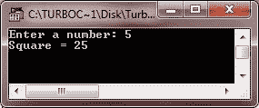
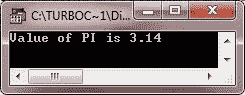
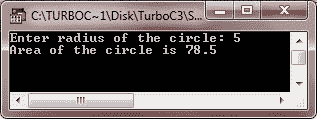
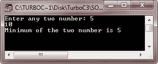
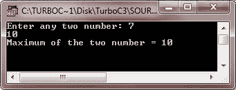
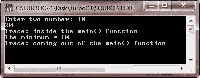
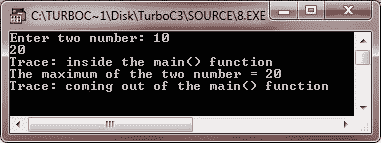
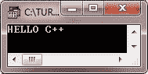
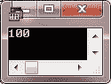

# C++预处理程序

> 原文：<https://codescracker.com/cpp/cpp-preprocessors.htm>

C++中的预处理器基本上是指令，指示 C++编译器在实际程序编译之前对信息进行预处理。

## #在 C++中定义预处理器

宏是在#define 预处理器上构建的。通常#define 看起来像这样:

```
#define PI 3.142
```

但是，宏应该是这样的(也称为函数宏)。

```
#define SQUARE(x) x∗x
```

主要区别在于第一个例子是一个符号常量，第二个例子是一个表达式。如果在某些代码中使用了上面的宏，它可能看起来像这样:

```
/* C++ Preprocessor - Example Program */

#include<iostream.h>
#include<conio.h>

#define SQUARE(x) x*x

void main()
{
   clrscr();
   int val;
   cout<<"Enter a number: ";
   cin>>val;
   cout<<"Square = "<<SQUARE(val);
   getch();
}
```

处理后，代码将变成:

```
void main()
{
   clrscr();
   int val;
   cout<<"Enter a number: ";
   cin>>val;
   cout<<"Square = "<<val*val;
   getch();
}
```

下面是这个 C++程序的运行示例:



宏的文本替换称为宏扩展。

关于宏，您必须了解以下几点:

*   不带参数的宏被视为符号常量。
*   当宏展开时，带有参数的宏用其参数替换替换文本。
*   宏仅替换文本；它不检查数据类型。

定义宏时，请确保使用括号，因为它可以确保正确的结果。例如，如果您定义了一个宏，如下所示:

```
#define CIRCLE_AREA(x) PI∗x∗x
```

你把它当作:

```
area = CIRCLE_AREA(c + 2) ;
```

那么它将扩展为:

```
area = 3.14159 ∗ c + 2 ∗ c + 2 ;
```

看，它会产生正确的结果吗？要获得正确的结果，应该将该宏定义为:

```
#define CIRCLE_AREA((x)) PI∗(x)∗(x)
```

会导致

```
rectArea = RECTANGLE_AREA(x + 4, y +7) ;
```

被扩展为

```
rectArea = ((x+4) ∗ (y+7)) ;
```

下面是一个例子，说明了 C++中的#define 预处理程序

```
/* C++ Preprocessor - Example Program */

#include<iostream.h>
#include<conio.h>
#define PI 3.14
void main()
{
   clrscr();
   cout<<"Value of PI is "<<PI;
   getch();
}
```

以下是上述 C++程序的示例输出:



让我们再举一个例子，演示 C++中的预处理器

```
/* C++ Preprocessor - Example Program */

#include<iostream.h>
#include<conio.h>
#define PI 3.14
void main()
{
   clrscr();
   int rad;
   cout<<"Enter radius of the circle: ";
   cin>>rad;
   cout<<"Area of the circle is "<<PI*rad*rad;
   getch();
}
```

下面是上述 C++程序的运行示例:



有关#define 的更多细节，请参考 [C++ #define](/cpp/cpp-hash-define-preprocessor-directive.htm)

## C++中的函数宏

下面是一个示例程序，演示了 C++中的函数宏(预处理器)

```
/* C++ Preprocessors - Example Program */

#include<iostream.h>
#include<conio.h>
#define MIN(num1, num2) (((num1)<(num2))?num1:num2)
void main()
{
   clrscr();
   int a, b;
   cout<<"Enter any two number: ";
   cin>>a>>b;
   cout<<"Minimum of the two number is "<<MIN(a, b);
   getch();
}
```

下面是上述 C++程序的运行示例:



这里还有一个示例程序，也演示了 C++中的预处理程序

```
/* C++ Preprocessors - Example Program */

#include<iostream.h>
#include<conio.h>
#define MAX(num1, num2) (((num1)>(num2))?num1:num2)
void main()
{
   clrscr();
   int a, b;
   cout<<"Enter any two number: ";
   cin>>a>>b;
   cout<<"Maximum of the two number = "<<MAX(a, b);
   getch();
}
```

下面是这个 C++程序的运行示例:



## C++中的条件编译

下面是一个示例程序，演示了 C++中的条件编译:

```
/* C++ Preprocessor - Example Program */

#include<iostream.h>
#include<conio.h>
#define DEBUG
#define MIN(num1, num2) (((num1)<(num2))?num1:num2)
void main()
{
   clrscr();
   int a, b;
   cout<<"Enter two number: ";
   cin>>a>>b;
   #ifdef DEBUG
      cerr<<"Trace: inside the main() function\n";
   #endif
   #if 0
   cout<<MKSTR(HELLO C++)<<endl;
   #endif
   cout<<"The minimum = "<<MIN(a, b)<<"\n";
   #ifdef DEBUG
      cerr<<"Trace: coming out of the main() function\n";
   #endif
   getch();
}
```

下面是上述 C++程序的运行示例:



下面是另一个示例程序，也演示了 C++中的条件编译

```
/* C++ Preprocessor - Example Program */

#include<iostream.h>
#include<conio.h>
#define DEBUG
#define MAX(num1, num2) (((num1)>(num2))?num1:num2)
void main()
{
   clrscr();
   int a, b;
   cout<<"Enter two number: ";
   cin>>a>>b;
   #ifdef DEBUG
      cerr<<"Trace: inside the main() function\n";
   #endif
   #if 0
   // this is commented part
   cout<<MKSTR(HELLO C++)<<endl;
   #endif
   cout<<"The maximum of the two number = "<<MAX(a, b)<<"\n";
   #ifdef DEBUG
      cerr<<"Trace: coming out of the main() function\n";
   #endif
   getch();
}
```

下面是上述 C++程序的运行示例:



## C++中的#和##运算符

#运算符会将替换文本标记转换为用引号括起来的字符串。这里有一个例子来说明这一点。

```
/* C++ Preprocessor - Example Program */

#include<iostream.h>
#include<conio.h>
#define MKSTR(z) #z
void main()
{
   clrscr();
   cout<<MKSTR(HELLO C++)<<endl;
   getch();
}
```

以下是上述 C++程序的示例输出:



这一行:

```
cout<<MKSTR(HELLO C++)<<endl;
```

成为

```
cout<<"HELLO C++"<<endl;
```

##运算符用于连接两个标记。下面是演示这一概念的示例程序:

```
/* C++ Preprocessor - Example Program */

#include<iostream.h>
#include<conio.h>
#define concat(i, j) i##j
void main()
{
   clrscr();
   int ab=100;
   cout<<concat(a, b);
   getch();
}
```

下面是这个 C++程序的示例输出:



这条线在这里

```
cout<<concat(a, b);
```

成为

```
cout<<ab;
```

[C++在线测试](/exam/showtest.php?subid=3)

* * *

* * *