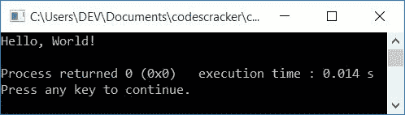
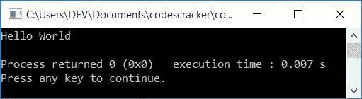
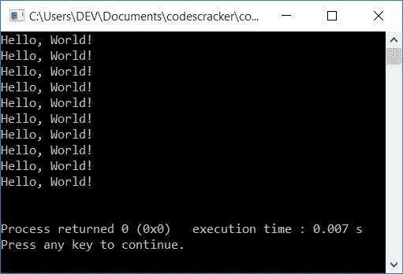

# C++ 程序：打印 Hello World 

> 原文：<https://codescracker.com/cpp/program/cpp-program-print-hello-world.htm>

在本文中，您将学习并获得打印 **Hello，World！**在很多方面使用 C++ 程序。以下是 正在印刷的节目单*你好，世界*:

*   打印**你好，世界！**
*   不使用分号
*   打印**你好，世界！** 10 次使用*进行循环*
*   使用 *while 循环*
*   打印**你好，世界！**使用*功能*
*   使用*类和对象*

## 打印 Hello World

打印**你好，世界！**在 [C++](/cpp/index.htm) 编程中，只需放置 **Hello，World！** **内**(“”)后 **cout < <** 如下面给出的程序所示:

问题是，**用 C++ 写个程序打印 Hello，World！**。以下是它的答案:

```
#include<iostream>
using namespace std;
int main()
{
    cout<<"Hello, World!";
    cout<<endl;
    return 0;
}
```

这个程序是在 *Code::Blocks* IDE 下构建和运行的。下面是它的示例输出:



### 不使用分号打印 Hello World

要打印 *Hello World* ，不带分号。唯一要做的就是，去掉**后的*分号*你好** 如本程序所示:

```
#include<iostream>
using namespace std;
int main()
{
    cout<<"Hello World";
    cout<<endl;
    return 0;
}
```

该程序产生如下图所示的输出:



### 使用 for 循环打印 Hello World 10 次

这个程序打印*你好，世界！* 10 次使用*进行循环*

```
#include<iostream>
using namespace std;
int main()
{
    int i;
    for(i=0; i<10; i++)
        cout<<"Hello, World!\n";
    cout<<endl;
    return 0;
}
```

这个节目制作**你好，世界！**如下例所示输出 10 次:



上述程序的预演如下:

*   最初， **0** 被初始化为 **i** 并且条件 **i < 10** 被评估。循环的*的 first(初始化)语句首先执行，但只执行一次*
*   也就是说，条件， **i < 10** 或 **0 < 10** 评估为真，因此程序流 进入循环和字符串， **Hello，World！**开始打印
*   印完*你好，世界！*，使用 **\n** ，下一件事从下一行开始。因此， 下一次印刷的*你好，世界！*从新行开始
*   现在程序流程转到循环的*的更新(第三条语句)部分，并增加 **i** 的值 。所以 **i=1***
*   现在条件， **i < 10** 或 **1 < 10** 再次评估为真，因此程序流再次 进入循环并再次执行以下语句:
    `cout<<"Hello, World!\n";`
    打印一个 *Hello，World！*又断线了
*   该过程继续，直到循环的条件*评估为假。也就是说，当 **i** 的 值变为等于 10 时，那么条件 **i < 10** 或 **10 < 10** 评估为 假，因此循环*的*执行结束*
*   就这样，10 次，*你好，世界！*在输出上打印

### 使用 while 循环打印 Hello World 10 次

这个程序做的工作和前一个程序一样。唯一不同的是，这个程序使用了 *while 循环*。 *while 循环*只有一个语句，那就是条件。因此，我们必须在执行 *while 循环*之前将 0 初始化为 **i** 。和包含在其主体内的更新部分。

```
#include<iostream>
using namespace std;
int main()
{
    int i=0;
    while(i<10)
    {
        cout<<"Hello, World!\n";
        i++;
    }
    cout<<endl;
    return 0;
}
```

这个程序产生与前一个程序相同的输出。您可以替换以下代码块:

```
while(i<10)
{
    cout<<"Hello, World!\n";
    i++;
}
```

随着

```
while((i++)<10)
    cout<<"Hello, World!\n";
```

### 使用函数打印 Hello World

这个程序打印*你好，世界！*使用名为*的自定义函数 printHello()* 。

```
#include<iostream>
using namespace std;
void printHello();
int main()
{
    printHello();
    cout<<endl;
    return 0;
}
void printHello()
{
    cout<<"Hello, World!";
}
```

产生与本文中第一个程序相同的输出。

### 使用类和对象打印 Hello World

这是关于这个话题的最后一个节目。这个程序是使用**类和**对象创建的，这是 **C++** 的一个面向对象的 特性。

```
#include<iostream>
using namespace std;
class CodesCracker
{
    public:
        void printHello();
};
void CodesCracker::printHello()
{
    cout<<"Hello, World!";
}
int main()
{
    CodesCracker c;
    c.printHello();
    cout<<endl;
    return 0;
}
```

这个程序也产生与本文中第一个程序相同的输出。

在上面的程序中，在 **main()** 函数中创建了一个 **CodesCracker** 类型的对象 **c** 。 现在使用这个对象，我们调用了类 **CodesCracker** 的成员函数，命名为 **printHello()** ， 打印 **Hello，World！**以与前面程序类似的方式，使用函数。

#### 其他语言的相同程序

*   [C 打印你好世界](/c/program/c-program-print-hello-world.htm)
*   [Java 打印 Hello World](/java/program/java-program-print-hello-world.htm)
*   [Python 打印 Hello World](/python/program/python-program-print-hello-world.htm)

[C++ 在线测试](/exam/showtest.php?subid=3)

* * *

* * *