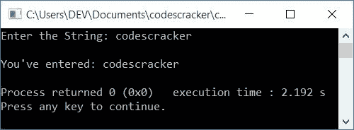

# 获取用户输入的 C++程序

> 原文：<https://codescracker.com/cpp/program/cpp-program-receive-input.htm>

在本文中，您将学习并获得在 C++编程中获取或接收用户输入的代码。以下是获取用户输入的程序列表:

*   从用户处获取整数输入
*   获取用户输入的字符
*   从用户处获取字符串输入
*   从用户处获取带有空格的字符串输入

为了接收或获得用户的输入，使用**【CIN】>>输入**。这里，*输入*是 存储给定数字、字符或字符串值的变量。

**>>**用于接收输入数据，如整数、字符、浮点数等。

## 从用户处获取整数输入

这个 [C++](/cpp/index.htm) 程序要求用户输入一个整数值或数字来接收它 并存储在一个变量中，比如说 **val** 。然后进一步在屏幕上显示输入的号码:

```
#include<iostream>
using namespace std;
int main()
{
    int val;
    cout<<"Enter the Number: ";
    cin>>val;
    cout<<"\nThe Value is "<<val;
    cout<<endl;
    return 0;
}
```

这个程序是在 *Code::Blocks* IDE 下构建和运行的。下面是它的运行示例:


现在提供一个整数输入，比如说 **25** ，按`ENTER`键，将它存储在 **val** 变量中，然后 将其打印回输出，如下图所示:


## 从用户处获取字符输入

这个程序从用户那里获得字符输入，并在运行时打印用户输入的字符，返回到输出屏幕:

```
#include<iostream>
using namespace std;
int main()
{
    char ch;
    cout<<"Enter the Character: ";
    cin>>ch;
    cout<<"\nYou've entered: "<<ch;
    cout<<endl;
    return 0;
}
```

下面是用户输入的运行示例， **c** 作为字符:


## 从用户处获取字符串输入

这个程序使用 **cin** 从用户那里获得字符串输入。后来，我们还创建了一些程序来使用函数接收 字符串输入。

```
#include<iostream>
using namespace std;
int main()
{
    char str[200];
    cout<<"Enter the String: ";
    cin>>str;
    cout<<"\nYou've entered: "<<str;
    cout<<endl;
    return 0;
}
```

下面是用户输入的示例运行， **codescracker** 作为字符串:



这是另一个运行用户输入的例子，**这是 codescracker.com**作为字符串:


正如您从这个示例运行中看到的，字符串的其余部分，在**之后，这个**被跳过。也就是说，空格前的字符串 ，只在这里被接收。

### 如何获得带空格的字符串输入？

**重要的**——要获得带空格的字符串输入，使用 **gets()** 或 **getline()** 函数。

要使用 **gets()** 获取字符串输入，请按以下方式使用:

```
gets(str);
```

然而，要使用 **getline()** 获取字符串输入，请按照以下方式使用它:

```
getline(cin, str);
```

#### 使用 gets()获取带空格的字符串输入

这个程序使用 **gets()** 接收用户输入的字符串和所有空格。也就是说，这个程序 不会跳过输入字符串中的任何单词，而不管空格是否出现。

```
#include<iostream>
#include<stdio.h>
using namespace std;
int main()
{
    char str[200];
    cout<<"Enter the String: ";
    gets(str);
    cout<<"\nYou've entered: "<<str;
    cout<<endl;
    return 0;
}
```

这是它的运行示例，有用户输入**这是 codescracker.com**:


**注-** 函数， **gets()** 在 **stdio.h** 头文件中定义

#### 使用 getline()获取带空格的字符串输入

这是另一个程序，它做的工作和前面的程序一样。也就是说，这个程序也接收带有空格的字符串输入，使用 **getline()** 函数:

```
#include<iostream>
#include<string>
using namespace std;
int main()
{
    string str;
    cout<<"Enter the String: ";
    getline(cin, str);
    cout<<"\nYou've entered: "<<str;
    cout<<endl;
    return 0;
}
```

下面是它的运行示例，有用户输入，**codes cracker . com**:


**注-** 函数， **getline()** 在**字符串**头文件中定义。要声明 使用该函数存储或接收字符串输入的变量，必须使用 *string* header 文件的 **string** 数据类型。

#### 其他语言的相同程序

*   [C 获取用户的输入](/c/program/c-program-receive-input.htm)
*   [Java 从用户处获取输入](/java/program/java-program-take-input-from-user.htm)
*   [Python 从用户处获取输入](/python/program/python-program-get-input-from-user.htm)

[C++在线测试](/exam/showtest.php?subid=3)

* * *

* * *