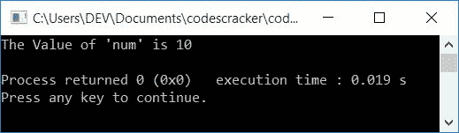
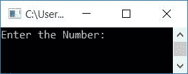
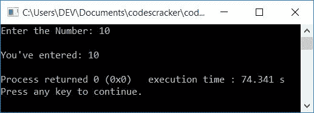

# 打印整数的 C++程序

> 原文：<https://codescracker.com/cpp/program/cpp-program-print-integer.htm>

在本文中，您将学习并获得使用 C++程序打印整数值的代码。以下是打印整数(数字)的程序列表:

*   打印一个整数。这个程序不允许用户输入数字
*   打印用户在运行时输入的整数

## 打印整数

要在 [C++](/cpp/index.htm) 编程中输出任何整数或数字，只需将保存值的 [变量](/cpp/cpp-variables.htm)放在*之后 cout < <* 就像:

```
cout<<num;
```

无论 **num** 的值是多少，它都会打印在输出上。下面是打印一个 整数值及其前面的字符串(或消息)的完整程序。

```
#include<iostream>
using namespace std;
int main()
{
    int num=10;
    cout<<"The Value of 'num' is "<<num;
    cout<<endl;
    return 0;
}
```

这个程序是在 *Code::Blocks* IDE 下构建和运行的。下面是它的示例输出:



您可以替换以下语句:

```
cout<<"The Value of 'num' is "<<num;
```

随着

```
cout<<num;
```

在输出上只打印 **10** ，不需要任何额外的东西。

### 打印用户输入的整数(数字)

这个程序允许用户输入数字。当用户输入一个数字，比如说 **10** ，它被存储在 **num** 中。并在输出上打印出 **num** 的值，就像前面程序中已经讨论过的那样。

```
#include<iostream>
using namespace std;
int main()
{
    int num;
    cout<<"Enter the Number: ";
    cin>>num;
    cout<<"\nYou've entered: "<<num;
    cout<<endl;
    return 0;
}
```

下面给出的快照显示了该程序产生的初始输出:



现在输入一个数字，比如说 **10** ，然后按`ENTER`将输入的数字 打印回输出屏幕，如下图所示:



#### 其他语言的相同程序

*   [C 打印整数](/c/program/c-program-print-integer.htm)
*   [Java 打印整数](/java/program/java-program-print-integer.htm)

[C++在线测试](/exam/showtest.php?subid=3)

* * *

* * *