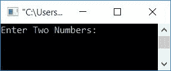
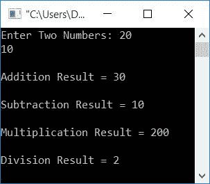
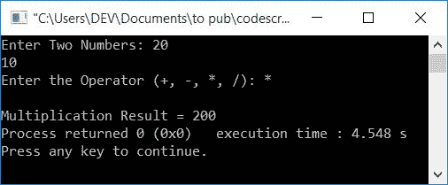
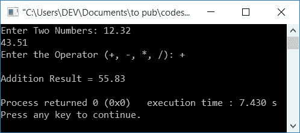

# 执行加减乘除的 C++程序

> 原文：<https://codescracker.com/cpp/program/addition-subtraction-multiplication-division.htm>

在这里，您将学习并获得在 C++编程的运行时由用户执行任意两个给定数字的加、减、乘、除的代码。以下是完成这项任务的方法:

*   加减乘除
*   根据用户的选择进行加减乘除
*   使用用户定义的[函数](/cpp/cpp-functions.htm)进行加减乘除运算

## 加减乘除

要在 [C++](/cpp/index.htm) 编程中执行任意两个数的加、减、乘、除，你必须要求用户输入这两个数来执行所有基本的数学运算 ，如加、减、乘、除。并在屏幕上显示结果，如下面给出的 程序所示。

减法和除法运算是从第一个数字中减去第二个数字。同样，第二个数除以第一个数。例如，如果用户输入 20 和 10 作为第一个和第二个数字。然后，减法结果将是 10，因为 10(第二个数字)是从 20(第一个数字)中减去的。而除法结果会是 2，因为 10 除 20。

```
#include<iostream>
using namespace std;
int main()
{
    int num1, num2, res;
    cout<<"Enter Two Numbers: ";
    cin>>num1>>num2;
    res = num1+num2;
    cout<<endl<<"Addition Result = "<<res<<endl;
    res = num1-num2;
    cout<<endl<<"Subtraction Result = "<<res<<endl;
    res = num1*num2;
    cout<<endl<<"Multiplication Result = "<<res<<endl;
    res = num1/num2;
    cout<<endl<<"Division Result = "<<res<<endl;
    return 0;
}
```

这个程序是在 *Code::Blocks* IDE 下构建和运行的。下面是它的运行示例:



现在提供两个数字，如 **20** 和 **10** ，并按`ENTER`键查看以下输出:



以下声明:

```
cin>>num1>>num2;
```

可以替换为:

```
cin>>num1;
cin>>num2;
```

以及下面的两个声明:

```
res = num1+num2;
cout<<endl<<"Addition Result = "<<res<<endl;
```

也可以只用一句话来代替:

```
cout<<"\nAddition Result = "<<num1+num2<<"\n";
```

在这里，代替 **endl** ，我们使用了一个字符 **\n** ，它也从新行开始接下来的事情。

### 如果用户输入包含小数的数字会怎样？

为了处理实数，将[数据类型](/cpp/cpp-data-types.htm)从 **int** 替换为 **float** 。这取代了下面的语句:

```
int num1, num2, res;
```

使用下面给出的语句:

```
float num1, num2, res;
```

其余的事情将是一样的。

## 基于用户选择的加减乘除

这里有另一个程序做同样的工作，但不是自动计算所有四个操作，而是让我们问用户他/她想要执行什么，然后相应地做工作，如这里给出的程序所示:

```
#include<iostream>
using namespace std;
int main()
{
    int num1, num2;
    char op;
    cout<<"Enter Two Numbers: ";
    cin>>num1>>num2;
    cout<<"Enter the Operator (+, -, *, /): ";
    cin>>op;
    if(op=='+')
        cout<<endl<<"Addition Result = "<<num1+num2;
    else if(op=='-')
        cout<<endl<<"Subtraction Result = "<<num1-num2;
    else if(op=='*')
        cout<<endl<<"Multiplication Result = "<<num1*num2;
    else if(op=='/')
        cout<<endl<<"Division Result = "<<num1/num2;
    else
        cout<<endl<<"Wrong Operator!";
    return 0;
}
```

下面是它的运行示例，用户输入两个数字 20 和 10，操作员输入为*



## 使用函数进行加、减、乘、除

问题是，**用 C++写一个程序，使用用户定义的函数，根据用户的选择，计算任意两个给定数字的加、减、乘或除 。**下面是它的回答:

```
#include<iostream>
using namespace std;
float addFun(float, float);
float subFun(float, float);
float mulFun(float, float);
float divFun(float, float);
int main()
{
    float num1, num2;
    char op;
    cout<<"Enter Two Numbers: ";
    cin>>num1>>num2;
    cout<<"Enter the Operator (+, -, *, /): ";
    cin>>op;
    if(op=='+')
        cout<<endl<<"Addition Result = "<<addFun(num1, num2);
    else if(op=='-')
        cout<<endl<<"Subtraction Result = "<<subFun(num1, num2);
    else if(op=='*')
        cout<<endl<<"Multiplication Result = "<<mulFun(num1, num2);
    else if(op=='/')
        cout<<endl<<"Division Result = "<<divFun(num1, num2);
    else
        cout<<endl<<"Wrong Operator!";
    cout<<endl;
    return 0;
}
float addFun(float a, float b)
{
    return a+b;
}
float subFun(float a, float b)
{
    return a-b;
}
float mulFun(float a, float b)
{
    return a*b;
}
float divFun(float a, float b)
{
    return a/b;
}
```

下面是它的运行示例:



要了解函数，您可以遵循其单独的教程。

#### 其他语言的相同程序

*   [C 加减乘除](/c/program/addition-subtraction-multiplication-division.htm)
*   [Java 加减乘除](/java/program/addition-subtraction-multiplication-division.htm)
*   [Python 加减乘除](/python/program/python-program-addition-subtraction-multiplication-division.htm)

[C++在线测试](/exam/showtest.php?subid=3)

* * *

* * *