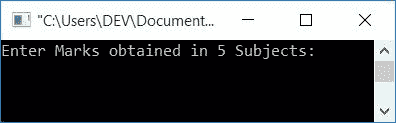
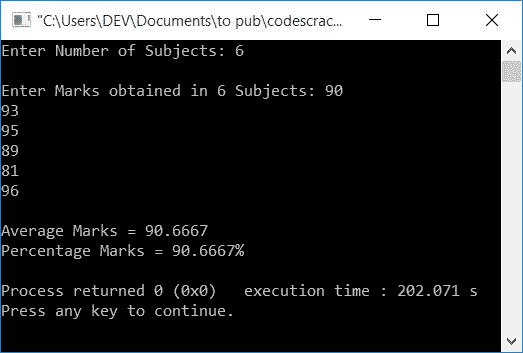

# C++ 程序：计算平均分、百分比分数

> 原文：<https://codescracker.com/cpp/program/cpp-program-calculate-average-percentage.htm>

在这里，您将学习并获得基于用户在 C++ 中输入的分数来查找学生的平均分和百分比分数的代码。您将在这里完成以下三个程序:

*   找出 5 个科目的平均分和百分比
*   允许用户定义科目数量和最大分数以及在每个科目中获得的分数
*   使用用户定义的函数查找平均值和百分比

### 如何找到平均分？

要找到 n 名受试者的平均分数，只需将所有分数相加，然后除以 **n** 。例如， 用三科成绩求平均分，比如说 **10，20，30** ，那么就会是:

```
avg = (10+20+30)/3
    = 60/3
    = 20
```

### 如何找到百分号？

要查找百分号，请使用以下公式:

```
perc = ((marks obtained)/(total marks))*100
```

例如，如果三个科目的分数是 25 分中的 **10、11、12** 。也就是说，最大标记是 25。在满分为 25 分的 中，这名学生在 3 门课程中得了 10 分、11 分、12 分。因此，他/她的百分比分数可以计算为:

```
perc = ((10+11+12)/(25*3))*100
     = (33/75)*100
     = (0.44)*100
     = 44
```

因此，百分比标记将是 **44** 百分比。现在让我们继续这个项目。

## 查找学生在 C++ 中的平均分数和百分比分数

要计算一名学生在 [C++](/cpp/index.htm) 编程中的平均分和百分比分数(5 门课程)，你必须要求用户输入在 5 门课程中获得的分数。

现在将 5 名受试者分数的求和结果放入一个变量[中](/cpp/cpp-variables.htm)比如说**sum**T12】并将 **sum/5** 放入一个变量比如说**avg**(5 名受试者的平均值)。然后将 **sum/500*100** 放入一个 变量，比如 **perc** (百分号)，然后在屏幕上显示结果，如下图 程序所示。

```
#include<iostream>
using namespace std;
int main()
{
    int i, mark[5];
    float sum=0, avg, perc;
    cout<<"Enter Marks obtained in 5 Subjects: ";
    for(i=0; i<5; i++)
    {
        cin>>mark[i];
        sum = sum+mark[i];
    }
    avg = sum/5;
    perc = (sum/500)*100;
    cout<<"\nAverage Marks = "<<avg;
    cout<<"\nPercentage Marks = "<<perc<<"%";
    cout<<endl;
    return 0;
}
```

这个程序是在 *Code::Blocks* IDE 下构建和运行的。下面是它的运行示例:



现在提供 5 门学科的分数，比如物理、化学、数学、英语、计算机科学和 T2。每个分数都应该是 100 分中的 。在提供标记说 **78，92，83，81，89** 后，按`ENTER`键可以看到下面的 输出:


### 允许用户定义最大标记

这个程序与前一个程序相同。但是它增加了两个额外的特性。第一个是，用户被允许输入科目的数量，即有多少科目为他/她的课程运行。二是允许用户输入最大分数。其余的事情将是相同的:

```
#include<iostream>
using namespace std;
int main()
{
    int i, n;
    float tot, arr[10], sum=0, avg, perc;
    cout<<"Enter Number of Subjects: ";
    cin>>n;
    cout<<"\nEnter Total Marks: ";
    cin>>tot;
    cout<<"\nEnter Marks obtained in "<<n<<" Subjects: ";
    for(i=0; i<n; i++)
    {
        cin>>arr[i];
        sum = sum+arr[i];
    }
    tot = tot*n;
    avg = sum/n;
    perc = (sum/tot)*100;
    cout<<"\nAverage Marks = "<<avg;
    cout<<"\nPercentage Marks = "<<perc<<"%";
    cout<<endl;
    return 0;
}
```

下面是用户输入的运行示例:

*   **3** 为<u>被试人数</u>
*   **25** 为<u>总分</u>
*   **10、11、12** 为 3 名受试者获得的<u>分数</u>

提供上述输入后，按`ENTER`键，以下是您将看到的输出:


### 使用用户定义的函数

这是最后一个程序，也发现和打印平均和百分比标志。唯一不同的是，这个程序使用函数找到平均分数和百分比分数，即 **averageMark()** 和 **percMark()** 。 要了解更多 C++ 中的[函数，可以参考其单独教程。](/cpp/cpp-functions.htm)

```
#include<iostream>
using namespace std;
float averageMark(float [], int);
float percMark(float [], int);
int main()
{
    int i, n;
    float arr[10], avg, per;
    cout<<"Enter Number of Subjects: ";
    cin>>n;
    cout<<"\nEnter Marks obtained in "<<n<<" Subjects: ";
    for(i=0; i<n; i++)
        cin>>arr[i];
    avg = averageMark(arr, n);
    per = percMark(arr, n);
    cout<<"\nAverage Marks = "<<avg;
    cout<<"\nPercentage Marks = "<<per<<"%";
    cout<<endl;
    return 0;
}
float averageMark(float arr[], int n)
{
    int i;
    float sum=0;
    for(i=0; i<n; i++)
        sum = sum+arr[i];
    return (sum/n);
}
float percMark(float arr[], int n)
{
    float perc;
    perc = averageMark(arr, n);
    return perc;
}
```

下面是它的运行示例:


现在输入你所在学院为你的课程开设的科目数量。例如，如果你正在学习一门包含 6 个科目的课程，那么输入 6。由于您的课程有 6 个科目，因此输入所有 6 个科目的分数(每个科目满分为 100 分)并按`ENTER`键查看平均分数和百分比 分数，如下图所示:



#### 其他语言的相同程序

*   [C 计算平均百分比分数](/c/program/c-program-calculate-average-percentage.htm)
*   [Java 计算平均百分比](/java/program/java-program-calculate-average-percentage.htm)
*   [Python 计算平均百分比](/python/program/python-program-calculate-average-percentage-marks.htm)

[C++ 在线测试](/exam/showtest.php?subid=3)

* * *

* * *