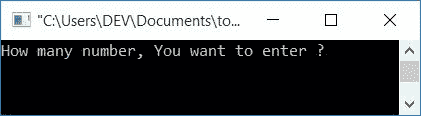
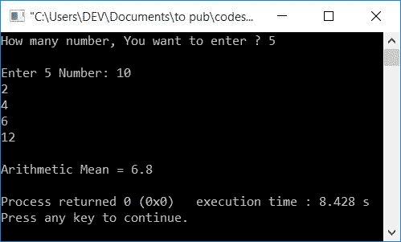
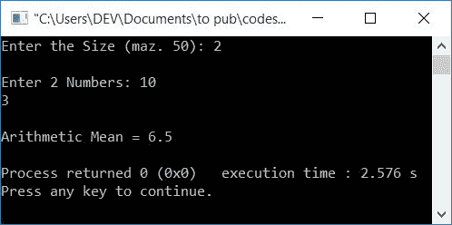

# 计算算术平均值的 C++程序

> 原文：<https://codescracker.com/cpp/program/cpp-program-calculate-arithmetic-mean.htm>

在这篇文章中，你将学习并获得在 C++中查找用户输入的所有数字的算法代码。用户也可以定义尺寸。例如，如果用户输入 5 作为大小，那么程序进一步要求输入任意 5 个数字来寻找算术平均值。这里有两个程序可用:

*   不使用函数求算术平均值
*   使用用户定义函数求算术平均值

### 怎么求算术平均值？

如果有 **n** 组数字，因此要求算术平均值，我们有一个公式:

```
am = (n1+n2+n3+...+nn)/n
```

这里 **am** 表示算术平均值，而**n<sub>1</sub>T5、**n<sub>2</sub>T9、**n<sub>3</sub>T13、 和**n<sub>n</sub>T17】表示第一、第二、第三、最后一个数。********

例如，如果我们有 5 组数字说 **10，20，30，40，50** ，那么它的算术平均值 可以计算为:

```
am = (10+20+30+40+50)/5
   = 150/5
   = 30
```

现在让我们继续这个项目。

## 在 C++中求算术平均值

在 [C++](/cpp/index.htm) 编程中，要计算(或寻找)算术平均值，你需要 让用户输入大小(多少组数)，然后要求输入该大小的所有数，以 找到并打印算术平均值。

要计算数字的算术平均值，首先执行所有数字的加法，然后让一个[变量](/cpp/cpp-variables.htm)负责算术平均值，并将 <u>加法/大小</u>放在一个变量中，比如说 **armean** (算术平均值)，然后在 输出屏幕上显示结果，如下面的程序所示。

```
#include<iostream>
using namespace std;
int main()
{
    int n, i;
    float arr[50], sum=0, armean;
    cout<<"How many number, You want to enter ? ";
    cin>>n;
    cout<<"\nEnter "<<n<<" Number: ";
    for(i=0; i<n; i++)
    {
        cin>>arr[i];
        sum = sum+arr[i];
    }
    armean = sum/n;
    cout<<"\nArithmetic Mean = "<<armean;
    cout<<endl;
    return 0;
}
```

这个程序是在 *Code::Blocks* IDE 下构建和运行的。下面是它的运行示例:



现在输入大小，也就是你要输入多少个数字来求算术平均值。让我们假设，用户输入大小为 **5** 和 5 个数字为 **10，2，4，6，12** 。按`ENTER`键可以看到 如下输出:



在接收数字的时候，我们已经将每个数字一个接一个地加到 **sum** 中。例如，如果用户输入 **5** 作为尺寸，其数字为 **10、2、4、6、12** ，则空运行(在循环的**内)如下所示:**

*   最初，0 被初始化为 **i** 。所以 **i=0**
*   检查条件，是否 **i** (0)小于 **n** (5)
*   该条件评估为真，因此程序流进入循环，并从用户接收一个数字，并将其存储在 **arr[i]** (即 **arr[0]** )中
*   以及语句 **sum = sum+arr[i]** 或 **sum = 0+arr[0]** 或 **sum = 0+10** (假设用户输入 10 作为第一个数字)。因此， **sum=10**
*   现在程序流程进行到循环的**的更新部分，并增加 **i** 的值。现在 **i=1****
*   检查条件，因为条件再次评估为真，所以程序流再次进入循环并评估两个语句
*   也就是说，接收一个数字，比如说 **2** ，并将其存储在 **arr[1]** 中
*   并且 **sum+arr[1]** 或 **10+2** 被初始化为 **sum** 。现在**总和=12**
*   继续该过程，直到 **i** 的值变为 5 或者条件 **i < n** 评估为假
*   从循环中退出后，我们将拥有一个变量 **sum** 来保存所有 5 个数的总和
*   现在应用算术平均的最终公式，即**总和/大小**，即**总和/5** 。将**和**的 值放入。变量 **armean** 保存其值(总和/大小)。因此只需将 **armean**的值打印出来作为输出，这将是算术平均值

### 使用功能

这个函数做的工作和前面的程序一样。但它是使用函数创建的。也就是说，一个函数 **arithmeticMean()** 有两个参数，第一个是数组，第二个是大小。并返回 数组中存储的所有数字的算术平均值。要进一步了解 C++ 中的 [函数，您可以按照单独的教程学习。](/cpp/cpp-functions.htm)

```
#include<iostream>
using namespace std;
float arithmeticMean(float [], int);
int main()
{
    int n, i;
    float arr[50], armean;
    cout<<"Enter the Size (maz. 50): ";
    cin>>n;
    cout<<"\nEnter "<<n<<" Numbers: ";
    for(i=0; i<n; i++)
        cin>>arr[i];
    armean = arithmeticMean(arr, n);
    cout<<"\nArithmetic Mean = "<<armean;
    cout<<endl;
    return 0;
}
float arithmeticMean(float arr[], int n)
{
    int i;
    float sum=0, am;
    for(i=0; i<n; i++)
        sum = sum+arr[i];
    am = sum/n;
    return am;
}
```

下面是它的示例运行，用户输入 **2** 作为大小， **10，3** 作为两个数字:



#### 其他语言的相同程序

*   [C 计算算术平均值](/c/program/c-program-calculate-arithmetic-mean.htm)
*   [Java 计算算术平均值](/java/program/java-program-calculate-arithmetic-mean.htm)
*   [Python 计算算术平均值](/python/program/python-program-calculate-average-of-numbers.htm)

[C++在线测试](/exam/showtest.php?subid=3)

* * *

* * *