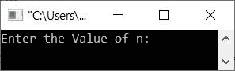
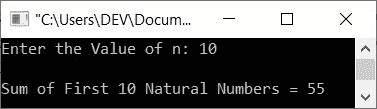
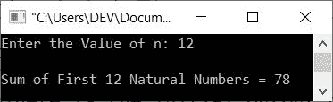

# C++ 程序：查找并打印前 n 个自然数之和

> 原文：<https://codescracker.com/cpp/program/cpp-find-sum-of-n-natural-numbers.htm>

本文旨在提供一些用 C++ 编写的程序，这些程序可以查找并打印第一个 **n 个**自然数的和。值 **n** 必须由用户在运行时输入。该程序通过以下方式创建:

*   使用 **while** 循环
*   使用**进行**循环
*   使用用户定义的函数

**注-** 自然数从 1 开始，延续如 **1，2，3，...**。

## 使用 while 循环求前 n 个自然数的和

问题是，*用 C++ 写一个程序，接收 n 的值，打印前 n 个自然数的和。*以下是其 的回答:

```
#include<iostream>
using namespace std;

int main()
{
   int n, natural=1, sum=0;
   cout<<"Enter the Value of n: ";
   cin>>n;
   while(natural<=n)
   {
      sum = sum+natural;
      natural++;
   }
   cout<<"\nSum of First "<<n<<" Natural Numbers = "<<sum;
   cout<<endl;
   return 0;
}
```

下面是上面的 C++ 程序在查找和打印 **n** 个自然数的和时产生的初始输出:



现在提供数字，比如说 **10** 作为 **n** 的值，并按`ENTER`键找到第一个 **10** 自然数 的和，如下图所示:



## 使用 for 循环求前 n 个自然数的和

这个程序是用**代替**时的**为**循环创建的。

```
#include<iostream>
using namespace std;

int main()
{
   int n, natural, sum=0;
   cout<<"Enter the Value of n: ";
   cin>>n;
   for(natural=1; natural<=n; natural++)
      sum = sum+natural;
   cout<<"\nSum of First "<<n<<" Natural Numbers = "<<sum;
   cout<<endl;
   return 0;
}
```

下面是用户输入 **12** 的运行示例:



## 用函数求前 n 个自然数的和

这是使用名为 **myfun()** 的用户定义函数创建的最后一个程序，该函数将整数 say **n** 作为其参数，然后查找 并返回第一个 **n 个**自然数的和。

```
#include<iostream>
using namespace std;

int myfun(int);
int main()
{
   int n, sum;
   cout<<"Enter the Value of n: ";
   cin>>n;
   sum = myfun(n);
   cout<<"\nSum of First "<<n<<" Natural Numbers = "<<sum;
   cout<<endl;
   return 0;
}
int myfun(int n)
{
   int natural, sum=0;
   for(natural=1; natural<=n; natural++)
      sum += natural;
   return sum;
}
```

[C++ 在线测试](/exam/showtest.php?subid=3)

* * *

* * *