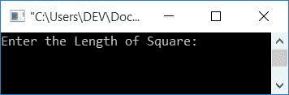
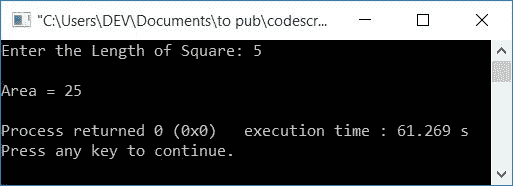
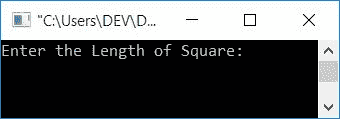
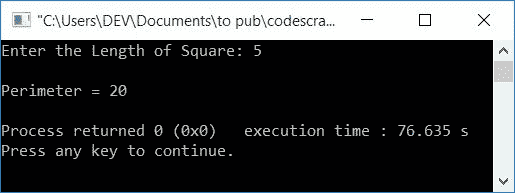
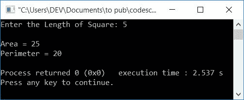

# C++ 程序：求正方形的面积，周长

> 原文：<https://codescracker.com/cpp/program/cpp-program-calculate-area-perimeter.htm>

在这篇文章中，你将学习并获得用 C++编程计算正方形的面积和周长的代码。以下是用于创建程序的方法列表:

*   不使用函数的正方形面积
*   使用[功能](/cpp/cpp-functions.htm)的正方形面积
*   不使用函数的正方形周长
*   用函数计算正方形的周长
*   使用[类和](/cpp/cpp-classes-objects.htm)对象的正方形的面积和周长

在开始程序之前，让我们先看看计算正方形面积和周长的公式。

### 面积公式

要计算正方形的面积，请使用以下公式:

```
area = len*len
```

**len** 表示正方形的长度。因为正方形的所有边都是等长的，所以 得到边的长度并将其平方。这将是该地区。

### 平方公式的周长

要计算正方形的周长，请使用以下公式:

```
perimeter = 4*len
```

**len** 表示长度。现在让我们继续这个项目。

## 求正方形的面积

在 [C++](/cpp/index.htm) 编程中要计算一个正方形的面积，你必须要求用户输入 正方形的边长。有了这个边长，应用上面给出的公式，将其值初始化为变量 ，比如说**区域**，并打印其值作为输出，如下程序所示。

```
#include<iostream>
using namespace std;
int main()
{
    float len, area;
    cout<<"Enter the Length of Square: ";
    cin>>len;
    area = len*len;
    cout<<"\nArea = "<<area;
    cout<<endl;
    return 0;
}
```

这个程序是在 *Code::Blocks* IDE 下构建和运行的。以下是示例运行的初始快照:



现在输入正方形的长度值，比如说 **5** 以找到它的面积，如下面给出的示例 运行的最终快照所示:



### 使用函数的正方形面积

这个程序和前一个程序做同样的工作。唯一的区别是，这个程序使用一个名为 **areaOfSquare()** 的用户定义函数来计算正方形的面积。它将正方形的长度作为参数，并根据作为参数传递的长度值返回正方形的面积 值。

```
#include<iostream>
using namespace std;
float areaOfSquare(float);
int main()
{
    float len, area;
    cout<<"Enter the Length of Square: ";
    cin>>len;
    area = areaOfSquare(len);
    cout<<"\nArea = "<<area;
    cout<<endl;
    return 0;
}
float areaOfSquare(float len)
{
    return (len*len);
}
```

这个程序将产生与前一个程序相同的输出。

## 求正方形的周长

现在让我们创建一个程序，不用任何函数就能求出正方形的周长。

```
#include<iostream>
using namespace std;
int main()
{
    float len, per;
    cout<<"Enter the Length of Square: ";
    cin>>len;
    per = 4*len;
    cout<<"\nPerimeter = "<<per;
    cout<<endl;
    return 0;
}
```

下面是它的运行示例:



提供正方形任一边的长度，找到并打印其周长，如下图所示:



### 用函数计算正方形的周长

这个程序也做与前一个相同的工作。它使用一个名为 **perOfSquare()** 的函数，该函数根据作为参数传递的长度来计算 正方形的周长。

```
#include<iostream>
using namespace std;
float perOfSquare(float);
int main()
{
    float len;
    cout<<"Enter the Length of Square: ";
    cin>>len;
    cout<<"\nPerimeter = "<<perOfSquare(len);
    cout<<endl;
    return 0;
}
float perOfSquare(float len)
{
    return (4*len);
}
```

## 用类求正方形的面积和周长

这个程序使用类和对象来寻找正方形的面积和周长。

```
#include<iostream>
using namespace std;
class CodesCracker
{
    private:
        float len;
    public:
        void getData();
        float findArea();
        float findPerimeter();
};
void CodesCracker::getData()
{
    cout<<"Enter the Length of Square: ";
    cin>>len;
}
float CodesCracker::findArea()
{
    return (len*len);
}
float CodesCracker::findPerimeter()
{
    return (4*len);
}
int main()
{
    CodesCracker c;
    float area, per;
    c.getData();
    area = c.findArea();
    per = c.findPerimeter();
    cout<<"\nArea = "<<area;
    cout<<"\nPerimeter = "<<per;
    cout<<endl;
    return 0;
}
```

下面是用户输入为 **5** 的运行示例:



要了解更多关于 C++中的类和对象的知识，你可以阅读它的单独教程。

#### 其他语言的相同程序

*   [C 计算面积，周长](/c/program/c-program-calculate-area-perimeter.htm)
*   [Java 计算面积，周长](/java/program/java-program-calculate-area-perimeter.htm)
*   [Python 计算正方形的面积](/python/program/python-program-calculate-area-of-square.htm)
*   [Python 计算正方形的周长](/python/program/python-program-calculate-perimeter-of-square.htm)

[C++在线测试](/exam/showtest.php?subid=3)

* * *

* * *