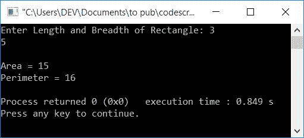

# C++ 程序：求矩形面积，周长

> 原文：<https://codescracker.com/cpp/program/cpp-program-area-perimeter-rectangle.htm>

在本文中，您将学习并获得基于用户在 C++编程运行时输入的长度和宽度打印矩形的面积和周长的代码。以下是用于计算矩形面积和周长的方法列表:

*   不使用函数求矩形的面积
*   使用[函数](/cpp/cpp-functions.htm)计算矩形的面积
*   不使用函数的矩形周长
*   使用函数的矩形周长
*   使用[类和对象](/cpp/cpp-classes-objects.htm)求矩形的面积和周长

### 矩形面积公式

计算矩形面积的公式如下:

```
area = len*bre
```

这里， **len** 表示矩形的长度， **bre** 表示矩形的宽度。

### 矩形周长公式

要计算矩形的周长，请使用以下公式:

```
perimeter = 2*(len+bre)
```

这里， **len** 和 **bre** 也表示矩形的长度和宽度。现在让我们继续讨论 计划。

## 求矩形的面积

问题是，**用 C++写一个程序，求并打印一个矩形的面积**。下面给出的程序是 这个问题的答案:

```
#include<iostream>
using namespace std;
int main()
{
    float len, bre, area;
    cout<<"Enter Length of Rectangle: ";
    cin>>len;
    cout<<"Enter Breadth of Rectangle: ";
    cin>>bre;
    area = len*bre;
    cout<<"\nArea = "<<area;
    cout<<endl;
    return 0;
}
```

这个程序是在 *Code::Blocks* IDE 下构建和运行的。下面是它的运行示例:


现在输入矩形的长和宽，按`ENTER`键查看基于给定的 矩形长和宽的面积，如下图所示:


当用户输入长度时，它被初始化为 **len** ，当输入宽度时，它被初始化为 **bre** 。 使用公式， **len*bre** 被初始化为 **area** 变量，用于保存矩形的面积。因此 只需打印其值作为输出。

### 使用函数的矩形面积

让我们使用一个用户定义的函数 **areaOfRectangle()** 创建一个相同目的的程序。这个函数 接受两个参数并返回一个值。两个参数是长度和宽度，而它的返回值 将是矩形的面积。要了解关于函数的更多信息，您可以遵循它的单独教程。

```
#include<iostream>
using namespace std;
float areaOfRectangle(float, float);
int main()
{
    float len, bre, area;
    cout<<"Enter Length of Rectangle: ";
    cin>>len;
    cout<<"Enter Breadth of Rectangle: ";
    cin>>bre;
    area = areaOfRectangle(len, bre);
    cout<<"\nArea = "<<area;
    cout<<endl;
    return 0;
}
float areaOfRectangle(float len, float bre)
{
    return (len*bre);
}
```

## 求矩形的周长

现在让我们在不使用函数的情况下找到并打印一个矩形的周长。

```
#include<iostream>
using namespace std;
int main()
{
    float len, bre, per;
    cout<<"Enter Length and Breadth of Rectangle: ";
    cin>>len>>bre;
    per = 2*(len+bre);
    cout<<"\nPerimeter = "<<per;
    cout<<endl;
    return 0;
}
```

下面是上述程序的运行示例:


现在提供一个矩形的长度和宽度值来查找并打印它的周长，如下面给出的输出所示


### 使用函数的矩形周长

这是另一个程序，它也使用用户定义的函数查找并打印矩形的周长。

```
#include<iostream>
using namespace std;
float perOfRectangle(float, float);
int main()
{
    float len, bre;
    cout<<"Enter Length and Breadth of Rectangle: ";
    cin>>len>>bre;
    cout<<"\nPerimeter = "<<perOfRectangle(len, bre);
    cout<<endl;
    return 0;
}
float perOfRectangle(float len, float bre)
{
    return (2*(len+bre));
}
```

## 用类求矩形的面积和周长

现在让我们把两者结合起来，用类创建一个单独的程序来求矩形的面积和周长。关于[类和对象](/cpp/cpp-classes-objects.htm)的更多细节，可以参考单独的教程。

```
#include<iostream>
using namespace std;
class CodesCracker
{
    private:
        float len, bre;
    public:
        void getData();
        float areaOfRect();
        float periOfRect();
};
void CodesCracker::getData()
{
    cout<<"Enter Length and Breadth of Rectangle: ";
    cin>>len>>bre;
}
float CodesCracker::areaOfRect()
{
    return (len*bre);
}
float CodesCracker::periOfRect()
{
    return (2*(len+bre));
}
int main()
{
    CodesCracker c;
    float area, per;
    c.getData();
    area = c.areaOfRect();
    per = c.periOfRect();
    cout<<"\nArea = "<<area;
    cout<<"\nPerimeter = "<<per;
    cout<<endl;
    return 0;
}
```

以下是用户输入的长度为 **5** ，宽度为 **3** 的示例运行:



[C++在线测试](/exam/showtest.php?subid=3)

* * *

* * *