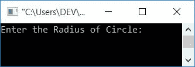
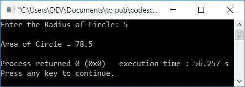
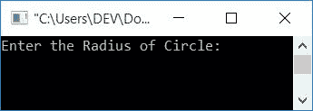
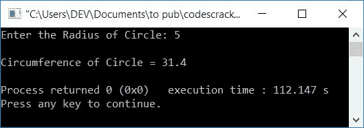
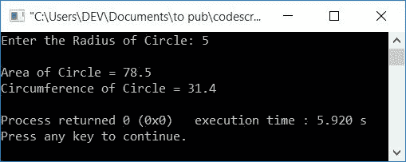

# C++程序求面积，圆周

> 原文：<https://codescracker.com/cpp/program/cpp-program-calculate-area-circumference.htm>

在本文中，您将学习并获得在 C++编程中根据用户在运行时输入的半径求圆的面积和周长的代码。以下是使用的方法列表:

*   不使用函数的圆的面积
*   使用[功能](/cpp/cpp-functions.htm)的圆的面积
*   不使用函数的圆周
*   使用函数的圆周
*   使用[类](/cpp/cpp-classes-objects.htm)的圆的面积和周长

在开始程序之前，我们先来了解一下用来求圆的面积和周长的公式。

### 圆的面积公式

要计算圆的面积，请使用以下公式:

```
area = 3πr2
```

**π** 的值为 **3.14** 。而 **r** 表示圆的半径。这个公式也可以写成:

```
area = 3*3.14*r*r
```

### 圆周公式

要计算圆的周长，请使用以下公式:

```
circumference = 2πr
```

现在让我们继续这个项目。

## 求圆的面积

要在 [C++](/cpp/index.htm) 编程中计算任何圆的面积，您必须要求用户输入 圆的半径，将半径放入一个[变量](/cpp/cpp-variables.htm)中，比如说 **rad** ，然后在一个保存圆面积值的变量中初始化 **3.14*rad*rad** ，如下面的程序所示。

```
#include<iostream>
using namespace std;
int main()
{
    float rad, area;
    cout<<"Enter the Radius of Circle: ";
    cin>>rad;
    area = 3.14*rad*rad;
    cout<<"\nArea of Circle = "<<area;
    cout<<endl;
    return 0;
}
```

这个程序是在 *Code::Blocks* IDE 下构建和运行的。下面是它的运行示例:



现在输入圆的半径，比如说 **5** 并按`ENTER`键查看以下输出:



你也可以将变量 **rad** 替换为 **r** 以使上述程序更有意义。

### 使用功能

让我们使用一个用户定义的函数 **findArea()** 创建一个相同目的的程序。该函数以半径 为参数，返回圆的面积。问题是，**用 C++写个程序，用自定义函数求一个 圆的面积。**这个问题的答案如下:

```
#include<iostream>
using namespace std;
float findArea(float);
int main()
{
    float rad, area;
    cout<<"Enter the Radius of Circle: ";
    cin>>rad;
    area = findArea(rad);
    cout<<"\nArea of Circle = "<<area;
    cout<<endl;
    return 0;
}
float findArea(float r)
{
    return (3.14*r*r);
}
```

它将产生与前一个相同的输出。

## 求圆周

问题是，**用 C++写个程序求圆周**。这个问题的答案是:

```
#include<iostream>
using namespace std;
int main()
{
    float rad, circum;
    cout<<"Enter the Radius of Circle: ";
    cin>>rad;
    circum = 2*3.14*rad;
    cout<<"\nCircumference of Circle = "<<circum;
    cout<<endl;
    return 0;
}
```

以下是示例运行的初始快照:



现在输入圆的半径来看它的周长。下面是示例运行的最终快照，假设用户输入 5 作为圆的半径:



### 使用功能

这个程序做的工作和前面的程序一样，但是使用了一个名为**findcurp()**的函数

```
#include<iostream>
using namespace std;
float findCircum(float);
int main()
{
    float rad;
    cout<<"Enter the Radius of Circle: ";
    cin>>rad;
    cout<<"\nCircumference of Circle = "<<findCircum(rad);
    cout<<endl;
    return 0;
}
float findCircum(float r)
{
    return (2*3.14*r);
}
```

这个程序产生与前一个程序相同的输出。

## 用类求面积和周长

这是本文的最后一个程序。这个程序使用 C++面向对象的特性，也就是类，来寻找圆的面积和周长。

```
#include<iostream>
using namespace std;
class CodesCracker
{
    public:
        float findArea(float r)
        {
            return (3.14*r*r);
        }
        float findCircum(float r)
        {
            return (2*3.14*r);
        }
};
int main()
{
    CodesCracker c;
    float rad, area, circum;
    cout<<"Enter the Radius of Circle: ";
    cin>>rad;
    area = c.findArea(rad);
    circum = c.findCircum(rad);
    cout<<"\nArea of Circle = "<<area;
    cout<<"\nCircumference of Circle = "<<circum;
    cout<<endl;
    return 0;
}
```

以下是上述程序的运行示例，用户输入为 **5** (圆的半径):



要了解更多关于[类](/cpp/cpp-classes-objects.htm)的信息，你可以跟随它的单独教程。 上面的程序也可以写成:

```
#include<iostream>
using namespace std;
class CodesCracker
{
    private:
        float r;
    public:
        void getData();
        float findArea();
        float findCircum();
};
void CodesCracker::getData()
{
    cout<<"Enter the Radius of Circle: ";
    cin>>r;
}
float CodesCracker::findArea()
{
    return (3.14*r*r);
}
float CodesCracker::findCircum()
{
    return (2*3.14*r);
}
int main()
{
    CodesCracker c;
    c.getData();
    cout<<"\nArea of Circle = "<<c.findArea();
    cout<<"\nCircumference of Circle = "<<c.findCircum();
    cout<<endl;
    return 0;
}
```

#### 其他语言的相同程序

*   [C 求面积&周长](/c/program/c-program-calculate-area-circumference.htm)
*   [爪哇找面积&周长](/java/program/java-program-calculate-area-circumference.htm)
*   [巨蟒发现区域&周长](/python/program/python-program-calculate-area-of-circle.htm)
*   [巨蟒寻围](/python/program/python-program-calculate-circumference-of-circle.htm)

[C++在线测试](/exam/showtest.php?subid=3)

* * *

* * *