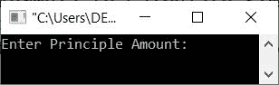

# C++ 程序：计算单利

> 原文：<https://codescracker.com/cpp/program/cpp-calculate-simple-interest.htm>

这篇文章包含了一些 C++程序，用于根据用户在运行时输入的数据查找/计算和打印单利。用户在运行时必须输入数据是:

*   本金金额-必须存入或借入的资金
*   利率-必须支付或收取回报的利率
*   时间周期——多少年来，钱被存入或借出

如果你对上面的数据感到困惑，那么忘记它，看看下面给出的单利公式和它的程序。读完这里提供的所有东西后，你会对这个项目了如指掌。

#### 计算单利的公式

求单利的公式是:

```
SI = (P*R*T)/100
```

其中 **SI** 代表单利， **P** 代表本金金额(存款或贷款金额)， **R** 代表 利率， **T** 代表期限(年)。

## 用 C++计算单利

问题是，**根据用户在运行时输入的 *P* 、 *R* 、 *T* (数据) 用 C++写一个程序来查找并打印单利。下面给出的程序是这个问题的答案:**

```
#include<iostream>

using namespace std;
int main()
{
   float p, r, t, si;
   cout<<"Enter Principle Amount: ";
   cin>>p;
   cout<<"Enter Rate of Interest: ";
   cin>>r;
   cout<<"Enter Time Period: ";
   cin>>t;
   si = (p*r*t)/100;
   cout<<"\nSimple Interest Amount: "<<si;
   cout<<endl;
   return 0;
}
```

下面给出的快照取自上面计算单利的 C++程序产生的初始输出:



现在输入数据，如 **246000** 为本金金额， **7.5** 为利率， **4** 为时间段，按`ENTER` 键计算并打印单利金额，如下图所示:


基于 **P=246000** 、 **R=7.5** 、 **T=4** 的单利计算是这样的:

```
SI = (P*R*T)/100
   = (246000*7.5*4)/100
   = (246000*30)/100
   = (7380000)/100
   = 73800
```

也就是说，如果你存了这笔钱，你将获得 73800 元的回报，否则，如果你从个人或银行或任何其他来源向 借款，你将不得不支付 **73800 元**。

**注意-** 仅输入以年为单位的时间段。如果要走 6 个月，那么就进入 6/12，也就是 **0.5** 年。

对于更具交互性和良好用户体验的程序，您还可以修改上面的程序，使用户可以选择是以年还是以月为单位输入时间段，如下面的程序所示:

```
#include<iostream>

using namespace std;
int main()
{
   float p, r, t, si;
   char ch;
   cout<<"Enter Principle Amount: ";
   cin>>p;
   cout<<"Enter Rate of Interest: ";
   cin>>r;
   cout<<"Time Period in Year or Month ? (y for year, m for month): ";
   cin>>ch;
   if(ch=='y')
   {
      cout<<"Enter Time Period (in Years): ";
      cin>>t;
      si = (p*r*t)/100;
   }
   else
   {
      cout<<"Enter Time Period (in Months): ";
      cin>>t;
      t = t/12;
      si = (p*r*t)/100;
   }
   cout<<"\nSimple Interest Amount: "<<si;
   cout<<endl;
   return 0;
}
```

下面是它的示例运行，以 **1000** 作为本金金额， **10** 作为利率，以 **m** 作为选择(以月为 时间段)，最后以 **4** 作为时间段的总月数:


## 使用函数计算单利

让我们创建相同的程序，即计算单利，但不是正常的过程，而是使用一个名为 **find_si()** 的自定义函数。这个函数有三个参数，分别是 **p** (本金金额) **r** (利率)，以及 **t** (时间段):

```
#include<iostream>

using namespace std;

float find_si(float, float, float);
int main()
{
   float p, r, t, si;
   cout<<"Enter Principle Amount: ";
   cin>>p;
   cout<<"Enter Rate of Interest: ";
   cin>>r;
   cout<<"Enter Time Period: ";
   cin>>t;
   si = find_si(p, r, t);
   cout<<"\nSimple Interest Amount: "<<si;
   cout<<endl;
   return 0;
}
float find_si(float a, float b, float c)
{
   float si;
   si = (a*b*c)/100;
   return si;
}
```

这个程序产生的输出与前一个程序产生的输出相似。唯一的区别是，这个程序是使用用户定义的函数创建的。

## 使用类计算单利

这是使用**类**创建的最后一个程序。也就是说，创建了类 **CodesCracker** 。在类内部，我已经创建了 一个名为 **res** 的私有变量和一个名为 **find_si()** 的公共函数。现在使用这个类，我已经定义了名为 **find_si()** 的函数，就像之前的程序一样。

在 **main()** 中，我创建了一个类 **CodesCracker** 的对象。这样，使用对象 **cc_obj** ，我可以 访问类(CodesCracker)的成员函数(find_si()):

```
#include<iostream>

using namespace std;

class CodesCracker
{
   private:
      int res;
   public:
      float find_si(float, float, float);
};
float CodesCracker::find_si(float a, float b, float c)
{
   res = (a*b*c)/100;
   return res;
}

int main()
{
   float p, r, t, si;
   CodesCracker cc_obj;

   cout<<"Enter Principle Amount: ";
   cin>>p;
   cout<<"Enter Rate of Interest: ";
   cin>>r;
   cout<<"Enter Time Period: ";
   cin>>t;

   si = cc_obj.find_si(p, r, t);
   cout<<"\nSimple Interest Amount: "<<si;
   cout<<endl;
   return 0;
}
```

这个程序也产生与第一个程序输出相似的输出。

[C++在线测试](/exam/showtest.php?subid=3)

* * *

* * *