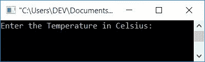

# C++ 程序：将摄氏温度转换为华氏温度

> 原文：<https://codescracker.com/cpp/program/cpp-program-convert-centigrade-to-fahrenheit.htm>

在本文中，您将学习并获得 C++ 中摄氏温度到华氏温度转换的代码。程序创建时使用和不使用函数。

### 摄氏至华氏公式

要将任何温度从摄氏度转换为华氏度，请使用以下公式:

```
F = (C * 1.8) + 32
```

其中 **F** 表示**华氏**的值， **C** 表示**摄氏**的值。

如果你好奇想知道，这个公式是从哪里来的，可以参考[摄氏度到](/nonprog/celsius-to-fahrenheit-formula.htm)华氏度的公式解释。

## C++ 中摄氏到华氏的转换

在 [C++](/cpp/index.htm) 编程中，要将温度从摄氏(或摄氏度)转换为华氏温度， 你必须要求用户输入摄氏温度。然后使用上面给出的公式将其转换为以 华氏度为单位的等值，如下面给出的程序所示:

```
#include<iostream>
using namespace std;
int main()
{
    float celsius, fahrenheit;
    cout<<"Enter the Temperature in Celsius: ";
    cin>>celsius;
    fahrenheit = (celsius*1.8)+32;
    cout<<"\nEquivalent Temperature in Fahrenheit: "<<fahrenheit;
    cout<<endl;
    return 0;
}
```

这个程序是在 *Code::Blocks* IDE 下构建和运行的。下面是它的运行示例:



现在提供以摄氏度为单位的温度输入，比如说 **37** 并按`ENTER`键打印其以华氏度为单位的 等效值，如下图所示:


### 使用用户定义的函数

这个程序使用了一个用户定义的函数 **CelsiusToFahrehneit()** ，将任何温度从 摄氏度转换为华氏温度。该函数将**摄氏度**值作为其参数，并返回其等效的 华氏度值。

```
#include<iostream>
using namespace std;
float CelsiusToFahrehneit(float);
int main()
{
    float celsius, fahrenheit;
    cout<<"Enter the Temperature in Celsius: ";
    cin>>celsius;
    fahrenheit = CelsiusToFahrehneit(celsius);
    cout<<endl<<celsius<<"\370C = "<<fahrenheit<<"\370F";
    cout<<endl;
    return 0;
}
float CelsiusToFahrehneit(float celsius)
{
    return ((celsius*1.8)+32);
}
```

下面是用户输入的示例运行:


**注** - <u>370</u> 是<u>度符号</u> ( <sup>o</sup> )的 ASCII 码的<u>八进制索引</u>。因此， **\370** 用于在输出上打印度数符号。

**注-** **C** 和 **F** 是用于表示**摄氏度**和**华氏度**的符号。

#### 其他语言的相同程序

*   [摄氏度到华氏度](/c/program/c-program-convert-centigrade-to-fahrenheit.htm)
*   [爪哇摄氏温度到华氏温度](/java/program/java-program-convert-centigrade-to-fahrenheit.htm)
*   [Python 摄氏到华氏](/python/program/python-program-convert-celsius-to-fahrenheit.htm)

[C++ 在线测试](/exam/showtest.php?subid=3)

* * *

* * *