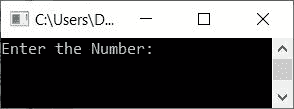
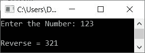
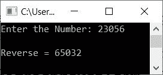

# C++ 程序：反转一个数

> 原文：<https://codescracker.com/cpp/program/cpp-program-reverse-numbers.htm>

在本文中，您将学习并获得代码来反转用户在运行时使用 C++程序输入的数字。因为有很多方法可以创建一个 C++程序来反转一个数字，所以我们使用了一些著名的方法来完成这个任务，如下所示:

*   使用*反转一个数字，同时循环*
*   使用*进行循环*
*   不使用循环
*   使用功能
*   使用类和对象
*   使用数组

在 C++中，这些是反转给定数字的最常见和最流行的方法。让我们从寻找和打印一个数的倒数的第一种方法开始。

## 使用 while 循环反转数字

要在 C++ 编程中反转一个数字，那么你必须要求用户输入一个 数字。现在找出该数字的倒数，然后在输出中打印它的倒数，如下面给出的程序所示:

问题是，**用 C++写个程序求一个数的倒数。**下面是它的回答:

```
#include<iostream>
using namespace std;
int main()
{
    int num, rem, rev=0;
    cout<<"Enter the Number: ";
    cin>>num;
    while(num!=0)
    {
        rem = num%10;
        rev = rem + (rev*10);
        num = num/10;
    }
    cout<<"\nReverse = "<<rev;
    cout<<endl;
    return 0;
}
```

这个程序是在 *Code::Blocks* IDE 下构建和运行的。下面是它的运行示例:



现在输入数字，如 **123** ，按`ENTER`键反转并打印，如下图 所示:



具有用户输入 **123** 的上述程序的试运行如下:

*   初始值， **rev=0**
*   当用户输入数字 **123** 时，它被存储在 **num** 中
*   现在条件 **num！=0** (循环时*或 **123！=0** 评估为真，因此 程序流进入循环，所有三条语句都被执行*
*   也就是说， **num%10** 或 **123%10** 或 **3** 被初始化为 **rem**
*   然后 **rem + (rev*10)** 或 **3 + (0*10)** 或 **3** 被初始化为 **rev** 。所以 **rev=3**
*   最后， **num/10** 或 **123/10** 或 **12** 被初始化为 **num** 。所以 **num=12**
*   现在，在执行完 while 循环的所有三条语句之后，它的条件再次被评估
*   也就是条件 **num！=0** 或 **12！=0** 再次评估为真，因此程序流再次 进入循环内部
*   在循环内部，再次 **num%10** 或 **12%10** 或 **2** 被初始化为 **rem**
*   然后 **rem + (rev*10)** 或 **2 + (3*10)** 或 **2+30** 或 **32** 被初始化为 **rev** 。 所以 **rev=32**
*   **num/10** 或 **12/10** 或 **1** 被初始化为 **num** 。所以 **num=1**
*   再次评估循环中*的条件。那就是，**小水！=0** 或 **1！=0** 评估为 为真，因此所有三个语句都被执行*
*   即 **num%10** 或 **1%10** 或 **1** 被初始化为 **rem** 。并且 **rem + (rev*10)** 或 **1 + (32*10)** 或 **1+320** 或 **321** 被初始化为 **rev** 。最后 **num/10** 或 或 **1/10** 或 **0** 被初始化为 **num** 。所以在执行完所有三条语句后，我们已经 **rev = 321**和 **num=0**
*   现在这个时候，条件*(while loop*)**小水！=0** 或 **0！=0** 评估为假。 因此循环结束时*的评估*
*   现在我们有了一个[变量](/cpp/cpp-variables.htm) **rev** ，它保存了给定 数(123)的倒数(321)
*   因此，只需将 **rev** 的值打印为用户在运行时输入的数字的倒数

## 使用 for 循环反转数字

该程序是使用循环的*而不是循环*的*创建的。其余事情与 之前的程序相同:*

```
#include<iostream>
using namespace std;
int main()
{
    int num, rem, rev;
    cout<<"Enter the Number: ";
    cin>>num;
    for(rev=0; num!=0; num=num/10)
    {
        rem = num%10;
        rev = rem + (rev*10);
    }
    cout<<"\nReverse = "<<rev;
    cout<<endl;
    return 0;
}
```

下面是用户输入的运行示例， **23056** :



## 不使用循环反转一个数

这个程序没有使用任何类型的*循环*，既没有用*代替*，也没有用*而*循环来倒数。让我们先来看看这个程序，稍后会给出解释:

```
#include<iostream>
using namespace std;
int main()
{
    int num, rem, rev=0;
    cout<<"Enter the Number: ";
    cin>>num;
    CODESCRACKER:
        rem = num%10;
        rev = (rev*10) + rem;
        num = num/10;
        if(num!=0)
            goto CODESCRACKER;
    cout<<"\nReverse = "<<rev;
    cout<<endl;
    return 0;
}
```

这个程序产生与前一个程序相同的输出。

**注-** 创建一个名为 **CODESCRACKER** 的标签，上面写着倒数的三种说法 。在执行完所有三条语句后，我们使用了 **if** 作为条件(检查)，就像在 **while 循环**中所做的那样。也就是说，如果条件评估为真，因此使用 **goto** 关键字后跟 **标签**名称，程序流程再次从**标签**开始。

## 使用函数反转数字

这个程序使用一个名为 **rev()** 的用户自定义函数来反转一个数字。它以一个数字作为它的参数， 并返回它的倒数。

```
#include<iostream>
using namespace std;
int rev(int);
int main()
{
    int num, r;
    cout<<"Enter the Number: ";
    cin>>num;
    r = rev(num);
    cout<<"\nReverse = "<<r;
    cout<<endl;
    return 0;
}
int rev(int n)
{
    int rem, res=0;
    while(n!=0)
    {
        rem = n%10;
        res = (res*10) + rem;
        n = n/10;
    }
    return res;
}
```

## 使用类反转数字

这个程序使用 C++面向对象的特性“类和对象”来反转用户给定的数字:

```
#include<iostream>
using namespace std;
class CodesCracker
{
    public:
        int rev(int);
};
int CodesCracker::rev(int n)
{
    int rem, res=0;
    while(n!=0)
    {
        rem = n%10;
        res = (res*10) + rem;
        n = n/10;
    }
    return res;
}
int main()
{
    int num, r;
    CodesCracker c;
    cout<<"Enter the Number: ";
    cin>>num;
    r = c.rev(num);
    cout<<"\nReverse = "<<r;
    cout<<endl;
    return 0;
}
```

**注意-** 在 **main()** 函数中创建了一个 **CodesCracker** 类型的对象 **c** 。现在使用 对象 **c** 我们已经调用了类 **CodesCracker** 的成员函数，就像使用**点(.)**运算符。函数 **rev()** 也返回一个作为参数传递的数字的倒数，就像前面的普通函数程序一样。

## 使用数组反转一个数

这是关于倒数的最后一个程序。这个程序是使用数组创建的。也就是说，数字的每一位都被初始化为数组的元素。使用数组，我们打印出了给定数字的倒数:

```
#include<iostream>
using namespace std;
int main()
{
    int num, rem, arr[10], i=0, tot=0;
    cout<<"Enter the Number: ";
    cin>>num;
    while(num!=0)
    {
        rem = num%10;
        arr[i] = rem;
        num = num/10;
        i++;
        tot++;
    }
    cout<<"\nReverse = ";
    for(i=0; i<tot; i++)
        cout<<arr[i];
    cout<<endl;
    return 0;
}
```

#### 其他语言的相同程序

*   [C 反向数字](/c/program/c-program-reverse-numbers.htm)
*   [Java 反向数字](/java/program/java-program-reverse-numbers.htm)

[C++在线测试](/exam/showtest.php?subid=3)

* * *

* * *