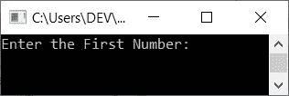

# 交换两个数的 C++程序

> 原文：<https://codescracker.com/cpp/program/cpp-program-swap-two-numbers.htm>

在本文中，您将学习并获得代码来交换用户在运行时使用 C++程序输入的任意两个数字。下面是本文中可用的程序列表:

*   使用第三个变量交换两个数
*   不使用第三个变量
*   使用函数(通过引用调用)
*   使用类和对象

## 使用第三个变量交换两个数

要在 C++ 编程中交换两个数字，你必须要求用户输入两个 数字。输入的两个数字存储在两个[变量](/cpp/cpp-variables.htm)中，比如**numOne**T9】和 **numTwo** 。现在使用它的变量交换这两个数字，如下面给出的程序所示:

```
#include<iostream>
using namespace std;
int main()
{
    int numOne, numTwo, temp;
    cout<<"Enter the First Number: ";
    cin>>numOne;
    cout<<"Enter the Second Number: ";
    cin>>numTwo;
    cout<<"\nBefore Swap:\n";
    cout<<"First Number = "<<numOne<<"\tSecond Number = "<<numTwo;
    temp = numOne;
    numOne = numTwo;
    numTwo = temp;
    cout<<"\n\nAfter Swap:\n";
    cout<<"First Number = "<<numOne<<"\tSecond Number = "<<numTwo;
    cout<<endl;
    return 0;
}
```

这个程序是在 *Code::Blocks* IDE 下构建和运行的。下面是它的运行示例:



现在供应输入表示第一个数字为 **10** ，第二个数字为 **20** 。按`ENTER`交换 这两个数字，并打印交换前后两个变量的值(存储这两个值的有 **numOne** 和**numwo**) ，如下图所示:


我们使用了第三个变量，比如说 **temp** 来帮助交换两个数字。也就是说， **numOne** 的值存储在 **temp** 中， **numTwo** 的值存储在 **numOne** 中。最后 **temp** 的值(numOne 的值)被存储在 **numTwo** 中。以这种方式，交换被执行。

## 不使用第三个变量交换两个数

要在不使用第三个变量的情况下交换两个数，只需替换以下三行代码(来自前面的程序):

```
temp = numOne;
numOne = numTwo;
numTwo = temp;
```

下面给出了代码块:

```
numOne = numOne + numTwo;
numTwo = numOne - numTwo;
numOne = numOne - numTwo;
```

同时从程序中删除对 **temp** 变量的声明。其余的事情将是一样的。

假设用户输入 10 和 20 作为第一个和第二个数字。因此 **numOne=10** 和 **numTwo=20** 。 现在使用上面三行代码。也就是说，在执行以下语句之后:

```
numOne = numOne + numTwo;
```

**10+20** 或 **30** 被初始化为 **numOne** 。所以 **numOne=30** 。并使用下面的【第二个】语句:

```
numTwo = numOne - numTwo;
```

**30-20** 或 **10** 被初始化为 **numTwo** 。所以 **numTwo=10** 。而用第三种说法，那 就是:

```
numOne = numOne - numTwo;
```

**30-10** 或 **20** 被初始化为 **numOne** 。所以 **numOne=20** 。通过这种方式，交换可以在不使用第三个变量的情况下执行 。

## 使用函数交换两个数(通过引用调用)

这个程序做的工作和前一个程序一样。但是使用名为 **swapFun()** ， 的自定义函数时，采用的是引用调用的方式。让我们先来看看这个程序:

```
#include<iostream>
using namespace std;
void swapFun(int *, int *);
int main()
{
    int numOne, numTwo;
    cout<<"Enter the First Number: ";
    cin>>numOne;
    cout<<"Enter the Second Number: ";
    cin>>numTwo;
    cout<<"\nBefore Swap:\n";
    cout<<"First Number = "<<numOne<<"\tSecond Number = "<<numTwo;
    swapFun(&numOne, &numTwo);
    cout<<"\n\nAfter Swap:\n";
    cout<<"First Number = "<<numOne<<"\tSecond Number = "<<numTwo;
    cout<<endl;
    return 0;
}
void swapFun(int *nOne, int *nTwo)
{
    int temp;
    temp = *nOne;
    *nOne = *nTwo;
    *nTwo = temp;
}
```

在上面的程序中，在 **main()** 函数中， **swapFun()** 被调用。它采用两个参数 **int** 指针类型。因此，我们传递了两个变量的地址，比如保存用户输入的第一个和第二个数字的 **numOne** 和 **numTwo** 。

**注-** 操作符的 ***** 称为**值 **&** 称为**地址。****

这样，两个值的地址(由用户输入)被传递给函数 *swapFun()* 。现在使用 ***** 运算符，我们已经访问了地址中的值，并交换了数字。

**注-** 要了解关于函数的更多信息，请参考 C++ 中的[函数一文，以获得关于它的所有必需的东西。](/cpp/cpp-functions.htm)

## 使用类交换两个数

这个程序使用 C++的面向对象特性*类和对象*来交换两个数。

```
#include<iostream>
using namespace std;
class CODESCRACKER
{
    public:
        void swapFun(int *, int *);
};
void CODESCRACKER::swapFun(int *nOne, int *nTwo)
{
    int temp;
    temp = *nOne;
    *nOne = *nTwo;
    *nTwo = temp;
}
int main()
{
    int numOne, numTwo;
    cout<<"Enter the First Number: ";
    cin>>numOne;
    cout<<"Enter the Second Number: ";
    cin>>numTwo;
    cout<<"\nBefore Swap:\n";
    cout<<"First Number = "<<numOne<<"\tSecond Number = "<<numTwo;
    CODESCRACKER c;
    c.swapFun(&numOne, &numTwo);
    cout<<"\n\nAfter Swap:\n";
    cout<<"First Number = "<<numOne<<"\tSecond Number = "<<numTwo;
    cout<<endl;
    return 0;
}
```

以下是用户输入的示例运行，第一个数字为 **50** ，第二个数字为 **60** :


在 **main()** 函数中创建了一个 **CODESCRACKER** 类型的对象 **c** 。现在通过 这个对象，我们已经使用 **点(.)**运算符。现在，该功能的运行方式与正常功能的运行方式相似。

**注意-** 要获得它的深入细节，那么参考[类和对象](/cpp/cpp-classes-objects.htm)

#### 其他语言的相同程序

*   [C 交换两个数](/c/program/c-program-swap-two-numbers.htm)
*   [Java 交换两个数](/java/program/java-program-swap-two-numbers.htm)
*   [Python 互换两个数](/python/program/python-program-swap-two-numbers.htm)

[C++在线测试](/exam/showtest.php?subid=3)

* * *

* * *