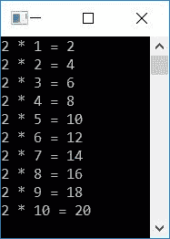
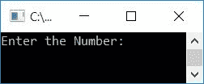
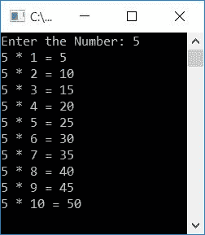
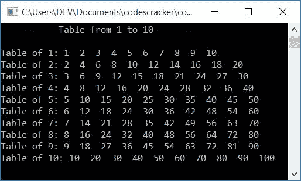
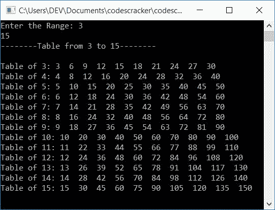
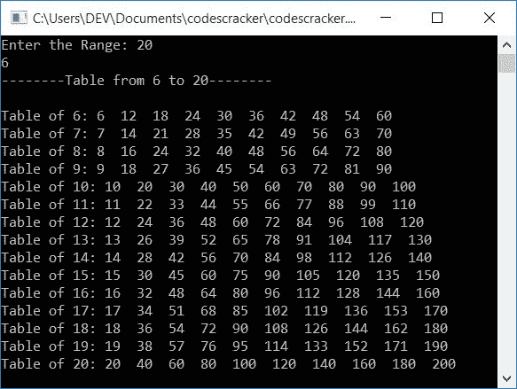

# C++ 程序：打印乘法表

> 原文：<https://codescracker.com/cpp/program/cpp-program-print-table-of-number.htm>

在本文中，您将学习并获得使用 C++程序打印乘法表的代码。下面是打印乘法表的程序列表:

*   打印 2 的乘法表
*   打印任意给定数字的乘法表
*   打印从 1 到 10 的乘法表
*   打印给定范围内所有数字的乘法表

### 什么是乘法表？

乘法表显示一个特定数字的倍数列表，从 1 到 10。比如 **3** 的乘法表会是:

```
3 * 1 = 3
3 * 2 = 6
3 * 3 = 9
3 * 4 = 12
3 * 5 = 15
3 * 6 = 18
3 * 7 = 21
3 * 8 = 24
3 * 9 = 27
3 * 10 = 30
```

**注-** 通常倍数列表是从 1 到 12。但是在这篇文章中，我们只基于 1 到 10 的倍数创建了所有关于乘法表打印的程序 。

## 打印 2 的乘法表

让我们从本文的第一个程序开始，它打印了 **2** 的表:

```
#include<iostream>
using namespace std;
int main()
{
    int num=2, i, res;
    for(i=1; i<=10; i++)
    {
        res = num*i;
        cout<<num<<" * "<<i<<" = "<<res;
        cout<<endl;
    }
    cout<<endl;
    return 0;
}
```

这个程序是在 *Code::Blocks* IDE 下构建和运行的。下面是它的示例输出:



这个程序的预演是这样的:

*   初始值， **num=2**
*   现在开始执行循环的*。它的初始化(第一条语句)首先被执行，但是 只能一次执行*
*   因此 **1** 被初始化为 **i** ，并且条件 **i < =10** 或 **1 < =10** 评估为 真，因此程序流程进入循环内部
*   并且 **num*i** 或 **2*1** 或 **2** 被初始化为 **res**
*   现在使用下面的语句:
    `cout<<num<<" * "<<i<<" = "<<res;`
    **2 * 1 = 2**，得到打印输出
*   第三条语句，即
    `cout<<endl;`
    被执行，即打印一个新行，即下一个输出的东西从新行开始
*   现在程序流程转到循环的*的更新(第三条语句)并增加 **I**的值。所以 **i=2***
*   条件 **i < =10** 或 **2 < =10** 再次评估为真，因此程序流程再次进入循环内的
*   这个过程继续，直到其条件评估为假
*   这样， **2** 的乘法表就打印在输出屏幕上。

## 打印任意给定数字的乘法表

要在 [C++](/cpp/index.htm) 编程中打印表格中的任何给定数字，你必须要求用户向 输入该数字。然后开始从 1 到 10 一个一个地相乘，并在相乘时显示相乘结果 ，如下面的程序所示。

```
#include<iostream>
using namespace std;
int main()
{
    int num, i, res;
    cout<<"Enter the Number: ";
    cin>>num;
    for(i=1; i<=10; i++)
    {
        res = num*i;
        cout<<num<<" * "<<i<<" = "<<res;
        cout<<endl;
    }
    cout<<endl;
    return 0;
}
```

下面是这个 C++程序产生的初始输出:



现在提供输入，比如说 **5** ，按`ENTER`键打印其表格，如下图 所示:



## 打印从 1 到 10 的乘法表

这个程序打印从 1 到 10 的表格。也就是说，首先打印 1 的表格，然后打印 2 的表格，依此类推，直到 10 的表格:

```
#include<iostream>
using namespace std;
int main()
{
    int num, i, j, res;
    cout<<"-----------Table from 1 to 10--------\n\n";
    for(i=1; i<=10; i++)
    {
        num = i;
        cout<<"Table of "<<num<<": ";
        for(j=1; j<=10; j++)
        {
            res = num*j;
            cout<<res<<"  ";
        }
        cout<<endl;
    }
    cout<<endl;
    return 0;
}
```

以下是该程序生成的示例输出:



## 打印给定范围内的乘法表

这个程序允许用户输入范围来打印给定范围内的所有数字的表格。例如，如果用户输入范围为 **3** 和 **15** ，则打印从 3 到 15 的所有数字的表格。

```
#include<iostream>
using namespace std;
int main()
{
    int numOne, numTwo, num, i, j, res;
    cout<<"Enter the Range: ";
    cin>>numOne>>numTwo;
    cout<<"--------Table from "<<numOne<<" to "<<numTwo<<"--------\n\n";
    for(i=numOne; i<=numTwo; i++)
    {
        num = i;
        cout<<"Table of "<<num<<": ";
        for(j=1; j<=10; j++)
        {
            res = num*j;
            cout<<res<<"  ";
        }
        cout<<endl;
    }
    cout<<endl;
    return 0;
}
```

以下是用户输入的示例运行，第一个数字为 **3** ，第二个数字为 **15** :



**注意-** 如果用户以第一个数字大于第二个数字的方式输入两个数字会怎样？

要解决此问题，请使用此程序，而不是以前的程序:

```
#include<iostream>
using namespace std;
int main()
{
    int numOne, numTwo, num, i, j, res;
    cout<<"Enter the Range: ";
    cin>>numOne>>numTwo;
    if(numTwo>numOne)
    {
        cout<<"--------Table from "<<numOne<<" to "<<numTwo<<"--------\n\n";
        for(i=numOne; i<=numTwo; i++)
        {
            num = i;
            cout<<"Table of "<<num<<": ";
            for(j=1; j<=10; j++)
            {
                res = num*j;
                cout<<res<<"  ";
            }
            cout<<endl;
        }
    }
    else
    {
        cout<<"--------Table from "<<numTwo<<" to "<<numOne<<"--------\n\n";
        for(i=numTwo; i<=numOne; i++)
        {
            num = i;
            cout<<"Table of "<<num<<": ";
            for(j=1; j<=10; j++)
            {
                res = num*j;
                cout<<res<<"  ";
            }
            cout<<endl;
        }
    }
    cout<<endl;
    return 0;
}
```

以下是用户输入的示例运行，第一个数字为 **20** ，第二个数字为 **6** :



#### 其他语言的相同程序

*   [C 打印号码表](/c/program/c-program-print-table-of-number.htm)
*   [Java 打印数字表](/java/program/java-program-print-table-of-number.htm)
*   [Python 打印的数字表](/python/program/python-program-print-multiplication-table.htm)

[C++在线测试](/exam/showtest.php?subid=3)

* * *

* * *