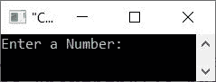
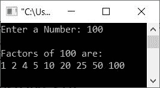

# C++ 程序：，查找并打印一个数的因子

> 原文：<https://codescracker.com/cpp/program/cpp-find-factors-of-number.htm>

本文提供了一些用 C++编写的程序，可以找到给定数字的因子。例如，如果用户输入 **10** 作为输入，那么 程序打印它的因子，那将是 **1，2，5，10** 。以下是本文涉及的程序列表:

*   在循环中使用**求一个数的因数**
*   使用**对**循环求一个数的因子
*   使用用户定义的函数求一个数的因子
*   用类和对象求一个数的因子

## 用 while 循环求一个数的因子

问题是，*用 C++写一个程序，从用户那里接收一个数字作为输入，并输出它的所有因子。*这个问题的答案 是下面给出的程序:

```
#include<iostream>

using namespace std;
int main()
{
   int num, i=1;
   cout<<"Enter a Number: ";
   cin>>num;
   cout<<"\nFactors of "<<num<<" are:\n";
   while(i<=num)
   {
      if(num%i==0)
         cout<<i<<" ";
      i++;
   }
   cout<<endl;
   return 0;
}
```

下面给出的快照显示了上述 C++程序在查找给定数字的因子时产生的初始输出:



现在提供输入，比如说 **100** 作为数字，按`ENTER`键查找并打印其所有因子，如下面给出的 快照所示:



当用户输入数字，比如说 **100** ，它被初始化为 **num** 。因此 **num=100** 。现在从上面的程序中预演下面的 代码块:

```
   while(i<=num)
   {
      if(num%i==0)
         cout<<i<<" ";
      i++;
   }
```

情况如下(初始值 **i** 为 1， **num=100** ):

*   条件**I<=数字**或 **1 < =100** 评估为真
*   因此程序流进入循环内部
*   条件 **num%i==0** 或 **100%1==0** 或 **0==0** 评估为真
*   因此，如果执行了和 **cout** 语句，程序流进入**的主体，打印出 **I**的值和一个空格**
*   所以 **1** 被打印出来
*   现在， **i** 的值增加。所以 **i=2**
*   再次评估循环时**的条件**
*   也就是说，条件**I<=数字**或 **2 < =100** 再次评估为真
*   因此，程序流再次进入循环
*   这个过程一直持续到条件评估为假
*   这样，给定数量的所有因子都被逐个打印出来

## 用 for 循环求一个数的因子

让我们创建与前一个程序相同的程序，但是这次使用**作为**循环。

```
#include<iostream>

using namespace std;
int main()
{
   int num, i;
   cout<<"Enter a Number: ";
   cin>>num;
   cout<<"\nFactors of "<<num<<" are:\n";
   for(i=1; i<=num; i++)
   {
      if(num%i==0)
         cout<<i<<" ";
   }
   cout<<endl;
   return 0;
}
```

## 用函数求一个数的因子

这个程序是使用名为 **fact()** 的用户定义函数创建的。这个函数以给定的数字作为它的参数，而 做同样的工作，寻找并打印传递参数的因子。

```
#include<iostream>

using namespace std;
void fact(int);
int main()
{
   int num;
   cout<<"Enter a Number: ";
   cin>>num;
   cout<<"\nFactors of "<<num<<" are:\n";
   fact(num);
   cout<<endl;
   return 0;
}
void fact(int n)
{
   int i=1;
   while(i<=n)
   {
      if(n%i==0)
         cout<<i<<" ";
      i++;
   }
}
```

## 用类求一个数的因子

这是本文的最后一个程序，使用 C++的面向对象特性**类**创建。

```
#include<iostream>
using namespace std;

class CodesCracker
{
   private:
      int i;
   public:
      void fact(int n)
      {
         for(i=1; i<=n; i++)
         {
            if(n%i==0)
               cout<<i<<" ";
         }
      }
};

int main()
{
   CodesCracker obj;
   int num;
   cout<<"Enter a Number: ";
   cin>>num;
   cout<<"\nFactors of "<<num<<" are:\n";
   obj.fact(num);
   cout<<endl;
   return 0;
}
```

[C++在线测试](/exam/showtest.php?subid=3)

* * *

* * *