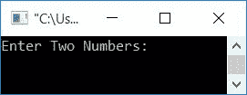
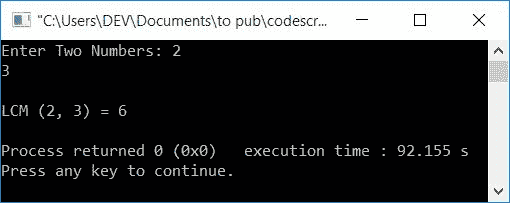
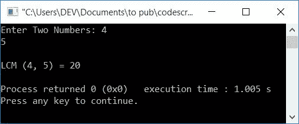
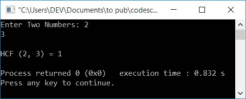
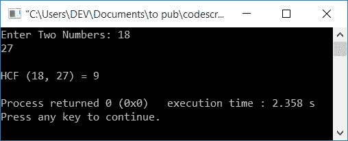
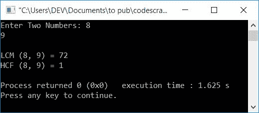

# C++程序求 LCM 和 HCF (GCD)的两个数

> 原文：<https://codescracker.com/cpp/program/cpp-program-find-hcf-lcm.htm>

在本文中，您将学习并获得在运行时用 C++查找并打印用户给定的任意两个数的 LCM 和 HCF (GCD)的代码。这是程序列表，您将浏览:

*   使用 while 循环查找两个数的 LCM
*   用 while 循环求两个数的 HCF
*   在单个程序中求两个数的 LCM 和 HCF。该程序中使用的代码是查找 LCM 和 HCF 的首选代码
*   用 for 循环求两个数的 LCM 和 HCF
*   使用功能

### 如何计算 LCM 和 HCF？

在阅读上面列出的程序之前，如果你不知道两个数字的 LCM 或 HCF 是如何计算的，那么你可以参考这些文章:

*   [如何找到 LCM](/nonprog/find-lcm.htm)
*   [如何找到 HCF](/nonprog/find-hcf.htm)

消除你对 LCM 和 HCF 的所有疑问。现在让我们继续这个项目。

## 求两个数的 LCM

要在 C++编程中找到两个数的 LCF，你必须要求用户输入这两个数。然后在输出中找到并打印它的 LCM，如下面给出的程序所示。

**注-** LCM 是最小公倍数或最小公约数。比如有两个数字说 **10** 和 **12** 。那么它的最小公约数就是 60。也就是说，两个数 **10** 和 **12** 都除以 **60** 而不留余数(或留 0 为余数)。

```
#include<iostream>
using namespace std;
int main()
{
    intnumOne, numTwo, mp;
    cout<<"Enter Two Numbers: ";
    cin>>numOne>>numTwo;
    if(numOne>numTwo)
        mp = numOne;
    else
        mp = numTwo;
    while(1)
    {
        if((mp%numOne == 0) && (mp%numTwo == 0))
            break;
        else
            mp++;
    }
    cout<<"\nLCM ("<<numOne<<", "<<numTwo<<") = "<<mp;
    cout<<endl;
    return 0;
}
```

这个程序是在 *Code::Blocks* IDE 下构建和运行的。下面是它的运行示例:



现在提供任意两个数字，比如说 **2** 和 **3** 。按`ENTER`键查找并打印其 LCM ，如下图所示:



**注** - **6** 是能被两个数 **2** 和 **3** 整除的最小数。

下面是另一个使用用户输入运行的示例， **4，5** :



上述程序背后的主要逻辑是:

*   将较大的数字初始化为 **mp**
*   将 **1** 作为*的条件，而循环*总是评估为真。因此，该循环结束其 执行，直到 **break** 关键字被执行
*   当【T2 if】(在 *while 循环* ) 的条件都为真时，执行 **break** 关键字
*   每次进入 *while 循环*的主体时，使用 **if** 应用一个条件，检查 **mp** 中的值 是否能被两个数整除
*   如果是可分的，那么使用 **break** 关键字并退出循环
*   否则增加其值，并继续检查下一步

用户输入 **2** 和 **3** 的上述程序的试运行如下:

*   当用户输入 **2** 和 **3** 作为输入时。然后它被存储在 **numOne** 和**numTwo**T12】变量中。因此， **numOne=2** 和 **numTwo=3**
*   如果被执行，那么**的条件。也就是说，条件 **numOne > numTwo** 或**2>3**T18】评估为假，因此程序流不进入 **if** 的主体，而是进入其 **else**的部分，并且 **numTwo** 的值被初始化为 **mp** 。所以 **mp=3****
*   现在条件**1**(while 循环的)评估为真，因此程序流进入循环内部
*   在循环内部，如果对求值，则为**的条件。这就是条件， **mp%numOne==0** 或 **3% 2 = = 0**或 **1==0** 评估为假。因为第一个条件评估为假，因此 不需要评估第二个条件**
*   因此 **mp** 的值增加，并使用新的 **mp** 、 值再次检查条件，这里是第二次使用 **4**
*   这个过程一直持续到两个条件都评估为真，如果的 主体执行 **break** 关键字来停止 **while 循环**的执行
*   当 **mp** 的值变为 **6** 时，则两个条件都满足，即 **6** 能被两个数 整除，如 **2** 和 **3**
*   因此，在退出循环后， **mp** 的值将为 6。
*   将 **mp** 的值打印为给定两个数的 LCM 结果。

## 求两个数的 HCF (GCD)

与 LCM 不同，LCM 处理倍数(最低公倍数)，HCM 处理因子(最高公倍数)。HCF 可以被称为最高公因数，或最大公因数(GCD)。

比如有两个数字说 **10** 和 **12** ，那么它的最高公因数就是 **2** 。 即 **2** 是两个数相除的最高数。1 也是两个数相除，但 2 更大， 所以 2 是 **10** 和 **12** 的 HCF。

问题是，**用 C++写一个程序，求两个数**的 HCF。以下是它的答案:

```
#include<iostream>
using namespace std;
int main()
{
    intnumOne, numTwo, mp;
    cout<<"Enter Two Numbers: ";
    cin>>numOne>>numTwo;
    if(numOne<numTwo)
        mp = numOne;
    else
        mp = numTwo;
    while(1)
    {
        if((numOne%mp == 0) && (numTwo%mp == 0))
            break;
        else
            mp--;
    }
    cout<<"\nHCF ("<<numOne<<", "<<numTwo<<") = "<<mp;
    cout<<endl;
    return 0;
}
```

下面是用户输入的示例运行， **2** 和 **3** :



**注-** 因为 **1** 是除以数字 **2** 和 T6 3 的最大正整数，所以 **1** 是 **2** 和 **3** 的 HCF

**注-** 这里，最高正整数，必须小于给定的两个数中较小的数。

下面是另一个带有用户输入的示例运行， **18** 和 **27** :



**注-** 因为 **9** 是除以数字 **18** 和 T6】27 的最大正整数

这里使用的逻辑与前面的两个数字的 LCM 程序有点相似。不同之处在于 **mp** 变量的条件和更新。也就是说，每次 进入循环时，不是递增它，而是递减它的值。这种情况会随着:

```
if((numOne%mp == 0) && (numTwo%mp == 0))
```

## 一个程序中的 C++ LCM 和 HCF

这个 C++程序接收来自用户的两个数字，并找到 LCM 和 HCF。

```
#include<iostream>
using namespace std;
int main()
{
    intnumOne, numTwo, lcm, hcf, a, b, temp;
    cout<<"Enter Two Numbers: ";
    cin>>numOne>>numTwo;
    a = numOne;
    b = numTwo;
    while(b!=0)
    {
        temp = b;
        b = a%b;
        a = temp;
    }
    hcf = a;
    lcm = (numOne*numTwo)/hcf;
    cout<<"\nLCM ("<<numOne<<", "<<numTwo<<") = "<<lcm;
    cout<<"\nHCF ("<<numOne<<", "<<numTwo<<") = "<<hcf;
    cout<<endl;
    return 0;
}
```

下面是用户输入的示例运行， **9，8** :



## 用 for 循环求两个数的 LCM 和 HCF

现在让我们使用循环的**创建相同的程序**

```
#include<iostream>
using namespace std;
int main()
{
    intnumOne, numTwo, mp, temp;
    cout<<"Enter Two Numbers: ";
    cin>>numOne>>numTwo;
    if(numOne>numTwo)
        mp = numOne;
    else
        mp = numTwo;
    temp = mp;
    for(;;mp++)
    {
        if((mp%numOne == 0) && (mp%numTwo == 0))
            break;
    }
    cout<<"\nLCM ("<<numOne<<", "<<numTwo<<") = "<<mp;
    mp = temp;
    for(;;mp--)
    {
        if((numOne%mp == 0) && (numTwo%mp == 0))
            break;
    }
    cout<<"\nHCF ("<<numOne<<", "<<numTwo<<") = "<<mp;
    cout<<endl;
    return 0;
}
```

下面是用户输入的示例运行， **10** 和 **12** :


**注**— 循环的**的初始化部分(第一部分)和条件检查部分(第二部分)被隐藏。将条件留空，将始终计算为真条件。**

## 用函数求两个数的 LCM 和 HCF

该程序使用两个自定义函数，即 **findLCM()** 和 **findHCF()** 来查找用户输入的两个数字的 LCM 和 HCF 。

Both 函数接收两个参数，作为第一个和第二个数字，返回这两个数字的 LCM/HCF 作为它的参数。

```
#include<iostream>
using namespace std;
int findLCM(int, int);
int findHCF(int, int);
int main()
{
    intnumOne, numTwo, res;
    cout<<"Enter Two Numbers: ";
    cin>>numOne>>numTwo;
    res = findLCM(numOne, numTwo);
    cout<<"\nLCM ("<<numOne<<", "<<numTwo<<") = "<<res;
    res = findHCF(numOne, numTwo);
    cout<<"\nHCF ("<<numOne<<", "<<numTwo<<") = "<<res;
    cout<<endl;
    return 0;
}
int findLCM(int a, int b)
{
    intlcm;
    if(a>b)
        lcm = a;
    else
        lcm = b;
    while(1)
    {
        if((lcm%a == 0) && (lcm%b == 0))
            break;
        lcm++;
    }
    return lcm;
}
int findHCF(int a, int b)
{
    inthcf;
    if(a>b)
        hcf = a;
    else
        hcf = b;
    while(1)
    {
        if((a%hcf == 0) && (b%hcf == 0))
            break;
        hcf--;
    }
    return hcf;
}
```

下面是用户输入的示例运行， **6，8** :


#### 其他语言的相同程序

*   [C 求两个数的 HCF 和 LCM](/c/program/c-program-find-hcf-lcm.htm)
*   [Java 找到 HCF 和 LCM 的两个数](/java/program/java-program-find-hcf-lcm.htm)
*   [Python 找到两个数的 HCF 和 LCM](/python/program/python-program-find-hcf-lcm.htm)

[C++在线测试](/exam/showtest.php?subid=3)

* * *

* * *