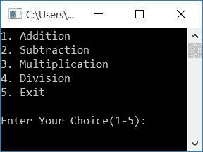
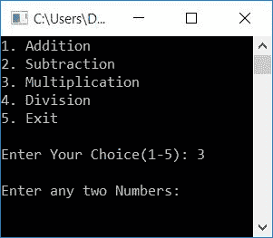
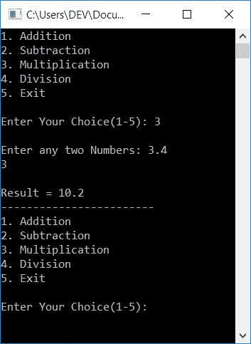

# 用 C++ 程序制作简单的计算器

> 原文：<https://codescracker.com/cpp/program/cpp-program-make-calculator.htm>

在本文中，您将学习并获得使用 C++ 创建一个简单计算器的代码。下面是本文中可用的计算器程序列表:

*   简单的计算器程序
*   使用用户自定义函数的计算器程序

## 用 C++ 制作一个计算器

下面给出的程序在 [C++](/cpp/index.htm) 编程中创建了一个简单的[计算器](/calculator/index.htm)，它根据用户的选择执行四种基本数学运算，如 [加、减、乘、除](/cpp/program/addition-subtraction-multiplication-division.htm)、 。

要执行计算器的任务，首先接收选择，然后接收任意两个数字(如果选择不退出)。然后使用[开关](/cpp/cpp-selection-statements.htm)盒来识别选择，并执行所需的 操作，如下图程序所示:

问题是，**用 C++** 写一个计算器程序。以下是它的答案:

```
#include<iostream>
using namespace std;
int main()
{
    float numOne, numTwo, res;
    int choice;
    do
    {
        cout<<"1\. Addition\n";
        cout<<"2\. Subtraction\n";
        cout<<"3\. Multiplication\n";
        cout<<"4\. Division\n";
        cout<<"5\. Exit\n\n";
        cout<<"Enter Your Choice(1-5): ";
        cin>>choice;
        if(choice>=1 && choice<=4)
        {
            cout<<"\nEnter any two Numbers: ";
            cin>>numOne>>numTwo;
        }
        switch(choice)
        {
            case 1:
                res = numOne+numTwo;
                cout<<"\nResult = "<<res;
                break;
            case 2:
                res = numOne-numTwo;
                cout<<"\nResult = "<<res;
                break;
            case 3:
                res = numOne*numTwo;
                cout<<"\nResult = "<<res;
                break;
            case 4:
                res = numOne/numTwo;
                cout<<"\nResult = "<<res;
                break;
            case 5:
                return 0;
            default:
                cout<<"\nWrong Choice!";
                break;
        }
        cout<<"\n------------------------\n";
    }while(choice!=5);
    cout<<endl;
    return 0;
}
```

这个程序是在 *Code::Blocks* IDE 下构建和运行的。下面是它的运行示例:



现在输入你的选择，比如说 **3** ，如果你想执行乘法运算。提供 3 作为选择后，按 `ENTER`键。以下是您将看到的输出:



现在提供任意两个数字，比如说 **3.4** 和 **3** 作为输入。然后按`ENTER`键打印 的乘法结果，如下图所示:



正如您所看到的，程序再次要求输入选项来再次执行操作，直到用户输入 5 作为退出计算器的选项。

## C++ 计算器程序使用函数

这个程序还创建了一个计算器，但是使用了用户定义的函数，例如:

*   addFun()相加，并返回作为其两个参数传递的两个数之和
*   subFun()减去两个数。从第一个数字中减去第二个数字(参数)
*   mulFun()将两个数相乘
*   divFun()将两个数相除。第一个数字(参数)除以第二个

现在让我们来看看这个程序:

```
#include<iostream>
using namespace std;
float addFun(float, float);
float subFun(float, float);
float mulFun(float, float);
float divFun(float, float);
int main()
{
    float numOne, numTwo, res;
    int choice;
    do
    {
        cout<<"1\. Addition\n";
        cout<<"2\. Subtraction\n";
        cout<<"3\. Multiplication\n";
        cout<<"4\. Division\n";
        cout<<"5\. Exit\n\n";
        cout<<"Enter Your Choice(1-5): ";
        cin>>choice;
        if(choice>=1 && choice<=4)
        {
            cout<<"\nEnter any two Numbers: ";
            cin>>numOne>>numTwo;
        }
        switch(choice)
        {
            case 1:
                res = addFun(numOne, numTwo);
                cout<<"\nResult = "<<res;
                break;
            case 2:
                res = subFun(numOne, numTwo);
                cout<<"\nResult = "<<res;
                break;
            case 3:
                res = mulFun(numOne, numTwo);
                cout<<"\nResult = "<<res;
                break;
            case 4:
                res = divFun(numOne, numTwo);
                cout<<"\nResult = "<<res;
                break;
            case 5:
                return 0;
            default:
                cout<<"\nWrong Choice!";
                break;
        }
        cout<<"\n------------------------\n";
    }while(choice!=5);
    cout<<endl;
    return 0;
}
float addFun(float a, float b)
{
    return (a+b);
}
float subFun(float a, float b)
{
    return (a-b);
}
float mulFun(float a, float b)
{
    return (a*b);
}
float divFun(float a, float b)
{
    return (a/b);
}
```

这个程序产生与前一个程序相同的输出。

#### 其他语言的相同程序

*   [C 制作计算器](/c/program/c-program-make-calculator.htm)
*   [Java 制作计算器](/java/program/java-program-make-calculator.htm)
*   [Python 制作计算器](/python/program/python-program-make-calculator.htm)

[C++ 在线测试](/exam/showtest.php?subid=3)

* * *

* * *